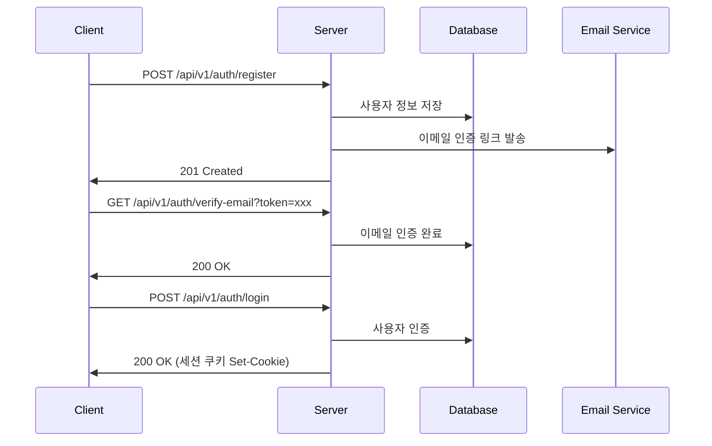
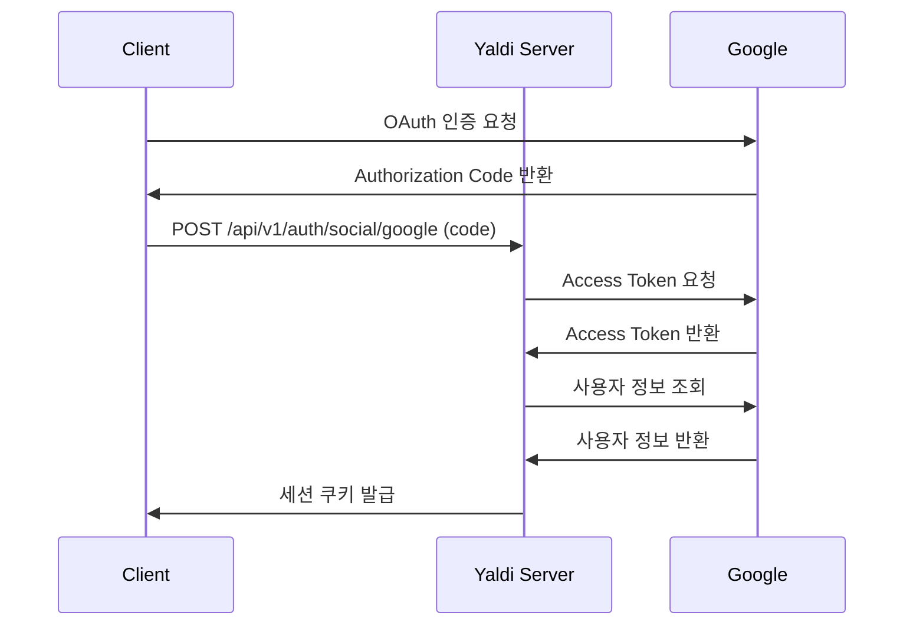
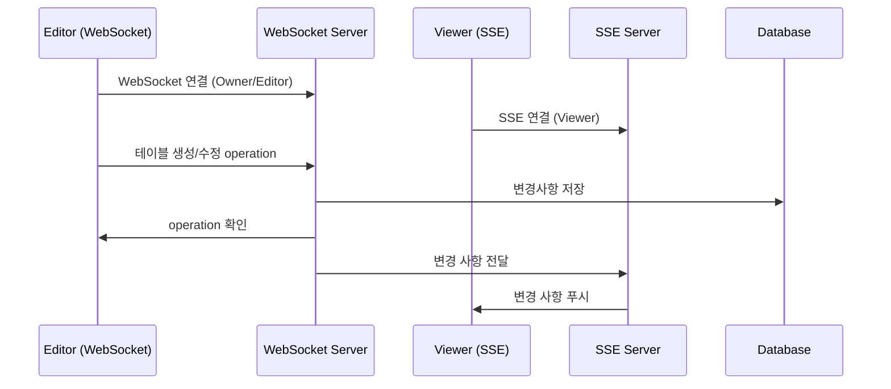

# Yaldi API 연동 규격서

## Document Information

| 항목 | 내용 |
|------|------|
| 문서명 | Yaldi API 연동 규격서 |
| 버전 | v1.1.0 |
| 작성일 | 2024-10-18 |
| 작성자 | 최경민 |

## Revision History

| 버전 | 날짜 | 작성자 | 변경 내용 |
|------|------|--------|----------|
| v1.0.0 | 2024-10-01 | 최경민 | 초안 작성 |
| v1.1.0 | 2024-10-18 | 최경민 | 실시간 협업 구조, 보안 및 통신 전략 추가 |

## 목차

1. [개요](#1-개요)
2. [시작하기](#2-시작하기)
3. [보안 및 통신 전략](#3-보안-및-통신-전략)
4. [API 사용 유의사항](#4-api-사용-유의사항)
5. [연동 방법](#5-연동-방법)
6. [Call Flow](#6-call-flow)
7. [API 목차](#7-api-목차)
8. [연동 API 규격](#8-연동-api-규격)
9. [Rate Limiting](#9-rate-limiting)
10. [Webhook](#10-webhook)
11. [부록](#11-부록)

## 1. 개요


### 1.1 목적

Yaldi ERD 도구의 백엔드 API 연동 규격서입니다. 프론트엔드와 백엔드 개발자 간 명확한 커뮤니케이션을 위한 표준 문서를 제공합니다.

### 1.2 배경

실시간 협업 ERD 작성 도구로 다음 기능을 제공합니다:
- 사용자 인증 (이메일, OAuth)
- ERD CRUD 작업
- 실시간 협업 (WebSocket/SSE)
- 버전 관리 (Git-like)
- AI 기반 설계 검증
- DTO 자동 생성
- 프로젝트 탐색
- 태블릿 스케치 OCR

### 1.3 비즈니스 필요성

- **효율성**: 데이터베이스 설계 시간 단축
- **협업**: 실시간 팀 협업으로 생산성 향상
- **품질**: AI 기반 정규화 및 최적화 제안
- **확장성**: DTO 자동 생성으로 개발 속도 향상

### 1.4 작성자

최경민

### 1.5 OpenAPI Spec

OpenAPI 3.0.3 기반 API 문서를 제공합니다. `/api/v1/openapi.json` 엔드포인트에서 전체 스펙을 확인할 수 있습니다.

## 2. 시작하기


### 2.1 사전작업

1. **회원가입**: `/api/v1/auth/register`로 계정 생성
2. **이메일 인증**: 발송된 링크를 통해 이메일 인증 완료
3. **로그인**: `/api/v1/auth/login`으로 JWT 토큰 자동 발급 (쿠키)
4. **API 호출**: 쿠키가 자동으로 전송됨 (별도 헤더 불필요)

### 2.2 인증방식

**JWT (JSON Web Token) + HttpOnly 쿠키**

- **Access Token**: 15분 유효, API 요청 시 사용
- **Refresh Token**: 7일 유효, Access Token 갱신용
- **알고리즘**: RS256 (비대칭키 서명)
- **전달 방식**: HttpOnly 쿠키 (XSS 방어)
- **쿠키명**: `access_token`, `refresh_token`
- **보안 설정**: HttpOnly, Secure, SameSite=Strict

**JWT의 장점**
- **병목 완화**: DB 조회 없이 인증 (서버 signature 검증만)
- **Connection 절감**: 동시접속 1천만 시 약 2천만 connection 절감
- **확장성**: 서버 간 인증 정보 공유 가능
- **무상태**: 서버에 세션 저장 불필요

**Token 갱신 전략**
- **웹**: 만료 전 갱신 (pre-refresh, 만료 5분 전 자동)
- **모바일**: 만료 시 자동 갱신
- **Access Token**: 서버에 저장 안 함
- **Refresh Token**: Redis에 저장 (블랙리스트 관리용)

**OAuth 2.0 & OIDC 소셜 로그인**

- Google (OIDC), GitHub 지원
- PKCE (Proof Key for Code Exchange) 적용
- 로그인 성공 시 JWT를 HttpOnly 쿠키로 발급

### 2.3 사용순서

1. 회원가입 및 로그인
2. JWT 토큰 발급 (HttpOnly 쿠키로 자동 저장)
3. 프로젝트 생성
4. ERD 작성 (테이블, 컬럼, 관계 생성)
5. 실시간 협업 (WebSocket/SSE 연결)
6. 버전 저장 및 관리
7. DTO 생성 및 Export

### 2.4 실시간 협업 구조

**Owner/Editor (WebSocket)**
- 양방향 실시간 통신
- ERD 편집 operation 송수신
- Operational Transformation (OT) 기반 충돌 해결
- Heartbeat: 30초마다 Ping/Pong

**Viewer (SSE - Server-Sent Events)**
- 단방향 실시간 수신
- 읽기 전용 모드
- 자동 재연결
- Heartbeat: 60초마다 빈 메시지

### 2.5 소셜 로그인 설정

**Google OAuth 2.0**
- Redirect URI: `http://localhost:3000/auth/google/callback`
- Scope: `email profile openid`

**GitHub OAuth 2.0**
- Redirect URI: `http://localhost:3000/auth/github/callback`
- Scope: `user:email read:user`


## 3. 보안 및 통신 전략


### 3.1 HTTPS/TLS

- **TLS 버전**: TLS 1.2 이상 (TLS 1.3 권장)
- **강제 HTTPS**: HTTP → HTTPS 301 리다이렉트
- **HSTS**: Strict-Transport-Security 헤더 (max-age=31536000)
- **SSL Pinning**: 모바일 앱에서 공개키 해시 검증
- **암호화 스위트**: TLS_AES_128_GCM_SHA256, TLS_AES_256_GCM_SHA384

### 3.2 TCP 통신

모든 API 통신은 TCP 기반 프로토콜 사용:
- **HTTP/1.1**: 기본 REST API
- **HTTP/2**: 성능 향상 (멀티플렉싱)
- **WebSocket**: 실시간 협업 (TCP 기반)
- **Connection Timeout**: 30초
- **Read Timeout**: 60초
- **Keep-Alive**: 활성화 (60초)

### 3.3 WebSocket

- **프로토콜**: `wss://` (TLS 암호화)
- **인증**: 세션 쿠키(yaldi_session_id) 자동 전송 (브라우저) 또는 헤더 전달
- **세션 검증**: 연결 시 세션 ID 검증 및 권한 확인
- **Heartbeat**: 30초마다 Ping/Pong
- **재연결**: 지수 백오프 (1s → 2s → 4s → 8s → 최대 30s)
- **최대 동시 연결**: 프로젝트당 24명
- **권한**: Owner/Editor만 사용 가능

### 3.4 SSE (Server-Sent Events)

- **용도**: Viewer의 단방향 실시간 수신
- **Heartbeat**: 60초마다 빈 메시지
- **재연결**: 자동 (5초 후)
- **이벤트 타입**: `table-created`, `table-updated`, `heartbeat` 등

### 3.5 Connection Pool

- **최대 연결**: 100개
- **Idle Timeout**: 300초 (5분)
- **Keep-Alive Timeout**: 60초

### 3.6 에러 핸들링

**Retry 정책**
- 5xx 에러: 3회 재시도 (exponential backoff: 1s, 2s, 4s)
- 4xx 에러: 재시도 안 함
- Timeout: 408 Request Timeout

**Circuit Breaker**
- 5회 연속 실패 시 30초 차단
- Half-Open 상태로 1회 테스트 후 복구

### 3.7 UDP

UDP는 신뢰성이 보장되지 않아 ERD 편집 및 버전 관리에 적합하지 않으므로 **사용하지 않습니다**.

### 3.8 성능 최적화

**압축**
- Gzip: 평균 70% 압축률
- Brotli: 최신 브라우저 지원
- 최소 크기: 1KB 이상만 압축

**캐싱**
- ETag: 리소스 버전 식별
- Cache-Control: 정적 리소스 캐싱
- 304 Not Modified: 변경 없으면 대역폭 절약

**Connection Pool**
- 최대 100개 동시 연결
- Keep-Alive로 연결 재사용


## 4. API 사용 유의사항

### 4.1 인증 처리

- 모든 인증 필요 API는 JWT 토큰이 쿠키(`access_token`)로 자동 전송됨
- 브라우저가 자동으로 쿠키를 관리하므로 별도 헤더 설정 불필요
- Access Token 만료 시 (15분):
  - **웹**: 만료 5분 전 자동 갱신 (pre-refresh)
  - **모바일**: 만료 시 Refresh Token으로 자동 갱신
- Refresh Token 만료 시 (7일): 재로그인 필요
- CSRF 방어: `SameSite=Strict` 쿠키 설정으로 자동 보호

### 4.2 공통 요청/응답 헤더

#### 4.2.1 필수 요청 헤더

| 헤더명 | 값 | 설명 | 필수 여부 |
|--------|-----|------|----------|
| `Content-Type` | `application/json` | JSON 요청 본문 형식 | POST/PUT/PATCH 시 필수 |
| `Content-Type` | `multipart/form-data` | 파일 업로드 시 | 파일 업로드 API 필수 |
| `Accept` | `application/json` | JSON 응답 선호 | 권장 |
| `Cookie` | `access_token=eyJhbGc...` | JWT 인증 (브라우저 자동 전송) | 인증 필요 API 필수 |
| `User-Agent` | `Mozilla/5.0 ...` | 클라이언트 정보 | 자동 전송 |
| `If-None-Match` | `"etag_value"` | 조건부 요청 (캐싱) | 선택 |
| `If-Match` | `"etag_value"` | 낙관적 잠금 | 선택 |

#### 4.2.2 공통 응답 헤더

**JWT 토큰 헤더 (로그인/OAuth 성공 시)**
```http
Set-Cookie: access_token=eyJhbGc...; HttpOnly; Secure; SameSite=Strict; Path=/; Max-Age=900
Set-Cookie: refresh_token=eyJhbGc...; HttpOnly; Secure; SameSite=Strict; Path=/api/v1/auth/refresh; Max-Age=604800
```

**보안 헤더 (모든 응답)**
```http
Strict-Transport-Security: max-age=31536000; includeSubDomains; preload
X-Content-Type-Options: nosniff
X-Frame-Options: DENY
X-XSS-Protection: 1; mode=block
Content-Security-Policy: default-src 'self'; script-src 'self' 'unsafe-inline'; style-src 'self' 'unsafe-inline'
Referrer-Policy: strict-origin-when-cross-origin
Permissions-Policy: geolocation=(), microphone=(), camera=()
```

**CORS 헤더 (CORS 요청 시)**
```http
Access-Control-Allow-Origin: https://app.yaldi.io
Access-Control-Allow-Methods: GET, POST, PUT, PATCH, DELETE, OPTIONS
Access-Control-Allow-Headers: Content-Type
Access-Control-Allow-Credentials: true
Access-Control-Max-Age: 86400
```

**Rate Limiting 헤더 (모든 응답)**
```http
X-RateLimit-Limit: 1000
X-RateLimit-Remaining: 847
X-RateLimit-Reset: 1729252800
X-RateLimit-Reset-At: 2024-10-18T15:00:00Z
```

**캐싱 헤더**
```http
ETag: "abc123xyz"
Cache-Control: private, max-age=0, must-revalidate
Last-Modified: Thu, 18 Oct 2024 10:00:00 GMT
```

**Pagination 헤더 (목록 조회 API)**
```http
X-Total-Count: 100
X-Page: 1
X-Per-Page: 20
Link: <https://api.yaldi.io/api/v1/projects?page=2>; rel="next"
```

**기타 헤더**
```http
Content-Type: application/json; charset=utf-8
Content-Length: 1234
Date: Thu, 18 Oct 2024 10:00:00 GMT
Server: Yaldi API Gateway
X-Request-Id: req_abc123xyz
X-Response-Time: 45ms
```

#### 4.2.3 Set-Cookie 헤더 상세

**Access Token (JWT)**
```
Set-Cookie: access_token=eyJhbGc...
  ; Domain=.yaldi.io
  ; Path=/
  ; Max-Age=900                // 15분
  ; HttpOnly                   // JavaScript 접근 불가 (XSS 방어)
  ; Secure                     // HTTPS에서만 전송
  ; SameSite=Strict            // CSRF 방어 (Lax보다 강력)
```

**Refresh Token (JWT)**
```
Set-Cookie: refresh_token=eyJhbGc...
  ; Domain=.yaldi.io
  ; Path=/api/v1/auth/refresh  // Refresh API에서만 전송
  ; Max-Age=604800              // 7일
  ; HttpOnly
  ; Secure
  ; SameSite=Strict
```

**JWT 쿠키 설계 포인트**
- Access Token은 모든 API 경로에서 전송 (`Path=/`)
- Refresh Token은 갱신 API에서만 전송 (`Path=/api/v1/auth/refresh`)
- `SameSite=Strict` 사용으로 CSRF 토큰 불필요
- HttpOnly로 XSS 공격 방어 (JavaScript 접근 차단)

### 4.3 에러 코드 정의

| 상태 코드 | 의미 | 설명 |
|----------|------|------|
| 200 | OK | 요청 성공 |
| 201 | Created | 리소스 생성 성공 |
| 204 | No Content | 요청 성공, 응답 본문 없음 |
| 304 | Not Modified | 리소스 변경 없음 (캐시 사용) |
| 400 | Bad Request | 잘못된 요청 |
| 401 | Unauthorized | 인증 실패 |
| 403 | Forbidden | 권한 없음 |
| 404 | Not Found | 리소스 없음 |
| 409 | Conflict | 리소스 충돌 |
| 412 | Precondition Failed | 조건부 요청 실패 (ETag 불일치) |
| 413 | Payload Too Large | 요청 크기 초과 |
| 429 | Too Many Requests | Rate Limit 초과 |
| 500 | Internal Server Error | 서버 오류 |
| 503 | Service Unavailable | 서비스 이용 불가 |

### 4.3 응답 형식

모든 응답은 다음 형식을 따릅니다:

**성공 응답:**

```json
{
  "success": true,
  "data": { ... },
  "message": "성공 메시지"
}
```

**에러 응답:**

```json
{
  "success": false,
  "error": {
    "code": 400,
    "message": "에러 메시지",
    "field": "필드명 (선택)"
  }
}
```

### 4.4 실시간 통신 유의사항

- **Owner/Editor**: WebSocket 연결 사용 (양방향 실시간 편집)
- **Viewer**: SSE 연결 사용 (단방향 실시간 수신)
- Heartbeat 주기: WebSocket 30초, SSE 60초
- 재연결 전략: 지수 백오프 (1s → 2s → 4s → 8s → 최대 30s)
- 최대 재연결 시도: 5회

## 5. 연동 방법

### 5.1 개발 환경

- **API Base URL (Development)**: `http://localhost:8080/api/v1`
- **API Base URL (Production)**: `https://api.yaldi.io/api/v1`
- **WebSocket URL (Development)**: `ws://localhost:8080`
- **WebSocket URL (Production)**: `wss://api.yaldi.io`

### 5.2 인증 정보

개발용 테스트 계정:

- Email: `test@yaldi.io` (변경될 수 있음)
- Password: `Test1234!`

### 5.3 SDK 사용 예시

```javascript
import YaldiClient from '@yaldi/sdk';

const client = new YaldiClient({
  baseURL: 'https://api.yaldi.io/api/v1',
  token: 'YOUR_ACCESS_TOKEN'
});

// 프로젝트 목록 조회
const projects = await client.projects.list();

// WebSocket 연결 (Owner/Editor)
const ws = client.realtime.connect(projectId, {
  role: 'editor'
});

// SSE 연결 (Viewer)
const sse = client.realtime.subscribe(projectId, {
  role: 'viewer'
});
```

## 6. Call Flow

### 6.1 회원가입 및 로그인 Flow



### 6.2 소셜 로그인 Flow (Google)



### 6.3 실시간 협업 Flow



## 7. API 목차

### 7.1 사용자 인증

- 7.1.1 회원가입 (`POST /api/v1/auth/register`)
- 7.1.2 이메일 인증 (`GET /api/v1/auth/verify-email`)
- 7.1.3 로그인 (`POST /api/v1/auth/login`)
- 7.1.4 구글 로그인 (`POST /api/v1/auth/social/google`)
- 7.1.5 깃허브 로그인 (`POST /api/v1/auth/social/github`)
- 7.1.6 토큰 갱신 (`POST /api/v1/auth/refresh`)
- 7.1.7 로그아웃 (`POST /api/v1/auth/logout`)

### 7.2 사용자 관리

- 7.2.1 프로필 조회 (`GET /api/v1/users/me`)
- 7.2.2 프로필 수정 (`PATCH /api/v1/users/me`)
- 7.2.3 프로필 이미지 업로드 (`POST /api/v1/users/me/profile-image`)
- 7.2.4 비밀번호 변경 (`PUT /api/v1/users/me/password`)
- 7.2.5 회원 탈퇴 (`DELETE /api/v1/users/me`)

### 7.3 프로젝트 관리

- 7.3.1 프로젝트 목록 조회 (`GET /api/v1/projects`)
- 7.3.2 프로젝트 생성 (`POST /api/v1/projects`)
- 7.3.3 프로젝트 상세 조회 (`GET /api/v1/projects/{projectId}`)
- 7.3.4 프로젝트 수정 (`PATCH /api/v1/projects/{projectId}`)
- 7.3.5 프로젝트 삭제 (`DELETE /api/v1/projects/{projectId}`)

### 7.4 ERD 테이블

- 7.4.1 테이블 목록 조회 (`GET /api/v1/projects/{projectId}/tables`)
- 7.4.2 테이블 생성 (`POST /api/v1/projects/{projectId}/tables`)
- 7.4.3 테이블 수정 (`PATCH /api/v1/projects/{projectId}/tables/{tableId}`)
- 7.4.4 테이블 삭제 (`DELETE /api/v1/projects/{projectId}/tables/{tableId}`)

### 7.5 ERD 컬럼

- 7.5.1 컬럼 생성 (`POST /api/v1/projects/{projectId}/tables/{tableId}/columns`)
- 7.5.2 컬럼 수정 (`PATCH /api/v1/projects/{projectId}/tables/{tableId}/columns/{columnId}`)
- 7.5.3 컬럼 삭제 (`DELETE /api/v1/projects/{projectId}/tables/{tableId}/columns/{columnId}`)

### 7.6 ERD 관계

- 7.6.1 관계 목록 조회 (`GET /api/v1/projects/{projectId}/relations`)
- 7.6.2 관계 생성 (`POST /api/v1/projects/{projectId}/relations`)
- 7.6.3 관계 삭제 (`DELETE /api/v1/projects/{projectId}/relations/{relationId}`)

### 7.7 팀원 관리

- 7.7.1 팀원 목록 조회 (`GET /api/v1/projects/{projectId}/members`)
- 7.7.2 팀원 초대 (`POST /api/v1/projects/{projectId}/members`)
- 7.7.3 권한 변경 (`PATCH /api/v1/projects/{projectId}/members/{userId}`)
- 7.7.4 팀원 삭제 (`DELETE /api/v1/projects/{projectId}/members/{userId}`)
- 7.7.5 초대 수락 (`POST /api/v1/projects/{projectId}/invitations/{invitationId}/accept`)
- 7.7.6 초대 거절 (`POST /api/v1/projects/{projectId}/invitations/{invitationId}/reject`)

### 7.8 버전 관리

- 7.8.1 버전 저장 (`POST /api/v1/projects/{projectId}/versions`)
- 7.8.2 버전 목록 조회 (`GET /api/v1/projects/{projectId}/versions`)
- 7.8.3 버전 상세 조회 (`GET /api/v1/projects/{projectId}/versions/{versionId}`)
- 7.8.4 버전 복원 (`POST /api/v1/projects/{projectId}/versions/{versionId}/restore`)
- 7.8.5 버전 비교 (`GET /api/v1/projects/{projectId}/versions/compare`)
- 7.8.6 API 버전 정보 (`GET /api/versions`)

### 7.9 SQL Import/Export

- 7.9.1 SQL Import (`POST /api/v1/projects/{projectId}/import/sql`)
- 7.9.2 SQL Export (`GET /api/v1/projects/{projectId}/export/sql`)

### 7.10 DTO 관리

- 7.10.1 DTO 프로젝트 생성 (`POST /api/v1/dto-projects`)
- 7.10.2 DTO 목록 조회 (`GET /api/v1/projects/{projectId}/dtos`)
- 7.10.3 DTO 생성 (`POST /api/v1/projects/{projectId}/dtos`)
- 7.10.4 DTO 상세 조회 (`GET /api/v1/projects/{projectId}/dtos/{dtoId}`)
- 7.10.5 DTO 수정 (`PATCH /api/v1/projects/{projectId}/dtos/{dtoId}`)
- 7.10.6 DTO 삭제 (`DELETE /api/v1/projects/{projectId}/dtos/{dtoId}`)
- 7.10.7 DTO Export (`GET /api/v1/projects/{projectId}/dtos/export`)
- 7.10.8 DTO Import (`POST /api/v1/projects/{projectId}/dtos/import`)

### 7.11 AI 기능

- 7.11.1 AI 정규화 제안 (`POST /api/v1/projects/{projectId}/ai/normalize`)
- 7.11.2 AI 더미데이터 생성 (`POST /api/v1/projects/{projectId}/versions/{versionId}/ai/dummy-data`)
- 7.11.3 AI 설계 검증 (`POST /api/v1/projects/{projectId}/ai/validate`)

### 7.12 ERD 고급 기능

- 7.12.1 인덱스 목록 조회 (`GET /api/v1/projects/{projectId}/tables/{tableId}/indexes`)
- 7.12.2 인덱스 생성 (`POST /api/v1/projects/{projectId}/tables/{tableId}/indexes`)
- 7.12.3 인덱스 삭제 (`DELETE /api/v1/projects/{projectId}/tables/{tableId}/indexes/{indexId}`)
- 7.12.4 메모 목록 조회 (`GET /api/v1/projects/{projectId}/memos`)
- 7.12.5 메모 생성 (`POST /api/v1/projects/{projectId}/memos`)
- 7.12.6 메모 수정 (`PATCH /api/v1/projects/{projectId}/memos/{memoId}`)
- 7.12.7 메모 삭제 (`DELETE /api/v1/projects/{projectId}/memos/{memoId}`)
- 7.12.8 그룹 목록 조회 (`GET /api/v1/projects/{projectId}/groups`)
- 7.12.9 그룹 생성 (`POST /api/v1/projects/{projectId}/groups`)
- 7.12.10 그룹 수정 (`PATCH /api/v1/projects/{projectId}/groups/{groupId}`)
- 7.12.11 그룹 삭제 (`DELETE /api/v1/projects/{projectId}/groups/{groupId}`)
- 7.12.12 Name Convention 설정 (`PATCH /api/v1/projects/{projectId}/convention`)

### 7.13 프로젝트 탐색

- 7.13.1 Public 프로젝트 목록 (`GET /api/v1/explore/projects`)
- 7.13.2 유사 프로젝트 추천 (`GET /api/v1/projects/{projectId}/similar`)

### 7.14 태블릿 스케치

- 7.14.1 스케치 저장 (`POST /api/v1/projects/{projectId}/sketches`)
- 7.14.2 스케치 → ERD 변환 (`POST /api/v1/projects/{projectId}/sketches/{sketchId}/convert`)

### 7.15 실시간 협업 (SSE)

- 7.15.1 SSE 연결 (Viewer용) (`SSE /api/v1/projects/{projectId}/events`)

### 7.16 실시간 협업 (Presence)

- 7.16.1 Presence 목록 조회 (`GET /api/v1/projects/{projectId}/presence`)
- 7.16.2 Presence 업데이트 (`POST /api/v1/projects/{projectId}/presence`)

### 7.17 실시간 협업 (Operation)

- 7.17.1 Operation 전송 (`POST /api/v1/projects/{projectId}/operations`)
- 7.17.2 Operation 이력 조회 (`GET /api/v1/projects/{projectId}/operations`)

### 7.18 실시간 협업 (선택 영역)

- 7.18.1 선택 영역 공유 (`WebSocket wss://api.yaldi.io/ws/projects/{projectId}`)

### 7.19 실시간 협업 (충돌 해결)

- 7.19.1 충돌 해결 전략 조회 (`GET /api/v1/projects/{projectId}/conflict-resolution`)
- 7.19.2 충돌 해결 전략 설정 (`PUT /api/v1/projects/{projectId}/conflict-resolution`)

### 7.20 알림 시스템

- 7.20.1 알림 설정 조회 (`GET /api/v1/users/me/notification-settings`)
- 7.20.2 알림 설정 수정 (`PATCH /api/v1/users/me/notification-settings`)
- 7.20.3 웹훅 설정 목록 (`GET /api/v1/projects/{projectId}/webhooks`)
- 7.20.4 웹훅 생성 (`POST /api/v1/projects/{projectId}/webhooks`)
- 7.20.5 웹훅 삭제 (`DELETE /api/v1/projects/{projectId}/webhooks/{webhookId}`)

### 7.21 세션 관리

- 7.21.1 세션 검증 (`POST /api/v1/auth/verify-token`)
- 7.21.2 세션 폐기 (로그아웃) (`POST /api/v1/auth/revoke-token`)

### 7.22 OAuth/OIDC

- 7.22.1 UserInfo 조회 (`GET /api/v1/auth/userinfo`)
- 7.22.2 세션 검증 (`POST /api/v1/auth/introspect`)
- 7.22.3 PKCE 인증 시작 (`GET /api/v1/auth/authorize`)
- 7.22.4 PKCE 인증 완료 (`POST /api/v1/auth/token`)

### 7.23 권한 관리

- 7.23.1 프로젝트 권한 조회 (`GET /api/v1/projects/{projectId}/permissions`)
- 7.23.2 멤버 역할 변경 (`PATCH /api/v1/projects/{projectId}/members/{userId}/role`)

### 7.24 감사 로그

- 7.24.1 Audit Log 조회 (`GET /api/v1/projects/{projectId}/audit-logs`)
- 7.24.2 사용자 활동 로그 (`GET /api/v1/users/me/activity-logs`)

### 7.25 RESTful 예제

- 7.25.1 프로젝트 조회 (HATEOAS) (`GET /api/v1/projects/{projectId}`)
- 7.25.2 ETag 캐싱 조회 (`GET /api/v1/projects/{projectId}`)
- 7.25.3 낙관적 잠금 수정 (`PATCH /api/v1/projects/{projectId}`)

### 7.26 보안

- 7.26.1 CORS Preflight (`OPTIONS /api/v1/*`)
- 7.26.2 Rate Limit 확인 (`GET /api/v1/rate-limit`)

### 7.27 운영

- 7.27.1 Health Check (`GET /api/v1/health`)
- 7.27.2 Readiness Check (`GET /api/v1/ready`)
- 7.27.3 Metrics (`GET /api/v1/metrics`)
- 7.27.4 서버 정보 (`GET /api/v1/info`)

### 7.28 문서

- 7.28.1 OpenAPI Spec (`GET /api/v1/openapi.json`)

### 7.29 Idempotency

- 7.29.1 멱등성 요청 (`POST /api/v1/projects`)

### 7.30 Webhook

- 7.30.1 Webhook 생성 (`POST /api/v1/webhooks`)
- 7.30.2 Webhook 목록 (`GET /api/v1/webhooks`)
- 7.30.3 Webhook 삭제 (`DELETE /api/v1/webhooks/{webhookId}`)

### 7.31 Rate Limiting

- 7.31.1 Rate Limit 확인 (`GET /api/v1/rate-limit`)

### 7.32 Batch

- 7.32.1 배치 요청 (`POST /api/v1/batch`)

## 8. 연동 API 규격

### 8.1 사용자 인증

#### 8.1.1 회원가입

이메일 기반 회원가입

**Request**

```http
POST /api/v1/auth/register
Content-Type: application/json

{ "email": "string", "password": "string", "username": "string", "agreeToTerms": "boolean" }
```

**Response**

```http
HTTP/1.1 201 Created
Content-Type: application/json

{
  "success": true,
  "data": {
    "userId": "usr_123",
    "email": "user@example.com",
    "username": "user1"
  },
  "message": "회원가입 성공"
}
```

```http
HTTP/1.1 400 Bad Request
Content-Type: application/json

{
  "success": false,
  "error": {
    "code": 400,
    "message": "이메일 형식이 올바르지 않습니다",
    "field": "email"
  }
}
```

```http
HTTP/1.1 409 Conflict
Content-Type: application/json

{
  "success": false,
  "error": {
    "code": 409,
    "message": "이미 존재하는 이메일입니다"
  }
}
```

**Example Request**

```bash
curl -X POST /api/v1/auth/register -H 'Content-Type: application/json' -d '{"email":"user@example.com","password":"Pass123!","username":"user1","agreeToTerms":true}'
```

**Example Response**

```json
{
  "success": true,
  "data": {
    "userId": "usr_123",
    "email": "user@example.com",
    "username": "user1"
  }
}
```

**비고**

비밀번호는 최소 8자 영문/숫자/특수문자 포함. 이메일 인증 링크 발송

---

#### 8.1.2 이메일 인증

이메일 인증 토큰 확인

**Request**

```http
GET /api/v1/auth/verify-email
```

**Request Parameters**

token: string (query, required)

**Response**

```http
HTTP/1.1 200 OK
Content-Type: application/json

{
  "success": true,
  "message": "이메일 인증 완료"
}
```

```http
HTTP/1.1 400 Bad Request
Content-Type: application/json

{
  "success": false,
  "error": {
    "code": 400,
    "message": "유효하지 않은 토큰입니다"
  }
}
```

```http
HTTP/1.1 404 Not Found
Content-Type: application/json

{
  "success": false,
  "error": {
    "code": 404,
    "message": "토큰이 만료되었습니다"
  }
}
```

**Example Request**

```bash
curl -X GET '/api/v1/auth/verify-email?token=abc123'
```

**Example Response**

```json
{
  "success": true,
  "message": "이메일 인증 완료"
}
```

**비고**

토큰은 24시간 유효

---

#### 8.1.3 로그인

이메일/비밀번호 로그인

**Request**

```http
POST /api/v1/auth/login
Content-Type: application/json

{ "email": "string", "password": "string" }
```

**Response**

```http
HTTP/1.1 200 OK
Content-Type: application/json
Set-Cookie: yaldi_session_id=sess_abc123...; HttpOnly; Secure; SameSite=Lax; Path=/; Max-Age=3600
Set-Cookie: csrf_token=csrf_xyz789...; Secure; SameSite=Lax; Path=/; Max-Age=3600

{
  "success": true,
  "data": {
    "user": {
      "userId": "usr_123",
      "email": "user@example.com",
      "username": "user1",
      "profileImage": "https://.."
    },
    "csrfToken": "csrf_xyz789...",
    "expiresAt": "2025-10-29T10:30:00Z"
  }
}
```

```http
HTTP/1.1 401 Unauthorized
Content-Type: application/json

{
  "success": false,
  "error": {
    "code": 401,
    "message": "이메일 또는 비밀번호가 올바르지 않습니다"
  }
}
```

```http
HTTP/1.1 403 Forbidden
Content-Type: application/json

{
  "success": false,
  "error": {
    "code": 403,
    "message": "이메일 인증이 필요합니다"
  }
}
```

**Example Request**

```bash
curl -X POST /api/v1/auth/login -H 'Content-Type: application/json' -d '{"email":"user@example.com","password":"Pass123!"}'
```

**Example Response**

```json
{
  "success": true,
  "data": {
    "user": {
      "userId": "usr_123",
      "email": "user@example.com",
      "username": "user1"
    },
    "csrfToken": "csrf_xyz789...",
    "expiresAt": "2025-10-29T10:30:00Z"
  }
}
```

**비고**

세션 쿠키는 1시간 유효 (활동 시 자동 갱신), Remember Me 선택 시 30일 유효. CSRF 토큰은 변경 작업(POST/PUT/DELETE/PATCH) 시 X-CSRF-Token 헤더에 포함 필요

---

#### 8.1.4 구글 로그인

Google OAuth 2.0 로그인

**Request**

```http
POST /api/v1/auth/social/google
Content-Type: application/json

{ "code": "string", "redirectUri": "string", "scope": "string" }
```

**Response**

```http
HTTP/1.1 200 OK
Content-Type: application/json
Set-Cookie: yaldi_session_id=sess_abc123...; HttpOnly; Secure; SameSite=Lax; Path=/; Max-Age=3600
Set-Cookie: csrf_token=csrf_xyz789...; Secure; SameSite=Lax; Path=/; Max-Age=3600

{
  "success": true,
  "data": {
    "user": {
      "userId": "usr_123",
      "email": "user@example.com",
      "username": "user1",
      "provider": "google",
      "profileImage": "https://lh3.googleusercontent.com/.."
    },
    "csrfToken": "csrf_xyz789...",
    "expiresAt": "2025-10-29T10:30:00Z"
  },
  "message": "구글 로그인 성공"
}
```

```http
HTTP/1.1 400 Bad Request
Content-Type: application/json

{
  "success": false,
  "error": {
    "code": 400,
    "message": "OAuth code가 유효하지 않습니다",
    "field": "code"
  }
}
```

```http
HTTP/1.1 401 Unauthorized
Content-Type: application/json

{
  "success": false,
  "error": {
    "code": 401,
    "message": "Google OAuth 인증에 실패했습니다"
  }
}
```

**Example Request**

```bash
curl -X POST /api/v1/auth/social/google -H 'Content-Type: application/json' -d '{"code":"4/0AY0e-g7..","redirectUri":"http://localhost:3000/auth/google/callback","scope":"email profile"}'
```

**Example Response**

```json
{
  "success": true,
  "data": {
    "accessToken": "eyJhbGc..",
    "user": {
      "userId": "usr_123",
      "email": "user@example.com",
      "provider": "google"
    }
  }
}
```

**비고**

Google OAuth 2.0 Client ID 필요. scope: email profile openid. Redirect URI는 Google Console에 등록된 URI와 일치해야 함

---

#### 8.1.5 깃허브 로그인

GitHub OAuth 2.0 로그인

**Request**

```http
POST /api/v1/auth/social/github
Content-Type: application/json

{ "code": "string", "redirectUri": "string", "state": "string" }
```

**Response**

```http
HTTP/1.1 200 OK
Content-Type: application/json
Set-Cookie: yaldi_session_id=sess_abc123...; HttpOnly; Secure; SameSite=Lax; Path=/; Max-Age=3600
Set-Cookie: csrf_token=csrf_xyz789...; Secure; SameSite=Lax; Path=/; Max-Age=3600

{
  "success": true,
  "data": {
    "user": {
      "userId": "usr_123",
      "email": "user@example.com",
      "username": "user1",
      "provider": "github",
      "profileImage": "https://avatars.githubusercontent.com/..",
      "githubId": "12345678"
    },
    "csrfToken": "csrf_xyz789...",
    "expiresAt": "2025-10-29T10:30:00Z"
  },
  "message": "깃허브 로그인 성공"
}
```

```http
HTTP/1.1 400 Bad Request
Content-Type: application/json

{
  "success": false,
  "error": {
    "code": 400,
    "message": "OAuth code가 유효하지 않습니다",
    "field": "code"
  }
}
```

```http
HTTP/1.1 401 Unauthorized
Content-Type: application/json

{
  "success": false,
  "error": {
    "code": 401,
    "message": "GitHub OAuth 인증에 실패했습니다"
  }
}
```

**Example Request**

```bash
curl -X POST /api/v1/auth/social/github -H 'Content-Type: application/json' -d '{"code":"abc123def..","redirectUri":"http://localhost:3000/auth/github/callback","state":"random_state_string"}'
```

**Example Response**

```json
{
  "success": true,
  "data": {
    "accessToken": "eyJhbGc..",
    "user": {
      "userId": "usr_123",
      "email": "user@example.com",
      "provider": "github",
      "githubId": "12345678"
    }
  }
}
```

**비고**

GitHub OAuth App 생성 필요. scope: user:email read:user. state 파라미터로 CSRF 방어. Redirect URI는 GitHub OAuth App 설정과 일치해야 함

---

#### 8.1.6 세션 검증

현재 세션 유효성 확인

**Request**

```http
GET /api/v1/auth/session
Cookie: yaldi_session_id=sess_abc123...
```

**Response**

```http
HTTP/1.1 200 OK
Content-Type: application/json

{
  "success": true,
  "data": {
    "active": true,
    "userId": "usr_123",
    "username": "user1",
    "email": "user@example.com",
    "roles": ["user"],
    "permissions": ["project:read", "project:write"],
    "expiresAt": "2025-10-29T10:30:00Z",
    "createdAt": "2025-10-29T09:30:00Z",
    "lastActivityAt": "2025-10-29T09:45:00Z"
  }
}
```

```http
HTTP/1.1 401 Unauthorized
Content-Type: application/json

{
  "success": false,
  "error": {
    "code": 401,
    "message": "세션이 유효하지 않거나 만료되었습니다"
  }
}
```

**Example Request**

```bash
curl -X GET /api/v1/auth/session --cookie "yaldi_session_id=sess_abc123..."
```

**Example Response**

```json
{
  "success": true,
  "data": {
    "active": true,
    "userId": "usr_123",
    "expiresAt": "2025-10-29T10:30:00Z"
  }
}
```

**비고**

세션이 만료되면 재로그인 필요. 활동 감지 시 자동 연장

---

#### 8.1.7 로그아웃

사용자 로그아웃 및 세션 삭제

**Request**

```http
POST /api/v1/auth/logout
Cookie: yaldi_session_id=sess_abc123...
Content-Type: application/json

{}
```

**Response**

```http
HTTP/1.1 200 OK
Content-Type: application/json
Set-Cookie: yaldi_session_id=; Max-Age=0; Path=/
Set-Cookie: csrf_token=; Max-Age=0; Path=/

{
  "success": true,
  "message": "로그아웃 완료"
}
```

```http
HTTP/1.1 401 Unauthorized
Content-Type: application/json

{
  "success": false,
  "error": {
    "code": 401,
    "message": "유효하지 않은 세션입니다"
  }
}
```

**Example Request**

```bash
curl -X POST /api/v1/auth/logout --cookie "yaldi_session_id=sess_abc123..."
```

**Example Response**

```json
{
  "success": true,
  "message": "로그아웃 완료"
}
```

**비고**

Refresh Token 무효화

---

### 8.2 사용자 관리

#### 8.2.1 프로필 조회

사용자 프로필 정보 조회

**Request**

```http
GET /api/v1/users/me
Cookie: yaldi_session_id=sess_abc123...
```

**Response**

```http
HTTP/1.1 200 OK
Content-Type: application/json

{
  "success": true,
  "data": {
    "userId": "usr_123",
    "email": "user@example.com",
    "username": "user1",
    "profileImage": "https://..",
    "bio": "Hello World",
    "createdAt": "2024-10-18T10:00:00Z",
    "updatedAt": "2024-10-18T12:00:00Z"
  }
}
```

```http
HTTP/1.1 401 Unauthorized
Content-Type: application/json

{
  "success": false,
  "error": {
    "code": 401,
    "message": "인증이 필요합니다"
  }
}
```

**Example Request**

```bash
curl -X GET /api/v1/users/me --cookie 'yaldi_session_id=sess_abc123...' 
```

**Example Response**

```json
{
  "success": true,
  "data": {
    "userId": "usr_123",
    "email": "user@example.com",
    "username": "user1"
  }
}
```

---

#### 8.2.2 프로필 수정

사용자 프로필 정보 수정

**Request**

```http
PATCH /api/v1/users/me
Cookie: yaldi_session_id=sess_abc123...
X-CSRF-Token: csrf_xyz789...
Content-Type: application/json

{ "username": "string", "bio": "string", "profileImage": "string" }
```

**Response**

```http
HTTP/1.1 200 OK
Content-Type: application/json

{
  "success": true,
  "data": {
    "userId": "usr_123",
    "username": "newname",
    "bio": "Hello",
    "profileImage": "https://..",
    "updatedAt": "2024-10-18T13:00:00Z"
  }
}
```

```http
HTTP/1.1 400 Bad Request
Content-Type: application/json

{
  "success": false,
  "error": {
    "code": 400,
    "message": "username은 3-20자 영문/숫자/언더스코어만 허용됩니다",
    "field": "username"
  }
}
```

```http
HTTP/1.1 401 Unauthorized
Content-Type: application/json

{
  "success": false,
  "error": {
    "code": 401,
    "message": "인증이 필요합니다"
  }
}
```

**Example Request**

```bash
curl -X PATCH /api/v1/users/me --cookie 'yaldi_session_id=sess_abc123...' -d '{"username":"newname","bio":"Hello"}'
```

**Example Response**

```json
{
  "success": true,
  "data": {
    "userId": "usr_123",
    "username": "newname",
    "bio": "Hello"
  }
}
```

**비고**

username은 3-20자 영문/숫자/언더스코어만 허용

---

#### 8.2.3 프로필 이미지 업로드

프로필 이미지 파일 업로드

**Request**

```http
POST /api/v1/users/me/profile-image
Cookie: yaldi_session_id=sess_abc123...
X-CSRF-Token: csrf_xyz789...
Content-Type: multipart/form-data

FormData: { "image": File }
```

**Response**

```http
HTTP/1.1 200 OK
Content-Type: application/json

{
  "success": true,
  "data": {
    "profileImageUrl": "https://cdn.yaldi.io/profiles/usr_123.jpg"
  }
}
```

```http
HTTP/1.1 400 Bad Request
Content-Type: application/json

{
  "success": false,
  "error": {
    "code": 400,
    "message": "지원하지 않는 파일 형식입니다. JPG, PNG, GIF만 지원됩니다"
  }
}
```

```http
HTTP/1.1 401 Unauthorized
Content-Type: application/json

{
  "success": false,
  "error": {
    "code": 401,
    "message": "인증이 필요합니다"
  }
}
```

```http
HTTP/1.1 413 Payload Too Large
Content-Type: application/json

{
  "success": false,
  "error": {
    "code": 413,
    "message": "파일 크기는 5MB를 초과할 수 없습니다"
  }
}
```

**Example Request**

```bash
curl -X POST /api/v1/users/me/profile-image --cookie 'yaldi_session_id=sess_abc123...' -F 'image=@profile.jpg'
```

**Example Response**

```json
{
  "success": true,
  "data": {
    "profileImageUrl": "https://cdn.yaldi.io/profiles/usr_123.jpg"
  }
}
```

**비고**

JPG, PNG, GIF 지원. 최대 5MB

---

#### 8.2.4 비밀번호 변경

사용자 비밀번호 변경

**Request**

```http
PUT /api/v1/users/me/password
Cookie: yaldi_session_id=sess_abc123...
X-CSRF-Token: csrf_xyz789...
Content-Type: application/json

{ "currentPassword": "string", "newPassword": "string" }
```

**Response**

```http
HTTP/1.1 200 OK
Content-Type: application/json

{
  "success": true,
  "message": "비밀번호 변경 완료"
}
```

```http
HTTP/1.1 400 Bad Request
Content-Type: application/json

{
  "success": false,
  "error": {
    "code": 400,
    "message": "비밀번호는 최소 8자 영문/숫자/특수문자를 포함해야 합니다",
    "field": "newPassword"
  }
}
```

```http
HTTP/1.1 401 Unauthorized
Content-Type: application/json

{
  "success": false,
  "error": {
    "code": 401,
    "message": "현재 비밀번호가 일치하지 않습니다"
  }
}
```

**Example Request**

```bash
curl -X PUT /api/v1/users/me/password --cookie 'yaldi_session_id=sess_abc123...' -d '{"currentPassword":"Old123!","newPassword":"New123!"}'
```

**Example Response**

```json
{
  "success": true,
  "message": "비밀번호 변경 완료"
}
```

**비고**

비밀번호 변경 시 모든 세션 무효화

---

#### 8.2.5 회원 탈퇴

사용자 계정 삭제

**Request**

```http
DELETE /api/v1/users/me
Cookie: yaldi_session_id=sess_abc123...
X-CSRF-Token: csrf_xyz789...
Content-Type: application/json

{ "password": "string", "reason": "string" }
```

**Response**

```http
HTTP/1.1 200 OK
Content-Type: application/json

{
  "success": true,
  "message": "회원 탈퇴 완료"
}
```

```http
HTTP/1.1 401 Unauthorized
Content-Type: application/json

{
  "success": false,
  "error": {
    "code": 401,
    "message": "비밀번호가 일치하지 않습니다"
  }
}
```

**Example Request**

```bash
curl -X DELETE /api/v1/users/me --cookie 'yaldi_session_id=sess_abc123...' -d '{"password":"Pass123!","reason":"서비스 미사용"}'
```

**Example Response**

```json
{
  "success": true,
  "message": "회원 탈퇴 완료"
}
```

**비고**

탈퇴 시 모든 프로젝트 데이터 삭제. 30일 내 복구 가능

---

### 8.3 프로젝트 관리

#### 8.3.1 프로젝트 목록 조회

사용자의 프로젝트 목록 조회

**Request**

```http
GET /api/v1/projects
Cookie: yaldi_session_id=sess_abc123...
```

**Request Parameters**

page: number (query, optional, default=1), limit: number (query, optional, default=20), sort: string (query, optional, default=updatedAt), order: string (query, optional, default=desc)

**Response**

```http
HTTP/1.1 200 OK
Content-Type: application/json

{
  "success": true,
  "data": {
    "projects": [
      {
        "projectId": "prj_123",
        "name": "My ERD",
        "description": "Test project",
        "isPublic": false,
        "owner": {
          "userId": "usr_123",
          "username": "user1"
        },
        "createdAt": "2024-10-18T10:00:00Z",
        "updatedAt": "2024-10-18T12:00:00Z"
      }
    ],
    "pagination": {
      "page": 1,
      "limit": 20,
      "total": 100
    }
  }
}
```

```http
HTTP/1.1 401 Unauthorized
Content-Type: application/json

{
  "success": false,
  "error": {
    "code": 401,
    "message": "인증이 필요합니다"
  }
}
```

**Example Request**

```bash
curl -X GET '/api/v1/projects?page=1&limit=20&sort=updatedAt&order=desc' --cookie 'yaldi_session_id=sess_abc123...' 
```

**Example Response**

```json
{
  "success": true,
  "data": {
    "projects": [
      {
        "projectId": "prj_123",
        "name": "My ERD",
        "isPublic": false
      }
    ],
    "pagination": {
      "page": 1,
      "total": 5
    }
  }
}
```

**비고**

본인이 소유하거나 초대된 프로젝트 목록 반환

---

#### 8.3.2 프로젝트 생성

새 ERD 프로젝트 생성

**Request**

```http
POST /api/v1/projects
Cookie: yaldi_session_id=sess_abc123...
X-CSRF-Token: csrf_xyz789...
Content-Type: application/json

{ "name": "string", "description": "string", "isPublic": "boolean", "database": "string" }
```

**Response**

```http
HTTP/1.1 201 Created
Content-Type: application/json

{
  "success": true,
  "data": {
    "projectId": "prj_new123",
    "name": "New ERD",
    "description": "Test project",
    "isPublic": false,
    "database": "postgresql",
    "owner": {
      "userId": "usr_123"
    },
    "createdAt": "2024-10-18T10:00:00Z"
  }
}
```

```http
HTTP/1.1 400 Bad Request
Content-Type: application/json

{
  "success": false,
  "error": {
    "code": 400,
    "message": "프로젝트 이름은 필수입니다",
    "field": "name"
  }
}
```

```http
HTTP/1.1 401 Unauthorized
Content-Type: application/json

{
  "success": false,
  "error": {
    "code": 401,
    "message": "인증이 필요합니다"
  }
}
```

**Example Request**

```bash
curl -X POST /api/v1/projects --cookie 'yaldi_session_id=sess_abc123...' -d '{"name":"New ERD","description":"Test project","isPublic":false,"database":"postgresql"}'
```

**Example Response**

```json
{
  "success": true,
  "data": {
    "projectId": "prj_new123",
    "name": "New ERD",
    "database": "postgresql"
  }
}
```

**비고**

database: postgresql, mysql, mariadb, oracle, mssql

---

#### 8.3.3 프로젝트 상세 조회

프로젝트 상세 정보 조회

**Request**

```http
GET /api/v1/projects/{projectId}
Cookie: yaldi_session_id=sess_abc123...
```

**Request Parameters**

projectId: string (path, required)

**Response**

```http
HTTP/1.1 200 OK
Content-Type: application/json

{
  "success": true,
  "data": {
    "projectId": "prj_123",
    "name": "My ERD",
    "description": "Test",
    "isPublic": false,
    "database": "postgresql",
    "owner": {
      "userId": "usr_123",
      "username": "user1"
    },
    "members": [
      {
        "userId": "usr_123",
        "username": "user1",
        "role": "owner"
      }
    ],
    "createdAt": "2024-10-18T10:00:00Z",
    "updatedAt": "2024-10-18T12:00:00Z"
  }
}
```

```http
HTTP/1.1 401 Unauthorized
Content-Type: application/json

{
  "success": false,
  "error": {
    "code": 401,
    "message": "인증이 필요합니다"
  }
}
```

```http
HTTP/1.1 403 Forbidden
Content-Type: application/json

{
  "success": false,
  "error": {
    "code": 403,
    "message": "이 프로젝트에 대한 권한이 없습니다"
  }
}
```

```http
HTTP/1.1 404 Not Found
Content-Type: application/json

{
  "success": false,
  "error": {
    "code": 404,
    "message": "프로젝트를 찾을 수 없습니다"
  }
}
```

**Example Request**

```bash
curl -X GET /api/v1/projects/prj_123 --cookie 'yaldi_session_id=sess_abc123...' 
```

**Example Response**

```json
{
  "success": true,
  "data": {
    "projectId": "prj_123",
    "name": "My ERD",
    "members": [
      {
        "userId": "usr_123",
        "role": "owner"
      }
    ]
  }
}
```

**비고**

Public 프로젝트는 인증 없이 조회 가능

---

#### 8.3.4 프로젝트 수정

프로젝트 정보 수정

**Request**

```http
PATCH /api/v1/projects/{projectId}
Cookie: yaldi_session_id=sess_abc123...
X-CSRF-Token: csrf_xyz789...
Content-Type: application/json

{ "name": "string", "description": "string", "isPublic": "boolean" }
```

**Request Parameters**

projectId: string (path, required)

**Response**

```http
HTTP/1.1 200 OK
Content-Type: application/json

{
  "success": true,
  "data": {
    "projectId": "prj_123",
    "name": "Updated ERD",
    "description": "Updated description",
    "isPublic": true,
    "updatedAt": "2024-10-18T13:00:00Z"
  }
}
```

```http
HTTP/1.1 400 Bad Request
Content-Type: application/json

{
  "success": false,
  "error": {
    "code": 400,
    "message": "프로젝트 이름은 비워둘 수 없습니다",
    "field": "name"
  }
}
```

```http
HTTP/1.1 401 Unauthorized
Content-Type: application/json

{
  "success": false,
  "error": {
    "code": 401,
    "message": "인증이 필요합니다"
  }
}
```

```http
HTTP/1.1 403 Forbidden
Content-Type: application/json

{
  "success": false,
  "error": {
    "code": 403,
    "message": "이 작업을 수행할 권한이 없습니다. owner 또는 admin 권한이 필요합니다"
  }
}
```

```http
HTTP/1.1 404 Not Found
Content-Type: application/json

{
  "success": false,
  "error": {
    "code": 404,
    "message": "프로젝트를 찾을 수 없습니다"
  }
}
```

**Example Request**

```bash
curl -X PATCH /api/v1/projects/prj_123 --cookie 'yaldi_session_id=sess_abc123...' -d '{"name":"Updated ERD","isPublic":true}'
```

**Example Response**

```json
{
  "success": true,
  "data": {
    "projectId": "prj_123",
    "name": "Updated ERD",
    "isPublic": true
  }
}
```

**비고**

owner 또는 admin 권한 필요

---

#### 8.3.5 프로젝트 삭제

프로젝트 삭제

**Request**

```http
DELETE /api/v1/projects/{projectId}
Authorization: Bearer {JWT_TOKEN}
```

**Request Parameters**

projectId: string (path, required)

**Response**

```http
HTTP/1.1 200 OK
Content-Type: application/json

{
  "success": true,
  "message": "프로젝트 삭제 완료"
}
```

```http
HTTP/1.1 401 Unauthorized
Content-Type: application/json

{
  "success": false,
  "error": {
    "code": 401,
    "message": "인증이 필요합니다"
  }
}
```

```http
HTTP/1.1 403 Forbidden
Content-Type: application/json

{
  "success": false,
  "error": {
    "code": 403,
    "message": "프로젝트 삭제는 owner만 가능합니다"
  }
}
```

```http
HTTP/1.1 404 Not Found
Content-Type: application/json

{
  "success": false,
  "error": {
    "code": 404,
    "message": "프로젝트를 찾을 수 없습니다"
  }
}
```

**Example Request**

```bash
curl -X DELETE /api/v1/projects/prj_123 --cookie 'yaldi_session_id=sess_abc123...' 
```

**Example Response**

```json
{
  "success": true,
  "message": "프로젝트 삭제 완료"
}
```

**비고**

owner만 삭제 가능. 30일 내 복구 가능

---

### 8.4 ERD 테이블

#### 8.4.1 테이블 목록 조회

프로젝트의 테이블 목록 조회

**Request**

```http
GET /api/v1/projects/{projectId}/tables
Cookie: yaldi_session_id=sess_abc123...
```

**Request Parameters**

projectId: string (path, required)

**Response**

```http
HTTP/1.1 200 OK
Content-Type: application/json

{
  "success": true,
  "data": {
    "tables": [
      {
        "tableId": "tbl_1",
        "name": "users",
        "comment": "사용자 테이블",
        "position": {
          "x": 100,
          "y": 200
        },
        "columns": [
          {
            "columnId": "col_1",
            "name": "id",
            "type": "int",
            "isPrimaryKey": true,
            "isForeignKey": false,
            "isNullable": false
          }
        ],
        "createdAt": "2024-10-18T10:00:00Z",
        "updatedAt": "2024-10-18T12:00:00Z"
      }
    ]
  }
}
```

```http
HTTP/1.1 401 Unauthorized
Content-Type: application/json

{
  "success": false,
  "error": {
    "code": 401,
    "message": "인증이 필요합니다"
  }
}
```

```http
HTTP/1.1 403 Forbidden
Content-Type: application/json

{
  "success": false,
  "error": {
    "code": 403,
    "message": "이 프로젝트에 대한 권한이 없습니다"
  }
}
```

```http
HTTP/1.1 404 Not Found
Content-Type: application/json

{
  "success": false,
  "error": {
    "code": 404,
    "message": "프로젝트를 찾을 수 없습니다"
  }
}
```

**Example Request**

```bash
curl -X GET /api/v1/projects/prj_123/tables --cookie 'yaldi_session_id=sess_abc123...' 
```

**Example Response**

```json
{
  "success": true,
  "data": {
    "tables": [
      {
        "tableId": "tbl_1",
        "name": "users",
        "columns": [
          {
            "name": "id",
            "type": "int",
            "isPrimaryKey": true
          }
        ]
      }
    ]
  }
}
```

**비고**

프로젝트의 모든 테이블 및 컬럼 정보 반환

---

#### 8.4.2 테이블 생성

새 테이블 생성

**Request**

```http
POST /api/v1/projects/{projectId}/tables
Cookie: yaldi_session_id=sess_abc123...
X-CSRF-Token: csrf_xyz789...
Content-Type: application/json

{ "name": "string", "comment": "string", "position": { "x": 0, "y": 0 }, "columns": [{ "name": "string", "type": "string", "length": "number", "isPrimaryKey": "boolean", "isNullable": "boolean", "defaultValue": "string", "comment": "string" }] }
```

**Request Parameters**

projectId: string (path, required)

**Response**

```http
HTTP/1.1 201 Created
Content-Type: application/json

{
  "success": true,
  "data": {
    "tableId": "tbl_new1",
    "name": "products",
    "comment": "상품 테이블",
    "position": {
      "x": 0,
      "y": 0
    },
    "columns": [
      {
        "columnId": "col_1",
        "name": "id",
        "type": "int",
        "isPrimaryKey": true
      }
    ],
    "createdAt": "2024-10-18T10:00:00Z"
  }
}
```

```http
HTTP/1.1 400 Bad Request
Content-Type: application/json

{
  "success": false,
  "error": {
    "code": 400,
    "message": "테이블 이름은 필수입니다",
    "field": "name"
  }
}
```

```http
HTTP/1.1 401 Unauthorized
Content-Type: application/json

{
  "success": false,
  "error": {
    "code": 401,
    "message": "인증이 필요합니다"
  }
}
```

```http
HTTP/1.1 403 Forbidden
Content-Type: application/json

{
  "success": false,
  "error": {
    "code": 403,
    "message": "편집 권한이 필요합니다"
  }
}
```

```http
HTTP/1.1 404 Not Found
Content-Type: application/json

{
  "success": false,
  "error": {
    "code": 404,
    "message": "프로젝트를 찾을 수 없습니다"
  }
}
```

**Example Request**

```bash
curl -X POST /api/v1/projects/prj_123/tables --cookie 'yaldi_session_id=sess_abc123...' -d '{"name":"products","columns":[{"name":"id","type":"int","isPrimaryKey":true}]}'
```

**Example Response**

```json
{
  "success": true,
  "data": {
    "tableId": "tbl_new1",
    "name": "products"
  }
}
```

**비고**

실시간 협업 시 WebSocket으로 다른 사용자에게 브로드캐스트

---

#### 8.4.3 테이블 수정

테이블 정보 수정

**Request**

```http
PATCH /api/v1/projects/{projectId}/tables/{tableId}
Cookie: yaldi_session_id=sess_abc123...
X-CSRF-Token: csrf_xyz789...
Content-Type: application/json

{ "name": "string", "comment": "string", "position": { "x": 0, "y": 0 } }
```

**Request Parameters**

projectId: string (path, required), tableId: string (path, required)

**Response**

```http
HTTP/1.1 200 OK
Content-Type: application/json

{
  "success": true,
  "data": {
    "tableId": "tbl_1",
    "name": "users_new",
    "comment": "사용자 테이블 (수정됨)",
    "position": {
      "x": 100,
      "y": 200
    },
    "updatedAt": "2024-10-18T13:00:00Z"
  }
}
```

```http
HTTP/1.1 400 Bad Request
Content-Type: application/json

{
  "success": false,
  "error": {
    "code": 400,
    "message": "테이블 이름은 비워둘 수 없습니다",
    "field": "name"
  }
}
```

```http
HTTP/1.1 401 Unauthorized
Content-Type: application/json

{
  "success": false,
  "error": {
    "code": 401,
    "message": "인증이 필요합니다"
  }
}
```

```http
HTTP/1.1 403 Forbidden
Content-Type: application/json

{
  "success": false,
  "error": {
    "code": 403,
    "message": "편집 권한이 필요합니다"
  }
}
```

```http
HTTP/1.1 404 Not Found
Content-Type: application/json

{
  "success": false,
  "error": {
    "code": 404,
    "message": "테이블을 찾을 수 없습니다"
  }
}
```

**Example Request**

```bash
curl -X PATCH /api/v1/projects/prj_123/tables/tbl_1 --cookie 'yaldi_session_id=sess_abc123...' -d '{"name":"users_new","position":{"x":100,"y":200}}'
```

**Example Response**

```json
{
  "success": true,
  "data": {
    "tableId": "tbl_1",
    "name": "users_new",
    "position": {
      "x": 100,
      "y": 200
    }
  }
}
```

**비고**

편집 권한 필요. 변경 이력 자동 저장

---

#### 8.4.4 테이블 삭제

테이블 삭제

**Request**

```http
DELETE /api/v1/projects/{projectId}/tables/{tableId}
Authorization: Bearer {JWT_TOKEN}
```

**Request Parameters**

projectId: string (path, required), tableId: string (path, required)

**Response**

```http
HTTP/1.1 200 OK
Content-Type: application/json

{
  "success": true,
  "message": "테이블 삭제 완료",
  "warnings": [
    "이 테이블은 orders 테이블에서 참조되고 있습니다"
  ]
}
```

```http
HTTP/1.1 401 Unauthorized
Content-Type: application/json

{
  "success": false,
  "error": {
    "code": 401,
    "message": "인증이 필요합니다"
  }
}
```

```http
HTTP/1.1 403 Forbidden
Content-Type: application/json

{
  "success": false,
  "error": {
    "code": 403,
    "message": "편집 권한이 필요합니다"
  }
}
```

```http
HTTP/1.1 404 Not Found
Content-Type: application/json

{
  "success": false,
  "error": {
    "code": 404,
    "message": "테이블을 찾을 수 없습니다"
  }
}
```

**Example Request**

```bash
curl -X DELETE /api/v1/projects/prj_123/tables/tbl_1 --cookie 'yaldi_session_id=sess_abc123...' 
```

**Example Response**

```json
{
  "success": true,
  "message": "테이블 삭제 완료"
}
```

**비고**

외래키 관계가 있는 경우 경고 메시지 반환

---

### 8.5 ERD 컬럼

#### 8.5.1 컬럼 생성

테이블에 새 컬럼 추가

**Request**

```http
POST /api/v1/projects/{projectId}/tables/{tableId}/columns
Cookie: yaldi_session_id=sess_abc123...
X-CSRF-Token: csrf_xyz789...
Content-Type: application/json

{ "name": "string", "type": "string", "length": "number", "isPrimaryKey": "boolean", "isNullable": "boolean", "isUnique": "boolean", "defaultValue": "string", "comment": "string" }
```

**Request Parameters**

projectId: string (path, required), tableId: string (path, required)

**Response**

```http
HTTP/1.1 201 Created
Content-Type: application/json

{
  "success": true,
  "data": {
    "columnId": "col_new1",
    "name": "email",
    "type": "varchar",
    "length": 255,
    "isPrimaryKey": false,
    "isNullable": false,
    "isUnique": true,
    "defaultValue": null,
    "comment": "이메일 주소",
    "createdAt": "2024-10-18T10:00:00Z"
  }
}
```

```http
HTTP/1.1 400 Bad Request
Content-Type: application/json

{
  "success": false,
  "error": {
    "code": 400,
    "message": "컬럼 이름은 필수입니다",
    "field": "name"
  }
}
```

```http
HTTP/1.1 401 Unauthorized
Content-Type: application/json

{
  "success": false,
  "error": {
    "code": 401,
    "message": "인증이 필요합니다"
  }
}
```

```http
HTTP/1.1 403 Forbidden
Content-Type: application/json

{
  "success": false,
  "error": {
    "code": 403,
    "message": "편집 권한이 필요합니다"
  }
}
```

```http
HTTP/1.1 404 Not Found
Content-Type: application/json

{
  "success": false,
  "error": {
    "code": 404,
    "message": "테이블을 찾을 수 없습니다"
  }
}
```

**Example Request**

```bash
curl -X POST /api/v1/projects/prj_123/tables/tbl_1/columns --cookie 'yaldi_session_id=sess_abc123...' -d '{"name":"email","type":"varchar","length":255,"isNullable":false}'
```

**Example Response**

```json
{
  "success": true,
  "data": {
    "columnId": "col_new1",
    "name": "email",
    "type": "varchar",
    "length": 255
  }
}
```

**비고**

type: int, varchar, text, datetime, boolean, decimal 등

---

#### 8.5.2 컬럼 수정

컬럼 정보 수정

**Request**

```http
PATCH /api/v1/projects/{projectId}/tables/{tableId}/columns/{columnId}
Cookie: yaldi_session_id=sess_abc123...
X-CSRF-Token: csrf_xyz789...
Content-Type: application/json

{ "name": "string", "type": "string", "length": "number", "isNullable": "boolean", "defaultValue": "string", "comment": "string" }
```

**Request Parameters**

projectId: string (path, required), tableId: string (path, required), columnId: string (path, required)

**Response**

```http
HTTP/1.1 200 OK
Content-Type: application/json

{
  "success": true,
  "data": {
    "columnId": "col_1",
    "name": "email_address",
    "type": "varchar",
    "length": 500,
    "updatedAt": "2024-10-18T13:00:00Z"
  }
}
```

```http
HTTP/1.1 400 Bad Request
Content-Type: application/json

{
  "success": false,
  "error": {
    "code": 400,
    "message": "Primary Key는 nullable로 변경할 수 없습니다",
    "field": "isNullable"
  }
}
```

```http
HTTP/1.1 401 Unauthorized
Content-Type: application/json

{
  "success": false,
  "error": {
    "code": 401,
    "message": "인증이 필요합니다"
  }
}
```

```http
HTTP/1.1 403 Forbidden
Content-Type: application/json

{
  "success": false,
  "error": {
    "code": 403,
    "message": "편집 권한이 필요합니다"
  }
}
```

```http
HTTP/1.1 404 Not Found
Content-Type: application/json

{
  "success": false,
  "error": {
    "code": 404,
    "message": "컬럼을 찾을 수 없습니다"
  }
}
```

**Example Request**

```bash
curl -X PATCH /api/v1/projects/prj_123/tables/tbl_1/columns/col_1 --cookie 'yaldi_session_id=sess_abc123...' -d '{"name":"email_address","length":500}'
```

**Example Response**

```json
{
  "success": true,
  "data": {
    "columnId": "col_1",
    "name": "email_address",
    "length": 500
  }
}
```

**비고**

Primary Key 수정 시 제약사항 검증

---

#### 8.5.3 컬럼 삭제

컬럼 삭제

**Request**

```http
DELETE /api/v1/projects/{projectId}/tables/{tableId}/columns/{columnId}
Authorization: Bearer {JWT_TOKEN}
```

**Request Parameters**

projectId: string (path, required), tableId: string (path, required), columnId: string (path, required)

**Response**

```http
HTTP/1.1 200 OK
Content-Type: application/json

{
  "success": true,
  "message": "컬럼 삭제 완료",
  "warnings": [
    "이 컬럼은 Foreign Key로 사용되고 있습니다"
  ]
}
```

```http
HTTP/1.1 401 Unauthorized
Content-Type: application/json

{
  "success": false,
  "error": {
    "code": 401,
    "message": "인증이 필요합니다"
  }
}
```

```http
HTTP/1.1 403 Forbidden
Content-Type: application/json

{
  "success": false,
  "error": {
    "code": 403,
    "message": "편집 권한이 필요합니다"
  }
}
```

```http
HTTP/1.1 404 Not Found
Content-Type: application/json

{
  "success": false,
  "error": {
    "code": 404,
    "message": "컬럼을 찾을 수 없습니다"
  }
}
```

**Example Request**

```bash
curl -X DELETE /api/v1/projects/prj_123/tables/tbl_1/columns/col_1 --cookie 'yaldi_session_id=sess_abc123...' 
```

**Example Response**

```json
{
  "success": true,
  "message": "컬럼 삭제 완료"
}
```

**비고**

Primary Key 또는 Foreign Key인 경우 경고

---

### 8.6 ERD 관계

#### 8.6.1 관계 목록 조회

프로젝트의 테이블 관계 조회

**Request**

```http
GET /api/v1/projects/{projectId}/relations
Cookie: yaldi_session_id=sess_abc123...
```

**Request Parameters**

projectId: string (path, required)

**Response**

```http
HTTP/1.1 200 OK
Content-Type: application/json

{
  "success": true,
  "data": {
    "relations": [
      {
        "relationId": "rel_1",
        "fromTable": "orders",
        "fromColumn": "user_id",
        "toTable": "users",
        "toColumn": "id",
        "relationType": "1:N",
        "onDelete": "CASCADE",
        "onUpdate": "CASCADE"
      }
    ]
  }
}
```

```http
HTTP/1.1 401 Unauthorized
Content-Type: application/json

{
  "success": false,
  "error": {
    "code": 401,
    "message": "인증이 필요합니다"
  }
}
```

```http
HTTP/1.1 403 Forbidden
Content-Type: application/json

{
  "success": false,
  "error": {
    "code": 403,
    "message": "이 프로젝트에 대한 권한이 없습니다"
  }
}
```

```http
HTTP/1.1 404 Not Found
Content-Type: application/json

{
  "success": false,
  "error": {
    "code": 404,
    "message": "프로젝트를 찾을 수 없습니다"
  }
}
```

**Example Request**

```bash
curl -X GET /api/v1/projects/prj_123/relations --cookie 'yaldi_session_id=sess_abc123...' 
```

**Example Response**

```json
{
  "success": true,
  "data": {
    "relations": [
      {
        "relationId": "rel_1",
        "fromTable": "orders",
        "toTable": "users",
        "relationType": "1:N"
      }
    ]
  }
}
```

**비고**

relationType: 1:1, 1:N, N:M

---

#### 8.6.2 관계 생성

테이블 간 관계 생성

**Request**

```http
POST /api/v1/projects/{projectId}/relations
Cookie: yaldi_session_id=sess_abc123...
X-CSRF-Token: csrf_xyz789...
Content-Type: application/json

{ "fromTableId": "string", "fromColumnId": "string", "toTableId": "string", "toColumnId": "string", "relationType": "string", "onDelete": "string", "onUpdate": "string" }
```

**Request Parameters**

projectId: string (path, required)

**Response**

```http
HTTP/1.1 201 Created
Content-Type: application/json

{
  "success": true,
  "data": {
    "relationId": "rel_new1",
    "fromTable": "orders",
    "toTable": "users",
    "relationType": "1:N",
    "onDelete": "CASCADE",
    "createdAt": "2024-10-18T10:00:00Z"
  }
}
```

```http
HTTP/1.1 400 Bad Request
Content-Type: application/json

{
  "success": false,
  "error": {
    "code": 400,
    "message": "relationType은 1:1, 1:N, N:M 중 하나여야 합니다",
    "field": "relationType"
  }
}
```

```http
HTTP/1.1 401 Unauthorized
Content-Type: application/json

{
  "success": false,
  "error": {
    "code": 401,
    "message": "인증이 필요합니다"
  }
}
```

```http
HTTP/1.1 403 Forbidden
Content-Type: application/json

{
  "success": false,
  "error": {
    "code": 403,
    "message": "편집 권한이 필요합니다"
  }
}
```

```http
HTTP/1.1 404 Not Found
Content-Type: application/json

{
  "success": false,
  "error": {
    "code": 404,
    "message": "테이블 또는 컬럼을 찾을 수 없습니다"
  }
}
```

**Example Request**

```bash
curl -X POST /api/v1/projects/prj_123/relations --cookie 'yaldi_session_id=sess_abc123...' -d '{"fromTableId":"tbl_1","fromColumnId":"col_1","toTableId":"tbl_2","toColumnId":"col_2","relationType":"1:N"}'
```

**Example Response**

```json
{
  "success": true,
  "data": {
    "relationId": "rel_new1",
    "relationType": "1:N"
  }
}
```

**비고**

onDelete/onUpdate: CASCADE, SET NULL, RESTRICT, NO ACTION

---

#### 8.6.3 관계 삭제

테이블 관계 삭제

**Request**

```http
DELETE /api/v1/projects/{projectId}/relations/{relationId}
Authorization: Bearer {JWT_TOKEN}
```

**Request Parameters**

projectId: string (path, required), relationId: string (path, required)

**Response**

```http
HTTP/1.1 200 OK
Content-Type: application/json

{
  "success": true,
  "message": "관계 삭제 완료"
}
```

```http
HTTP/1.1 401 Unauthorized
Content-Type: application/json

{
  "success": false,
  "error": {
    "code": 401,
    "message": "인증이 필요합니다"
  }
}
```

```http
HTTP/1.1 403 Forbidden
Content-Type: application/json

{
  "success": false,
  "error": {
    "code": 403,
    "message": "편집 권한이 필요합니다"
  }
}
```

```http
HTTP/1.1 404 Not Found
Content-Type: application/json

{
  "success": false,
  "error": {
    "code": 404,
    "message": "관계를 찾을 수 없습니다"
  }
}
```

**Example Request**

```bash
curl -X DELETE /api/v1/projects/prj_123/relations/rel_1 --cookie 'yaldi_session_id=sess_abc123...' 
```

**Example Response**

```json
{
  "success": true,
  "message": "관계 삭제 완료"
}
```

---

### 8.7 팀원 관리

#### 8.7.1 팀원 목록 조회

프로젝트 팀원 목록 조회

**Request**

```http
GET /api/v1/projects/{projectId}/members
Cookie: yaldi_session_id=sess_abc123...
```

**Request Parameters**

projectId: string (path, required)

**Response**

```http
HTTP/1.1 200 OK
Content-Type: application/json

{
  "success": true,
  "data": {
    "members": [
      {
        "userId": "usr_123",
        "username": "user1",
        "email": "user@example.com",
        "role": "owner",
        "joinedAt": "2024-10-18T10:00:00Z"
      },
      {
        "userId": "usr_456",
        "username": "user2",
        "email": "user2@example.com",
        "role": "editor",
        "joinedAt": "2024-10-19T10:00:00Z"
      }
    ]
  }
}
```

```http
HTTP/1.1 401 Unauthorized
Content-Type: application/json

{
  "success": false,
  "error": {
    "code": 401,
    "message": "인증이 필요합니다"
  }
}
```

```http
HTTP/1.1 403 Forbidden
Content-Type: application/json

{
  "success": false,
  "error": {
    "code": 403,
    "message": "이 프로젝트에 대한 권한이 없습니다"
  }
}
```

```http
HTTP/1.1 404 Not Found
Content-Type: application/json

{
  "success": false,
  "error": {
    "code": 404,
    "message": "프로젝트를 찾을 수 없습니다"
  }
}
```

**Example Request**

```bash
curl -X GET /api/v1/projects/prj_123/members --cookie 'yaldi_session_id=sess_abc123...' 
```

**Example Response**

```json
{
  "success": true,
  "data": {
    "members": [
      {
        "userId": "usr_123",
        "username": "user1",
        "role": "owner"
      }
    ]
  }
}
```

**비고**

role: owner, admin, editor, viewer

---

#### 8.7.2 팀원 초대

프로젝트에 팀원 초대

**Request**

```http
POST /api/v1/projects/{projectId}/members
Cookie: yaldi_session_id=sess_abc123...
X-CSRF-Token: csrf_xyz789...
Content-Type: application/json

{ "email": "string", "role": "string", "message": "string" }
```

**Request Parameters**

projectId: string (path, required)

**Response**

```http
HTTP/1.1 201 Created
Content-Type: application/json

{
  "success": true,
  "data": {
    "invitationId": "inv_123",
    "email": "newuser@example.com",
    "role": "editor",
    "status": "pending",
    "expiresAt": "2024-10-25T10:00:00Z",
    "createdAt": "2024-10-18T10:00:00Z"
  },
  "message": "초대 이메일이 발송되었습니다"
}
```

```http
HTTP/1.1 400 Bad Request
Content-Type: application/json

{
  "success": false,
  "error": {
    "code": 400,
    "message": "유효하지 않은 이메일 형식입니다",
    "field": "email"
  }
}
```

```http
HTTP/1.1 401 Unauthorized
Content-Type: application/json

{
  "success": false,
  "error": {
    "code": 401,
    "message": "인증이 필요합니다"
  }
}
```

```http
HTTP/1.1 403 Forbidden
Content-Type: application/json

{
  "success": false,
  "error": {
    "code": 403,
    "message": "팀원 초대 권한이 없습니다. owner 또는 admin 권한이 필요합니다"
  }
}
```

```http
HTTP/1.1 404 Not Found
Content-Type: application/json

{
  "success": false,
  "error": {
    "code": 404,
    "message": "프로젝트를 찾을 수 없습니다"
  }
}
```

```http
HTTP/1.1 409 Conflict
Content-Type: application/json

{
  "success": false,
  "error": {
    "code": 409,
    "message": "이미 프로젝트 멤버입니다"
  }
}
```

**Example Request**

```bash
curl -X POST /api/v1/projects/prj_123/members --cookie 'yaldi_session_id=sess_abc123...' -d '{"email":"newuser@example.com","role":"editor","message":"함께 작업해요!"}'
```

**Example Response**

```json
{
  "success": true,
  "data": {
    "invitationId": "inv_123",
    "email": "newuser@example.com",
    "role": "editor"
  }
}
```

**비고**

초대 링크는 7일간 유효. role: admin, editor, viewer

---

#### 8.7.3 권한 변경

팀원의 권한 변경

**Request**

```http
PATCH /api/v1/projects/{projectId}/members/{userId}
Cookie: yaldi_session_id=sess_abc123...
X-CSRF-Token: csrf_xyz789...
Content-Type: application/json

{ "role": "string" }
```

**Request Parameters**

projectId: string (path, required), userId: string (path, required)

**Response**

```http
HTTP/1.1 200 OK
Content-Type: application/json

{
  "success": true,
  "data": {
    "userId": "usr_456",
    "username": "user2",
    "role": "admin",
    "updatedAt": "2024-10-18T13:00:00Z"
  },
  "message": "권한이 변경되었습니다"
}
```

```http
HTTP/1.1 400 Bad Request
Content-Type: application/json

{
  "success": false,
  "error": {
    "code": 400,
    "message": "유효하지 않은 role 값입니다",
    "field": "role"
  }
}
```

```http
HTTP/1.1 401 Unauthorized
Content-Type: application/json

{
  "success": false,
  "error": {
    "code": 401,
    "message": "인증이 필요합니다"
  }
}
```

```http
HTTP/1.1 403 Forbidden
Content-Type: application/json

{
  "success": false,
  "error": {
    "code": 403,
    "message": "권한 변경 권한이 없습니다. owner만 가능합니다"
  }
}
```

```http
HTTP/1.1 404 Not Found
Content-Type: application/json

{
  "success": false,
  "error": {
    "code": 404,
    "message": "팀원을 찾을 수 없습니다"
  }
}
```

**Example Request**

```bash
curl -X PATCH /api/v1/projects/prj_123/members/usr_456 --cookie 'yaldi_session_id=sess_abc123...' -d '{"role":"admin"}'
```

**Example Response**

```json
{
  "success": true,
  "data": {
    "userId": "usr_456",
    "role": "admin"
  }
}
```

**비고**

owner 권한만 가능. owner는 변경 불가

---

#### 8.7.4 팀원 삭제

프로젝트에서 팀원 제거

**Request**

```http
DELETE /api/v1/projects/{projectId}/members/{userId}
Authorization: Bearer {JWT_TOKEN}
```

**Request Parameters**

projectId: string (path, required), userId: string (path, required)

**Response**

```http
HTTP/1.1 200 OK
Content-Type: application/json

{
  "success": true,
  "message": "팀원이 제거되었습니다"
}
```

```http
HTTP/1.1 401 Unauthorized
Content-Type: application/json

{
  "success": false,
  "error": {
    "code": 401,
    "message": "인증이 필요합니다"
  }
}
```

```http
HTTP/1.1 403 Forbidden
Content-Type: application/json

{
  "success": false,
  "error": {
    "code": 403,
    "message": "팀원 제거 권한이 없습니다. owner 또는 admin 권한이 필요합니다"
  }
}
```

```http
HTTP/1.1 404 Not Found
Content-Type: application/json

{
  "success": false,
  "error": {
    "code": 404,
    "message": "팀원을 찾을 수 없습니다"
  }
}
```

**Example Request**

```bash
curl -X DELETE /api/v1/projects/prj_123/members/usr_456 --cookie 'yaldi_session_id=sess_abc123...' 
```

**Example Response**

```json
{
  "success": true,
  "message": "팀원이 제거되었습니다"
}
```

**비고**

owner 또는 admin 권한 필요. owner는 제거 불가

---

#### 8.7.5 초대 수락

프로젝트 초대 수락

**Request**

```http
POST /api/v1/projects/{projectId}/invitations/{invitationId}/accept
Authorization: Bearer {JWT_TOKEN}
```

**Request Parameters**

projectId: string (path, required), invitationId: string (path, required)

**Response**

```http
HTTP/1.1 200 OK
Content-Type: application/json

{
  "success": true,
  "data": {
    "projectId": "prj_123",
    "userId": "usr_456",
    "role": "editor",
    "joinedAt": "2024-10-18T10:00:00Z"
  },
  "message": "프로젝트에 참여했습니다"
}
```

```http
HTTP/1.1 401 Unauthorized
Content-Type: application/json

{
  "success": false,
  "error": {
    "code": 401,
    "message": "인증이 필요합니다"
  }
}
```

```http
HTTP/1.1 404 Not Found
Content-Type: application/json

{
  "success": false,
  "error": {
    "code": 404,
    "message": "초대를 찾을 수 없습니다"
  }
}
```

```http
HTTP/1.1 410 Gone
Content-Type: application/json

{
  "success": false,
  "error": {
    "code": 410,
    "message": "초대가 만료되었습니다"
  }
}
```

**Example Request**

```bash
curl -X POST /api/v1/projects/prj_123/invitations/inv_123/accept --cookie 'yaldi_session_id=sess_abc123...' 
```

**Example Response**

```json
{
  "success": true,
  "data": {
    "projectId": "prj_123",
    "role": "editor"
  }
}
```

**비고**

초대받은 이메일의 사용자만 수락 가능

---

#### 8.7.6 초대 거절

프로젝트 초대 거절

**Request**

```http
POST /api/v1/projects/{projectId}/invitations/{invitationId}/reject
Authorization: Bearer {JWT_TOKEN}
```

**Request Parameters**

projectId: string (path, required), invitationId: string (path, required)

**Response**

```http
HTTP/1.1 200 OK
Content-Type: application/json

{
  "success": true,
  "message": "초대를 거절했습니다"
}
```

```http
HTTP/1.1 401 Unauthorized
Content-Type: application/json

{
  "success": false,
  "error": {
    "code": 401,
    "message": "인증이 필요합니다"
  }
}
```

```http
HTTP/1.1 404 Not Found
Content-Type: application/json

{
  "success": false,
  "error": {
    "code": 404,
    "message": "초대를 찾을 수 없습니다"
  }
}
```

**Example Request**

```bash
curl -X POST /api/v1/projects/prj_123/invitations/inv_123/reject --cookie 'yaldi_session_id=sess_abc123...' 
```

**Example Response**

```json
{
  "success": true,
  "message": "초대를 거절했습니다"
}
```

**비고**

초대받은 이메일의 사용자만 거절 가능

---

### 8.8 버전 관리

#### 8.8.1 버전 저장

ERD 버전 저장 (AI 검증 포함)

**Request**

```http
POST /api/v1/projects/{projectId}/versions
Cookie: yaldi_session_id=sess_abc123...
X-CSRF-Token: csrf_xyz789...
Content-Type: application/json

{ "versionName": "string", "description": "string", "snapshot": "object", "aiValidation": "boolean" }
```

**Request Parameters**

projectId: string (path, required)

**Response**

```http
HTTP/1.1 201 Created
Content-Type: application/json

{
  "success": true,
  "data": {
    "versionId": "ver_123",
    "versionName": "v1.0.0",
    "description": "초기 버전",
    "snapshot": {
      "tables": [],
      "relations": []
    },
    "aiValidation": {
      "status": "passed",
      "suggestions": [
        "users 테이블에 인덱스 추가 권장"
      ],
      "score": 85
    },
    "createdAt": "2024-10-18T10:00:00Z"
  }
}
```

```http
HTTP/1.1 400 Bad Request
Content-Type: application/json

{
  "success": false,
  "error": {
    "code": 400,
    "message": "버전 이름은 필수입니다",
    "field": "versionName"
  }
}
```

```http
HTTP/1.1 401 Unauthorized
Content-Type: application/json

{
  "success": false,
  "error": {
    "code": 401,
    "message": "인증이 필요합니다"
  }
}
```

```http
HTTP/1.1 403 Forbidden
Content-Type: application/json

{
  "success": false,
  "error": {
    "code": 403,
    "message": "버전 저장 권한이 없습니다"
  }
}
```

```http
HTTP/1.1 404 Not Found
Content-Type: application/json

{
  "success": false,
  "error": {
    "code": 404,
    "message": "프로젝트를 찾을 수 없습니다"
  }
}
```

**Example Request**

```bash
curl -X POST /api/v1/projects/prj_123/versions --cookie 'yaldi_session_id=sess_abc123...' -d '{"versionName":"v1.0.0","description":"초기 버전","aiValidation":true}'
```

**Example Response**

```json
{
  "success": true,
  "data": {
    "versionId": "ver_123",
    "versionName": "v1.0.0",
    "aiValidation": {
      "status": "passed",
      "score": 85
    }
  }
}
```

**비고**

AI 검증 시 설계 품질 점수 및 개선 제안 제공. aiValidation=true 설정 시 활성화

---

#### 8.8.2 버전 목록 조회

프로젝트의 버전 목록 조회

**Request**

```http
GET /api/v1/projects/{projectId}/versions
Cookie: yaldi_session_id=sess_abc123...
```

**Request Parameters**

projectId: string (path, required), page: number (query, optional, default=1), limit: number (query, optional, default=20)

**Response**

```http
HTTP/1.1 200 OK
Content-Type: application/json

{
  "success": true,
  "data": {
    "versions": [
      {
        "versionId": "ver_123",
        "versionName": "v1.0.0",
        "description": "초기 버전",
        "createdBy": {
          "userId": "usr_123",
          "username": "user1"
        },
        "createdAt": "2024-10-18T10:00:00Z"
      }
    ],
    "pagination": {
      "page": 1,
      "limit": 20,
      "total": 5
    }
  }
}
```

```http
HTTP/1.1 401 Unauthorized
Content-Type: application/json

{
  "success": false,
  "error": {
    "code": 401,
    "message": "인증이 필요합니다"
  }
}
```

```http
HTTP/1.1 403 Forbidden
Content-Type: application/json

{
  "success": false,
  "error": {
    "code": 403,
    "message": "이 프로젝트에 대한 권한이 없습니다"
  }
}
```

```http
HTTP/1.1 404 Not Found
Content-Type: application/json

{
  "success": false,
  "error": {
    "code": 404,
    "message": "프로젝트를 찾을 수 없습니다"
  }
}
```

**Example Request**

```bash
curl -X GET /api/v1/projects/prj_123/versions --cookie 'yaldi_session_id=sess_abc123...' 
```

**Example Response**

```json
{
  "success": true,
  "data": {
    "versions": [
      {
        "versionId": "ver_123",
        "versionName": "v1.0.0"
      }
    ],
    "pagination": {
      "total": 5
    }
  }
}
```

**비고**

최신순으로 정렬

---

#### 8.8.3 버전 상세 조회

특정 버전의 상세 정보 조회

**Request**

```http
GET /api/v1/projects/{projectId}/versions/{versionId}
Cookie: yaldi_session_id=sess_abc123...
```

**Request Parameters**

projectId: string (path, required), versionId: string (path, required)

**Response**

```http
HTTP/1.1 200 OK
Content-Type: application/json

{
  "success": true,
  "data": {
    "versionId": "ver_123",
    "versionName": "v1.0.0",
    "description": "초기 버전",
    "snapshot": {
      "tables": [
        {
          "tableId": "tbl_1",
          "name": "users",
          "columns": []
        }
      ],
      "relations": []
    },
    "aiValidation": {
      "status": "passed",
      "suggestions": [],
      "score": 85
    },
    "createdBy": {
      "userId": "usr_123",
      "username": "user1"
    },
    "createdAt": "2024-10-18T10:00:00Z"
  }
}
```

```http
HTTP/1.1 401 Unauthorized
Content-Type: application/json

{
  "success": false,
  "error": {
    "code": 401,
    "message": "인증이 필요합니다"
  }
}
```

```http
HTTP/1.1 403 Forbidden
Content-Type: application/json

{
  "success": false,
  "error": {
    "code": 403,
    "message": "이 프로젝트에 대한 권한이 없습니다"
  }
}
```

```http
HTTP/1.1 404 Not Found
Content-Type: application/json

{
  "success": false,
  "error": {
    "code": 404,
    "message": "버전을 찾을 수 없습니다"
  }
}
```

**Example Request**

```bash
curl -X GET /api/v1/projects/prj_123/versions/ver_123 --cookie 'yaldi_session_id=sess_abc123...' 
```

**Example Response**

```json
{
  "success": true,
  "data": {
    "versionId": "ver_123",
    "versionName": "v1.0.0",
    "snapshot": {
      "tables": [],
      "relations": []
    }
  }
}
```

**비고**

전체 ERD 스냅샷 포함

---

#### 8.8.4 버전 복원

특정 버전으로 ERD 복원

**Request**

```http
POST /api/v1/projects/{projectId}/versions/{versionId}/restore
Authorization: Bearer {JWT_TOKEN}
```

**Request Parameters**

projectId: string (path, required), versionId: string (path, required)

**Response**

```http
HTTP/1.1 200 OK
Content-Type: application/json

{
  "success": true,
  "data": {
    "projectId": "prj_123",
    "restoredVersion": "ver_123",
    "currentSnapshot": {
      "tables": [],
      "relations": []
    }
  },
  "message": "버전이 복원되었습니다"
}
```

```http
HTTP/1.1 401 Unauthorized
Content-Type: application/json

{
  "success": false,
  "error": {
    "code": 401,
    "message": "인증이 필요합니다"
  }
}
```

```http
HTTP/1.1 403 Forbidden
Content-Type: application/json

{
  "success": false,
  "error": {
    "code": 403,
    "message": "버전 복원 권한이 없습니다. editor 이상 권한 필요"
  }
}
```

```http
HTTP/1.1 404 Not Found
Content-Type: application/json

{
  "success": false,
  "error": {
    "code": 404,
    "message": "버전을 찾을 수 없습니다"
  }
}
```

**Example Request**

```bash
curl -X POST /api/v1/projects/prj_123/versions/ver_123/restore --cookie 'yaldi_session_id=sess_abc123...' 
```

**Example Response**

```json
{
  "success": true,
  "message": "버전이 복원되었습니다"
}
```

**비고**

복원 전 현재 상태 자동 백업. editor 이상 권한 필요

---

#### 8.8.5 버전 비교

두 버전 간 차이 비교

**Request**

```http
GET /api/v1/projects/{projectId}/versions/compare
Cookie: yaldi_session_id=sess_abc123...
```

**Request Parameters**

projectId: string (path, required), fromVersion: string (query, required), toVersion: string (query, required)

**Response**

```http
HTTP/1.1 200 OK
Content-Type: application/json

{
  "success": true,
  "data": {
    "fromVersion": "ver_123",
    "toVersion": "ver_456",
    "differences": {
      "tables": {
        "added": [
          {
            "tableId": "tbl_2",
            "name": "orders"
          }
        ],
        "removed": [],
        "modified": [
          {
            "tableId": "tbl_1",
            "changes": [
              "컬럼 email 추가"
            ]
          }
        ]
      },
      "relations": {
        "added": [],
        "removed": [],
        "modified": []
      }
    }
  }
}
```

```http
HTTP/1.1 400 Bad Request
Content-Type: application/json

{
  "success": false,
  "error": {
    "code": 400,
    "message": "fromVersion과 toVersion은 필수입니다"
  }
}
```

```http
HTTP/1.1 401 Unauthorized
Content-Type: application/json

{
  "success": false,
  "error": {
    "code": 401,
    "message": "인증이 필요합니다"
  }
}
```

```http
HTTP/1.1 403 Forbidden
Content-Type: application/json

{
  "success": false,
  "error": {
    "code": 403,
    "message": "이 프로젝트에 대한 권한이 없습니다"
  }
}
```

```http
HTTP/1.1 404 Not Found
Content-Type: application/json

{
  "success": false,
  "error": {
    "code": 404,
    "message": "버전을 찾을 수 없습니다"
  }
}
```

**Example Request**

```bash
curl -X GET '/api/v1/projects/prj_123/versions/compare?fromVersion=ver_123&toVersion=ver_456' --cookie 'yaldi_session_id=sess_abc123...' 
```

**Example Response**

```json
{
  "success": true,
  "data": {
    "differences": {
      "tables": {
        "added": [
          {
            "name": "orders"
          }
        ]
      }
    }
  }
}
```

**비고**

추가/삭제/수정된 테이블 및 관계 정보 제공

---

#### 8.8.6 API 버전 정보

지원 버전 목록 조회

**Request**

```http
GET /api/versions
```

**Response**

```http
HTTP/1.1 200 OK
Content-Type: application/json

{
  "versions": [
    {
      "version": "v1",
      "status": "stable",
      "released": "2024-01-15",
      "deprecated": false,
      "sunset": null,
      "docs": "https://docs.yaldi.io/api/v1"
    },
    {
      "version": "v2",
      "status": "beta",
      "released": "2024-10-01",
      "deprecated": false,
      "sunset": null,
      "docs": "https://docs.yaldi.io/api/v2"
    }
  ],
  "current": "v1",
  "latest": "v2"
}
```

**Example Request**

```bash
curl -X GET /api/versions
```

**Example Response**

```json
{
  "versions": [
    {
      "version": "v1",
      "status": "stable"
    },
    {
      "version": "v2",
      "status": "beta"
    }
  ]
}
```

**비고**

지원 중인 API 버전 목록. 인증 불필요

---

### 8.9 SQL Import/Export

#### 8.9.1 SQL Import

SQL 파일 임포트 (AI 구문 검사)

**Request**

```http
POST /api/v1/projects/{projectId}/import/sql
Cookie: yaldi_session_id=sess_abc123...
X-CSRF-Token: csrf_xyz789...
Content-Type: application/json

{ "sqlContent": "string", "database": "string", "aiValidation": "boolean" }
```

**Request Parameters**

projectId: string (path, required)

**Response**

```http
HTTP/1.1 200 OK
Content-Type: application/json

{
  "success": true,
  "data": {
    "projectId": "prj_123",
    "tablesImported": 5,
    "relationsImported": 3,
    "aiValidation": {
      "status": "passed",
      "syntaxErrors": [],
      "warnings": [
        "users 테이블에 Primary Key가 없습니다"
      ]
    },
    "tables": [
      {
        "tableId": "tbl_1",
        "name": "users"
      }
    ]
  },
  "message": "SQL 임포트가 완료되었습니다"
}
```

```http
HTTP/1.1 400 Bad Request
Content-Type: application/json

{
  "success": false,
  "error": {
    "code": 400,
    "message": "유효하지 않은 SQL 구문입니다",
    "details": [
      "Line 5: Syntax error near 'CREAT'"
    ]
  }
}
```

```http
HTTP/1.1 401 Unauthorized
Content-Type: application/json

{
  "success": false,
  "error": {
    "code": 401,
    "message": "인증이 필요합니다"
  }
}
```

```http
HTTP/1.1 403 Forbidden
Content-Type: application/json

{
  "success": false,
  "error": {
    "code": 403,
    "message": "SQL 임포트 권한이 없습니다"
  }
}
```

```http
HTTP/1.1 404 Not Found
Content-Type: application/json

{
  "success": false,
  "error": {
    "code": 404,
    "message": "프로젝트를 찾을 수 없습니다"
  }
}
```

**Example Request**

```bash
curl -X POST /api/v1/projects/prj_123/import/sql --cookie 'yaldi_session_id=sess_abc123...' -d '{"sqlContent":"CREATE TABLE users (id INT PRIMARY KEY);","database":"postgresql","aiValidation":true}'
```

**Example Response**

```json
{
  "success": true,
  "data": {
    "tablesImported": 5,
    "aiValidation": {
      "status": "passed"
    }
  }
}
```

**비고**

AI 구문 검사로 잘못된 SQL 사전 검증. database: postgresql, mysql, mariadb, oracle, mssql

---

#### 8.9.2 SQL Export

ERD를 SQL 스크립트로 내보내기

**Request**

```http
GET /api/v1/projects/{projectId}/export/sql
Cookie: yaldi_session_id=sess_abc123...
```

**Request Parameters**

projectId: string (path, required), database: string (query, required), includeDropStatements: boolean (query, optional, default=false), aiValidation: boolean (query, optional, default=false)

**Response**

```http
HTTP/1.1 200 OK
Content-Type: application/json

{
  "success": true,
  "data": {
    "sqlContent": "CREATE TABLE users (id INT PRIMARY KEY, email VARCHAR(255) NOT NULL);",
    "database": "postgresql",
    "tablesCount": 5,
    "relationsCount": 3,
    "aiValidation": {
      "status": "passed",
      "optimizations": [
        "users 테이블의 email 컬럼에 인덱스 추가 권장"
      ],
      "score": 90
    }
  }
}
```

```http
HTTP/1.1 400 Bad Request
Content-Type: application/json

{
  "success": false,
  "error": {
    "code": 400,
    "message": "database 파라미터는 필수입니다"
  }
}
```

```http
HTTP/1.1 401 Unauthorized
Content-Type: application/json

{
  "success": false,
  "error": {
    "code": 401,
    "message": "인증이 필요합니다"
  }
}
```

```http
HTTP/1.1 403 Forbidden
Content-Type: application/json

{
  "success": false,
  "error": {
    "code": 403,
    "message": "이 프로젝트에 대한 권한이 없습니다"
  }
}
```

```http
HTTP/1.1 404 Not Found
Content-Type: application/json

{
  "success": false,
  "error": {
    "code": 404,
    "message": "프로젝트를 찾을 수 없습니다"
  }
}
```

**Example Request**

```bash
curl -X GET '/api/v1/projects/prj_123/export/sql?database=postgresql&includeDropStatements=true&aiValidation=true' --cookie 'yaldi_session_id=sess_abc123...' 
```

**Example Response**

```json
{
  "success": true,
  "data": {
    "sqlContent": "CREATE TABLE users..",
    "tablesCount": 5,
    "aiValidation": {
      "score": 90
    }
  }
}
```

**비고**

AI 검증 시 SQL 최적화 제안 제공. database별 문법 지원

---

### 8.10 DTO 관리

#### 8.10.1 DTO 프로젝트 생성

DTO 생성용 프로젝트 초기화

**Request**

```http
POST /api/v1/dto-projects
Cookie: yaldi_session_id=sess_abc123...
X-CSRF-Token: csrf_xyz789...
Content-Type: application/json

{ "erdProjectId": "string", "language": "string", "framework": "string" }
```

**Response**

```http
HTTP/1.1 201 Created
Content-Type: application/json

{
  "success": true,
  "data": {
    "dtoProjectId": "dto_prj_123",
    "erdProjectId": "prj_123",
    "language": "typescript",
    "framework": "nestjs",
    "createdAt": "2024-10-18T10:00:00Z"
  }
}
```

```http
HTTP/1.1 400 Bad Request
Content-Type: application/json

{
  "success": false,
  "error": {
    "code": 400,
    "message": "지원하지 않는 language입니다",
    "field": "language"
  }
}
```

```http
HTTP/1.1 401 Unauthorized
Content-Type: application/json

{
  "success": false,
  "error": {
    "code": 401,
    "message": "인증이 필요합니다"
  }
}
```

```http
HTTP/1.1 404 Not Found
Content-Type: application/json

{
  "success": false,
  "error": {
    "code": 404,
    "message": "ERD 프로젝트를 찾을 수 없습니다"
  }
}
```

**Example Request**

```bash
curl -X POST /api/v1/dto-projects --cookie 'yaldi_session_id=sess_abc123...' -d '{"erdProjectId":"prj_123","language":"typescript","framework":"nestjs"}'
```

**Example Response**

```json
{
  "success": true,
  "data": {
    "dtoProjectId": "dto_prj_123",
    "language": "typescript",
    "framework": "nestjs"
  }
}
```

**비고**

language: typescript, java, python, go. framework: nestjs, express, spring, django, gin

---

#### 8.10.2 DTO 목록 조회

프로젝트의 DTO 목록 조회

**Request**

```http
GET /api/v1/projects/{projectId}/dtos
Cookie: yaldi_session_id=sess_abc123...
```

**Request Parameters**

projectId: string (path, required)

**Response**

```http
HTTP/1.1 200 OK
Content-Type: application/json

{
  "success": true,
  "data": {
    "dtos": [
      {
        "dtoId": "dto_1",
        "name": "UserDto",
        "tableName": "users",
        "language": "typescript",
        "framework": "nestjs",
        "content": "export class UserDto { id: number; email: string; }",
        "createdAt": "2024-10-18T10:00:00Z"
      }
    ]
  }
}
```

```http
HTTP/1.1 401 Unauthorized
Content-Type: application/json

{
  "success": false,
  "error": {
    "code": 401,
    "message": "인증이 필요합니다"
  }
}
```

```http
HTTP/1.1 403 Forbidden
Content-Type: application/json

{
  "success": false,
  "error": {
    "code": 403,
    "message": "이 프로젝트에 대한 권한이 없습니다"
  }
}
```

```http
HTTP/1.1 404 Not Found
Content-Type: application/json

{
  "success": false,
  "error": {
    "code": 404,
    "message": "프로젝트를 찾을 수 없습니다"
  }
}
```

**Example Request**

```bash
curl -X GET /api/v1/projects/prj_123/dtos --cookie 'yaldi_session_id=sess_abc123...' 
```

**Example Response**

```json
{
  "success": true,
  "data": {
    "dtos": [
      {
        "dtoId": "dto_1",
        "name": "UserDto",
        "content": "export class UserDto.."
      }
    ]
  }
}
```

**비고**

테이블별로 자동 생성된 DTO 목록

---

#### 8.10.3 DTO 생성

테이블 기반 DTO 자동 생성

**Request**

```http
POST /api/v1/projects/{projectId}/dtos
Cookie: yaldi_session_id=sess_abc123...
X-CSRF-Token: csrf_xyz789...
Content-Type: application/json

{ "tableId": "string", "language": "string", "framework": "string", "options": "object" }
```

**Request Parameters**

projectId: string (path, required)

**Response**

```http
HTTP/1.1 201 Created
Content-Type: application/json

{
  "success": true,
  "data": {
    "dtoId": "dto_1",
    "name": "UserDto",
    "tableName": "users",
    "language": "typescript",
    "framework": "nestjs",
    "content": "export class UserDto { @ApiProperty() id: number; @ApiProperty() email: string; }",
    "createdAt": "2024-10-18T10:00:00Z"
  }
}
```

```http
HTTP/1.1 400 Bad Request
Content-Type: application/json

{
  "success": false,
  "error": {
    "code": 400,
    "message": "tableId는 필수입니다",
    "field": "tableId"
  }
}
```

```http
HTTP/1.1 401 Unauthorized
Content-Type: application/json

{
  "success": false,
  "error": {
    "code": 401,
    "message": "인증이 필요합니다"
  }
}
```

```http
HTTP/1.1 403 Forbidden
Content-Type: application/json

{
  "success": false,
  "error": {
    "code": 403,
    "message": "DTO 생성 권한이 없습니다"
  }
}
```

```http
HTTP/1.1 404 Not Found
Content-Type: application/json

{
  "success": false,
  "error": {
    "code": 404,
    "message": "테이블을 찾을 수 없습니다"
  }
}
```

**Example Request**

```bash
curl -X POST /api/v1/projects/prj_123/dtos --cookie 'yaldi_session_id=sess_abc123...' -d '{"tableId":"tbl_1","language":"typescript","framework":"nestjs","options":{"includeValidation":true}}'
```

**Example Response**

```json
{
  "success": true,
  "data": {
    "dtoId": "dto_1",
    "name": "UserDto",
    "content": "export class UserDto.."
  }
}
```

**비고**

options: includeValidation, includeSwagger, useOptional 등

---

#### 8.10.4 DTO 상세 조회

특정 DTO의 상세 정보 조회

**Request**

```http
GET /api/v1/projects/{projectId}/dtos/{dtoId}
Cookie: yaldi_session_id=sess_abc123...
```

**Request Parameters**

projectId: string (path, required), dtoId: string (path, required)

**Response**

```http
HTTP/1.1 200 OK
Content-Type: application/json

{
  "success": true,
  "data": {
    "dtoId": "dto_1",
    "name": "UserDto",
    "tableName": "users",
    "language": "typescript",
    "framework": "nestjs",
    "content": "export class UserDto { @ApiProperty() id: number; @ApiProperty() email: string; }",
    "options": {
      "includeValidation": true,
      "includeSwagger": true
    },
    "createdAt": "2024-10-18T10:00:00Z",
    "updatedAt": "2024-10-18T12:00:00Z"
  }
}
```

```http
HTTP/1.1 401 Unauthorized
Content-Type: application/json

{
  "success": false,
  "error": {
    "code": 401,
    "message": "인증이 필요합니다"
  }
}
```

```http
HTTP/1.1 403 Forbidden
Content-Type: application/json

{
  "success": false,
  "error": {
    "code": 403,
    "message": "이 프로젝트에 대한 권한이 없습니다"
  }
}
```

```http
HTTP/1.1 404 Not Found
Content-Type: application/json

{
  "success": false,
  "error": {
    "code": 404,
    "message": "DTO를 찾을 수 없습니다"
  }
}
```

**Example Request**

```bash
curl -X GET /api/v1/projects/prj_123/dtos/dto_1 --cookie 'yaldi_session_id=sess_abc123...' 
```

**Example Response**

```json
{
  "success": true,
  "data": {
    "dtoId": "dto_1",
    "name": "UserDto",
    "content": "export class UserDto.."
  }
}
```

**비고**

생성된 DTO 코드 및 옵션 포함

---

#### 8.10.5 DTO 수정

DTO 내용 수정

**Request**

```http
PATCH /api/v1/projects/{projectId}/dtos/{dtoId}
Cookie: yaldi_session_id=sess_abc123...
X-CSRF-Token: csrf_xyz789...
Content-Type: application/json

{ "content": "string", "options": "object" }
```

**Request Parameters**

projectId: string (path, required), dtoId: string (path, required)

**Response**

```http
HTTP/1.1 200 OK
Content-Type: application/json

{
  "success": true,
  "data": {
    "dtoId": "dto_1",
    "name": "UserDto",
    "content": "export class UserDto { @ApiProperty() id: number; @ApiProperty() email: string; @ApiProperty() username: string; }",
    "updatedAt": "2024-10-18T13:00:00Z"
  }
}
```

```http
HTTP/1.1 400 Bad Request
Content-Type: application/json

{
  "success": false,
  "error": {
    "code": 400,
    "message": "유효하지 않은 DTO 구문입니다"
  }
}
```

```http
HTTP/1.1 401 Unauthorized
Content-Type: application/json

{
  "success": false,
  "error": {
    "code": 401,
    "message": "인증이 필요합니다"
  }
}
```

```http
HTTP/1.1 403 Forbidden
Content-Type: application/json

{
  "success": false,
  "error": {
    "code": 403,
    "message": "DTO 수정 권한이 없습니다"
  }
}
```

```http
HTTP/1.1 404 Not Found
Content-Type: application/json

{
  "success": false,
  "error": {
    "code": 404,
    "message": "DTO를 찾을 수 없습니다"
  }
}
```

**Example Request**

```bash
curl -X PATCH /api/v1/projects/prj_123/dtos/dto_1 --cookie 'yaldi_session_id=sess_abc123...' -d '{"content":"export class UserDto { id: number; email: string; username: string; }"}'
```

**Example Response**

```json
{
  "success": true,
  "data": {
    "dtoId": "dto_1",
    "content": "export class UserDto..",
    "updatedAt": "2024-10-18T13:00:00Z"
  }
}
```

**비고**

수동 수정 가능. 구문 검증 수행

---

#### 8.10.6 DTO 삭제

DTO 삭제

**Request**

```http
DELETE /api/v1/projects/{projectId}/dtos/{dtoId}
Authorization: Bearer {JWT_TOKEN}
```

**Request Parameters**

projectId: string (path, required), dtoId: string (path, required)

**Response**

```http
HTTP/1.1 200 OK
Content-Type: application/json

{
  "success": true,
  "message": "DTO가 삭제되었습니다"
}
```

```http
HTTP/1.1 401 Unauthorized
Content-Type: application/json

{
  "success": false,
  "error": {
    "code": 401,
    "message": "인증이 필요합니다"
  }
}
```

```http
HTTP/1.1 403 Forbidden
Content-Type: application/json

{
  "success": false,
  "error": {
    "code": 403,
    "message": "DTO 삭제 권한이 없습니다"
  }
}
```

```http
HTTP/1.1 404 Not Found
Content-Type: application/json

{
  "success": false,
  "error": {
    "code": 404,
    "message": "DTO를 찾을 수 없습니다"
  }
}
```

**Example Request**

```bash
curl -X DELETE /api/v1/projects/prj_123/dtos/dto_1 --cookie 'yaldi_session_id=sess_abc123...' 
```

**Example Response**

```json
{
  "success": true,
  "message": "DTO가 삭제되었습니다"
}
```

**비고**

삭제 후 복구 불가

---

#### 8.10.7 DTO Export

모든 DTO를 파일로 내보내기

**Request**

```http
GET /api/v1/projects/{projectId}/dtos/export
Cookie: yaldi_session_id=sess_abc123...
```

**Request Parameters**

projectId: string (path, required), format: string (query, optional, default=zip)

**Response**

```http
HTTP/1.1 200 OK
Content-Type: application/json

{
  "success": true,
  "data": {
    "downloadUrl": "https://cdn.yaldi.io/exports/prj_123_dtos.zip",
    "files": [
      {
        "name": "UserDto.ts",
        "path": "dtos/UserDto.ts"
      }
    ],
    "expiresAt": "2024-10-18T11:00:00Z"
  }
}
```

```http
HTTP/1.1 401 Unauthorized
Content-Type: application/json

{
  "success": false,
  "error": {
    "code": 401,
    "message": "인증이 필요합니다"
  }
}
```

```http
HTTP/1.1 403 Forbidden
Content-Type: application/json

{
  "success": false,
  "error": {
    "code": 403,
    "message": "이 프로젝트에 대한 권한이 없습니다"
  }
}
```

```http
HTTP/1.1 404 Not Found
Content-Type: application/json

{
  "success": false,
  "error": {
    "code": 404,
    "message": "프로젝트를 찾을 수 없습니다"
  }
}
```

**Example Request**

```bash
curl -X GET /api/v1/projects/prj_123/dtos/export --cookie 'yaldi_session_id=sess_abc123...' 
```

**Example Response**

```json
{
  "success": true,
  "data": {
    "downloadUrl": "https://cdn.yaldi.io/exports/prj_123_dtos.zip"
  }
}
```

**비고**

format: zip, tar.gz. 다운로드 링크는 1시간 유효

---

#### 8.10.8 DTO Import

외부 DTO 파일 임포트

**Request**

```http
POST /api/v1/projects/{projectId}/dtos/import
Cookie: yaldi_session_id=sess_abc123...
X-CSRF-Token: csrf_xyz789...
Content-Type: multipart/form-data

FormData: { "files": File[], "language": "string", "framework": "string" }
```

**Request Parameters**

projectId: string (path, required)

**Response**

```http
HTTP/1.1 200 OK
Content-Type: application/json

{
  "success": true,
  "data": {
    "importedCount": 5,
    "dtos": [
      {
        "dtoId": "dto_1",
        "name": "UserDto"
      }
    ],
    "errors": []
  },
  "message": "DTO 임포트가 완료되었습니다"
}
```

```http
HTTP/1.1 400 Bad Request
Content-Type: application/json

{
  "success": false,
  "error": {
    "code": 400,
    "message": "유효하지 않은 DTO 파일입니다",
    "details": [
      "UserDto.ts: 구문 오류"
    ]
  }
}
```

```http
HTTP/1.1 401 Unauthorized
Content-Type: application/json

{
  "success": false,
  "error": {
    "code": 401,
    "message": "인증이 필요합니다"
  }
}
```

```http
HTTP/1.1 403 Forbidden
Content-Type: application/json

{
  "success": false,
  "error": {
    "code": 403,
    "message": "DTO 임포트 권한이 없습니다"
  }
}
```

```http
HTTP/1.1 404 Not Found
Content-Type: application/json

{
  "success": false,
  "error": {
    "code": 404,
    "message": "프로젝트를 찾을 수 없습니다"
  }
}
```

**Example Request**

```bash
curl -X POST /api/v1/projects/prj_123/dtos/import --cookie 'yaldi_session_id=sess_abc123...' -F 'files=@UserDto.ts' -F 'language=typescript' -F 'framework=nestjs'
```

**Example Response**

```json
{
  "success": true,
  "data": {
    "importedCount": 5
  }
}
```

**비고**

여러 파일 동시 업로드 가능. 구문 검증 수행

---

### 8.11 AI 기능

#### 8.11.1 AI 정규화 제안

ERD 정규화 제안 생성

**Request**

```http
POST /api/v1/projects/{projectId}/ai/normalize
Cookie: yaldi_session_id=sess_abc123...
X-CSRF-Token: csrf_xyz789...
Content-Type: application/json

{ "targetNormalForm": "string", "options": "object" }
```

**Request Parameters**

projectId: string (path, required)

**Response**

```http
HTTP/1.1 200 OK
Content-Type: application/json

{
  "success": true,
  "data": {
    "currentNormalForm": "2NF",
    "targetNormalForm": "3NF",
    "suggestions": [
      {
        "type": "split_table",
        "tableId": "tbl_1",
        "tableName": "orders",
        "reason": "비정규화된 주소 정보 발견",
        "recommendation": "addresses 테이블로 분리 권장",
        "newTables": [
          {
            "name": "addresses",
            "columns": [
              {
                "name": "id",
                "type": "int"
              }
            ]
          }
        ]
      }
    ],
    "score": {
      "before": 65,
      "after": 90
    }
  }
}
```

```http
HTTP/1.1 400 Bad Request
Content-Type: application/json

{
  "success": false,
  "error": {
    "code": 400,
    "message": "유효하지 않은 targetNormalForm입니다",
    "field": "targetNormalForm"
  }
}
```

```http
HTTP/1.1 401 Unauthorized
Content-Type: application/json

{
  "success": false,
  "error": {
    "code": 401,
    "message": "인증이 필요합니다"
  }
}
```

```http
HTTP/1.1 403 Forbidden
Content-Type: application/json

{
  "success": false,
  "error": {
    "code": 403,
    "message": "이 프로젝트에 대한 권한이 없습니다"
  }
}
```

```http
HTTP/1.1 404 Not Found
Content-Type: application/json

{
  "success": false,
  "error": {
    "code": 404,
    "message": "프로젝트를 찾을 수 없습니다"
  }
}
```

**Example Request**

```bash
curl -X POST /api/v1/projects/prj_123/ai/normalize --cookie 'yaldi_session_id=sess_abc123...' -d '{"targetNormalForm":"3NF","options":{"preservePerformance":true}}'
```

**Example Response**

```json
{
  "success": true,
  "data": {
    "targetNormalForm": "3NF",
    "suggestions": [
      {
        "type": "split_table",
        "recommendation": "addresses 테이블로 분리"
      }
    ],
    "score": {
      "after": 90
    }
  }
}
```

**비고**

targetNormalForm: 1NF, 2NF, 3NF, BCNF. AI가 정규화 개선 사항 자동 분석

---

#### 8.11.2 AI 더미데이터 생성

테스트용 더미 데이터 생성

**Request**

```http
POST /api/v1/projects/{projectId}/versions/{versionId}/ai/dummy-data
Cookie: yaldi_session_id=sess_abc123...
X-CSRF-Token: csrf_xyz789...
Content-Type: application/json

{ "tableIds": "array", "rowCount": "number", "locale": "string", "seed": "number" }
```

**Request Parameters**

projectId: string (path, required), versionId: string (path, required)

**Response**

```http
HTTP/1.1 200 OK
Content-Type: application/json

{
  "success": true,
  "data": {
    "tables": [
      {
        "tableId": "tbl_1",
        "tableName": "users",
        "rowCount": 100,
        "data": [
          {
            "id": 1,
            "email": "user1@example.com",
            "username": "user1"
          }
        ]
      }
    ],
    "totalRows": 100,
    "downloadUrl": "https://cdn.yaldi.io/dummy-data/prj_123.sql"
  }
}
```

```http
HTTP/1.1 400 Bad Request
Content-Type: application/json

{
  "success": false,
  "error": {
    "code": 400,
    "message": "rowCount는 1-10000 사이여야 합니다",
    "field": "rowCount"
  }
}
```

```http
HTTP/1.1 401 Unauthorized
Content-Type: application/json

{
  "success": false,
  "error": {
    "code": 401,
    "message": "인증이 필요합니다"
  }
}
```

```http
HTTP/1.1 403 Forbidden
Content-Type: application/json

{
  "success": false,
  "error": {
    "code": 403,
    "message": "이 프로젝트에 대한 권한이 없습니다"
  }
}
```

```http
HTTP/1.1 404 Not Found
Content-Type: application/json

{
  "success": false,
  "error": {
    "code": 404,
    "message": "프로젝트 또는 버전을 찾을 수 없습니다"
  }
}
```

**Example Request**

```bash
curl -X POST /api/v1/projects/prj_123/versions/ver_123/ai/dummy-data --cookie 'yaldi_session_id=sess_abc123...' -d '{"tableIds":["tbl_1"],"rowCount":100,"locale":"ko-KR"}'
```

**Example Response**

```json
{
  "success": true,
  "data": {
    "tables": [
      {
        "tableName": "users",
        "rowCount": 100
      }
    ],
    "downloadUrl": "https://cdn.yaldi.io/dummy-data/prj_123.sql"
  }
}
```

**비고**

locale: ko-KR, en-US, ja-JP 등. seed 지정 시 재현 가능한 데이터 생성

---

#### 8.11.3 AI 설계 검증

ERD 설계 검증 및 개선 제안

**Request**

```http
POST /api/v1/projects/{projectId}/ai/validate
Cookie: yaldi_session_id=sess_abc123...
X-CSRF-Token: csrf_xyz789...
Content-Type: application/json

{ "validationType": "string", "strictMode": "boolean" }
```

**Request Parameters**

projectId: string (path, required)

**Response**

```http
HTTP/1.1 200 OK
Content-Type: application/json

{
  "success": true,
  "data": {
    "validationType": "comprehensive",
    "score": 85,
    "issues": [
      {
        "severity": "warning",
        "tableId": "tbl_1",
        "tableName": "users",
        "issue": "Primary Key가 없습니다",
        "recommendation": "id 컬럼을 Primary Key로 설정하세요"
      }
    ],
    "suggestions": [
      {
        "type": "add_index",
        "tableId": "tbl_1",
        "columnId": "col_2",
        "reason": "email 컬럼은 자주 검색되므로 인덱스 추가 권장"
      }
    ],
    "summary": {
      "tables": 5,
      "relations": 3,
      "errors": 0,
      "warnings": 2,
      "suggestions": 5
    }
  }
}
```

```http
HTTP/1.1 400 Bad Request
Content-Type: application/json

{
  "success": false,
  "error": {
    "code": 400,
    "message": "유효하지 않은 validationType입니다",
    "field": "validationType"
  }
}
```

```http
HTTP/1.1 401 Unauthorized
Content-Type: application/json

{
  "success": false,
  "error": {
    "code": 401,
    "message": "인증이 필요합니다"
  }
}
```

```http
HTTP/1.1 403 Forbidden
Content-Type: application/json

{
  "success": false,
  "error": {
    "code": 403,
    "message": "이 프로젝트에 대한 권한이 없습니다"
  }
}
```

```http
HTTP/1.1 404 Not Found
Content-Type: application/json

{
  "success": false,
  "error": {
    "code": 404,
    "message": "프로젝트를 찾을 수 없습니다"
  }
}
```

**Example Request**

```bash
curl -X POST /api/v1/projects/prj_123/ai/validate --cookie 'yaldi_session_id=sess_abc123...' -d '{"validationType":"comprehensive","strictMode":true}'
```

**Example Response**

```json
{
  "success": true,
  "data": {
    "score": 85,
    "issues": [
      {
        "severity": "warning",
        "issue": "Primary Key가 없습니다"
      }
    ],
    "suggestions": [
      {
        "type": "add_index"
      }
    ]
  }
}
```

**비고**

validationType: basic, comprehensive, performance. strictMode=true 시 엄격한 검증

---

### 8.12 ERD 고급 기능

#### 8.12.1 인덱스 목록 조회

테이블의 인덱스 목록 조회

**Request**

```http
GET /api/v1/projects/{projectId}/tables/{tableId}/indexes
Cookie: yaldi_session_id=sess_abc123...
```

**Request Parameters**

projectId: string (path, required), tableId: string (path, required)

**Response**

```http
HTTP/1.1 200 OK
Content-Type: application/json

{
  "success": true,
  "data": {
    "indexes": [
      {
        "indexId": "idx_1",
        "name": "idx_users_email",
        "columns": [
          "email"
        ],
        "isUnique": true,
        "type": "BTREE",
        "createdAt": "2024-10-18T10:00:00Z"
      }
    ]
  }
}
```

```http
HTTP/1.1 401 Unauthorized
Content-Type: application/json

{
  "success": false,
  "error": {
    "code": 401,
    "message": "인증이 필요합니다"
  }
}
```

```http
HTTP/1.1 403 Forbidden
Content-Type: application/json

{
  "success": false,
  "error": {
    "code": 403,
    "message": "이 프로젝트에 대한 권한이 없습니다"
  }
}
```

```http
HTTP/1.1 404 Not Found
Content-Type: application/json

{
  "success": false,
  "error": {
    "code": 404,
    "message": "테이블을 찾을 수 없습니다"
  }
}
```

**Example Request**

```bash
curl -X GET /api/v1/projects/prj_123/tables/tbl_1/indexes --cookie 'yaldi_session_id=sess_abc123...' 
```

**Example Response**

```json
{
  "success": true,
  "data": {
    "indexes": [
      {
        "indexId": "idx_1",
        "name": "idx_users_email",
        "columns": [
          "email"
        ]
      }
    ]
  }
}
```

**비고**

type: BTREE, HASH, GIN, GIST 등

---

#### 8.12.2 인덱스 생성

테이블에 인덱스 추가

**Request**

```http
POST /api/v1/projects/{projectId}/tables/{tableId}/indexes
Cookie: yaldi_session_id=sess_abc123...
X-CSRF-Token: csrf_xyz789...
Content-Type: application/json

{ "name": "string", "columns": "array", "isUnique": "boolean", "type": "string" }
```

**Request Parameters**

projectId: string (path, required), tableId: string (path, required)

**Response**

```http
HTTP/1.1 201 Created
Content-Type: application/json

{
  "success": true,
  "data": {
    "indexId": "idx_1",
    "name": "idx_users_email",
    "columns": [
      "email"
    ],
    "isUnique": true,
    "type": "BTREE",
    "createdAt": "2024-10-18T10:00:00Z"
  }
}
```

```http
HTTP/1.1 400 Bad Request
Content-Type: application/json

{
  "success": false,
  "error": {
    "code": 400,
    "message": "인덱스 이름은 필수입니다",
    "field": "name"
  }
}
```

```http
HTTP/1.1 401 Unauthorized
Content-Type: application/json

{
  "success": false,
  "error": {
    "code": 401,
    "message": "인증이 필요합니다"
  }
}
```

```http
HTTP/1.1 403 Forbidden
Content-Type: application/json

{
  "success": false,
  "error": {
    "code": 403,
    "message": "인덱스 생성 권한이 없습니다"
  }
}
```

```http
HTTP/1.1 404 Not Found
Content-Type: application/json

{
  "success": false,
  "error": {
    "code": 404,
    "message": "테이블을 찾을 수 없습니다"
  }
}
```

**Example Request**

```bash
curl -X POST /api/v1/projects/prj_123/tables/tbl_1/indexes --cookie 'yaldi_session_id=sess_abc123...' -d '{"name":"idx_users_email","columns":["email"],"isUnique":true,"type":"BTREE"}'
```

**Example Response**

```json
{
  "success": true,
  "data": {
    "indexId": "idx_1",
    "name": "idx_users_email",
    "columns": [
      "email"
    ]
  }
}
```

**비고**

복합 인덱스 지원. columns는 배열로 전달

---

#### 8.12.3 인덱스 삭제

인덱스 삭제

**Request**

```http
DELETE /api/v1/projects/{projectId}/tables/{tableId}/indexes/{indexId}
Authorization: Bearer {JWT_TOKEN}
```

**Request Parameters**

projectId: string (path, required), tableId: string (path, required), indexId: string (path, required)

**Response**

```http
HTTP/1.1 200 OK
Content-Type: application/json

{
  "success": true,
  "message": "인덱스가 삭제되었습니다"
}
```

```http
HTTP/1.1 401 Unauthorized
Content-Type: application/json

{
  "success": false,
  "error": {
    "code": 401,
    "message": "인증이 필요합니다"
  }
}
```

```http
HTTP/1.1 403 Forbidden
Content-Type: application/json

{
  "success": false,
  "error": {
    "code": 403,
    "message": "인덱스 삭제 권한이 없습니다"
  }
}
```

```http
HTTP/1.1 404 Not Found
Content-Type: application/json

{
  "success": false,
  "error": {
    "code": 404,
    "message": "인덱스를 찾을 수 없습니다"
  }
}
```

**Example Request**

```bash
curl -X DELETE /api/v1/projects/prj_123/tables/tbl_1/indexes/idx_1 --cookie 'yaldi_session_id=sess_abc123...' 
```

**Example Response**

```json
{
  "success": true,
  "message": "인덱스가 삭제되었습니다"
}
```

---

#### 8.12.4 메모 목록 조회

프로젝트의 메모 목록 조회

**Request**

```http
GET /api/v1/projects/{projectId}/memos
Cookie: yaldi_session_id=sess_abc123...
```

**Request Parameters**

projectId: string (path, required)

**Response**

```http
HTTP/1.1 200 OK
Content-Type: application/json

{
  "success": true,
  "data": {
    "memos": [
      {
        "memoId": "memo_1",
        "content": "users 테이블 검토 필요",
        "position": {
          "x": 100,
          "y": 200
        },
        "color": "#FFD700",
        "createdBy": {
          "userId": "usr_123",
          "username": "user1"
        },
        "createdAt": "2024-10-18T10:00:00Z"
      }
    ]
  }
}
```

```http
HTTP/1.1 401 Unauthorized
Content-Type: application/json

{
  "success": false,
  "error": {
    "code": 401,
    "message": "인증이 필요합니다"
  }
}
```

```http
HTTP/1.1 403 Forbidden
Content-Type: application/json

{
  "success": false,
  "error": {
    "code": 403,
    "message": "이 프로젝트에 대한 권한이 없습니다"
  }
}
```

```http
HTTP/1.1 404 Not Found
Content-Type: application/json

{
  "success": false,
  "error": {
    "code": 404,
    "message": "프로젝트를 찾을 수 없습니다"
  }
}
```

**Example Request**

```bash
curl -X GET /api/v1/projects/prj_123/memos --cookie 'yaldi_session_id=sess_abc123...' 
```

**Example Response**

```json
{
  "success": true,
  "data": {
    "memos": [
      {
        "memoId": "memo_1",
        "content": "users 테이블 검토 필요",
        "position": {
          "x": 100,
          "y": 200
        }
      }
    ]
  }
}
```

**비고**

ERD 캔버스에 표시되는 메모

---

#### 8.12.5 메모 생성

ERD에 메모 추가

**Request**

```http
POST /api/v1/projects/{projectId}/memos
Cookie: yaldi_session_id=sess_abc123...
X-CSRF-Token: csrf_xyz789...
Content-Type: application/json

{ "content": "string", "position": "object", "color": "string" }
```

**Request Parameters**

projectId: string (path, required)

**Response**

```http
HTTP/1.1 201 Created
Content-Type: application/json

{
  "success": true,
  "data": {
    "memoId": "memo_1",
    "content": "users 테이블 검토 필요",
    "position": {
      "x": 100,
      "y": 200
    },
    "color": "#FFD700",
    "createdBy": {
      "userId": "usr_123",
      "username": "user1"
    },
    "createdAt": "2024-10-18T10:00:00Z"
  }
}
```

```http
HTTP/1.1 400 Bad Request
Content-Type: application/json

{
  "success": false,
  "error": {
    "code": 400,
    "message": "메모 내용은 필수입니다",
    "field": "content"
  }
}
```

```http
HTTP/1.1 401 Unauthorized
Content-Type: application/json

{
  "success": false,
  "error": {
    "code": 401,
    "message": "인증이 필요합니다"
  }
}
```

```http
HTTP/1.1 403 Forbidden
Content-Type: application/json

{
  "success": false,
  "error": {
    "code": 403,
    "message": "메모 생성 권한이 없습니다"
  }
}
```

```http
HTTP/1.1 404 Not Found
Content-Type: application/json

{
  "success": false,
  "error": {
    "code": 404,
    "message": "프로젝트를 찾을 수 없습니다"
  }
}
```

**Example Request**

```bash
curl -X POST /api/v1/projects/prj_123/memos --cookie 'yaldi_session_id=sess_abc123...' -d '{"content":"users 테이블 검토 필요","position":{"x":100,"y":200},"color":"#FFD700"}'
```

**Example Response**

```json
{
  "success": true,
  "data": {
    "memoId": "memo_1",
    "content": "users 테이블 검토 필요"
  }
}
```

**비고**

color: hex code (예: #FFD700, #FF6B6B)

---

#### 8.12.6 메모 수정

메모 내용 수정

**Request**

```http
PATCH /api/v1/projects/{projectId}/memos/{memoId}
Cookie: yaldi_session_id=sess_abc123...
X-CSRF-Token: csrf_xyz789...
Content-Type: application/json

{ "content": "string", "position": "object", "color": "string" }
```

**Request Parameters**

projectId: string (path, required), memoId: string (path, required)

**Response**

```http
HTTP/1.1 200 OK
Content-Type: application/json

{
  "success": true,
  "data": {
    "memoId": "memo_1",
    "content": "users 테이블 검토 완료",
    "position": {
      "x": 150,
      "y": 250
    },
    "color": "#98D8C8",
    "updatedAt": "2024-10-18T13:00:00Z"
  }
}
```

```http
HTTP/1.1 400 Bad Request
Content-Type: application/json

{
  "success": false,
  "error": {
    "code": 400,
    "message": "메모 내용은 비워둘 수 없습니다",
    "field": "content"
  }
}
```

```http
HTTP/1.1 401 Unauthorized
Content-Type: application/json

{
  "success": false,
  "error": {
    "code": 401,
    "message": "인증이 필요합니다"
  }
}
```

```http
HTTP/1.1 403 Forbidden
Content-Type: application/json

{
  "success": false,
  "error": {
    "code": 403,
    "message": "메모 수정 권한이 없습니다"
  }
}
```

```http
HTTP/1.1 404 Not Found
Content-Type: application/json

{
  "success": false,
  "error": {
    "code": 404,
    "message": "메모를 찾을 수 없습니다"
  }
}
```

**Example Request**

```bash
curl -X PATCH /api/v1/projects/prj_123/memos/memo_1 --cookie 'yaldi_session_id=sess_abc123...' -d '{"content":"users 테이블 검토 완료","position":{"x":150,"y":250}}'
```

**Example Response**

```json
{
  "success": true,
  "data": {
    "memoId": "memo_1",
    "content": "users 테이블 검토 완료"
  }
}
```

**비고**

본인이 작성한 메모만 수정 가능

---

#### 8.12.7 메모 삭제

메모 삭제

**Request**

```http
DELETE /api/v1/projects/{projectId}/memos/{memoId}
Authorization: Bearer {JWT_TOKEN}
```

**Request Parameters**

projectId: string (path, required), memoId: string (path, required)

**Response**

```http
HTTP/1.1 200 OK
Content-Type: application/json

{
  "success": true,
  "message": "메모가 삭제되었습니다"
}
```

```http
HTTP/1.1 401 Unauthorized
Content-Type: application/json

{
  "success": false,
  "error": {
    "code": 401,
    "message": "인증이 필요합니다"
  }
}
```

```http
HTTP/1.1 403 Forbidden
Content-Type: application/json

{
  "success": false,
  "error": {
    "code": 403,
    "message": "메모 삭제 권한이 없습니다"
  }
}
```

```http
HTTP/1.1 404 Not Found
Content-Type: application/json

{
  "success": false,
  "error": {
    "code": 404,
    "message": "메모를 찾을 수 없습니다"
  }
}
```

**Example Request**

```bash
curl -X DELETE /api/v1/projects/prj_123/memos/memo_1 --cookie 'yaldi_session_id=sess_abc123...' 
```

**Example Response**

```json
{
  "success": true,
  "message": "메모가 삭제되었습니다"
}
```

**비고**

본인이 작성한 메모만 삭제 가능

---

#### 8.12.8 그룹 목록 조회

프로젝트의 테이블 그룹 목록 조회

**Request**

```http
GET /api/v1/projects/{projectId}/groups
Cookie: yaldi_session_id=sess_abc123...
```

**Request Parameters**

projectId: string (path, required)

**Response**

```http
HTTP/1.1 200 OK
Content-Type: application/json

{
  "success": true,
  "data": {
    "groups": [
      {
        "groupId": "grp_1",
        "name": "사용자 관련",
        "color": "#FF6B6B",
        "tables": [
          "tbl_1",
          "tbl_2"
        ],
        "position": {
          "x": 0,
          "y": 0,
          "width": 500,
          "height": 300
        },
        "createdAt": "2024-10-18T10:00:00Z"
      }
    ]
  }
}
```

```http
HTTP/1.1 401 Unauthorized
Content-Type: application/json

{
  "success": false,
  "error": {
    "code": 401,
    "message": "인증이 필요합니다"
  }
}
```

```http
HTTP/1.1 403 Forbidden
Content-Type: application/json

{
  "success": false,
  "error": {
    "code": 403,
    "message": "이 프로젝트에 대한 권한이 없습니다"
  }
}
```

```http
HTTP/1.1 404 Not Found
Content-Type: application/json

{
  "success": false,
  "error": {
    "code": 404,
    "message": "프로젝트를 찾을 수 없습니다"
  }
}
```

**Example Request**

```bash
curl -X GET /api/v1/projects/prj_123/groups --cookie 'yaldi_session_id=sess_abc123...' 
```

**Example Response**

```json
{
  "success": true,
  "data": {
    "groups": [
      {
        "groupId": "grp_1",
        "name": "사용자 관련",
        "tables": [
          "tbl_1"
        ]
      }
    ]
  }
}
```

**비고**

테이블을 논리적으로 그룹화

---

#### 8.12.9 그룹 생성

테이블 그룹 생성

**Request**

```http
POST /api/v1/projects/{projectId}/groups
Cookie: yaldi_session_id=sess_abc123...
X-CSRF-Token: csrf_xyz789...
Content-Type: application/json

{ "name": "string", "color": "string", "tableIds": "array", "position": "object" }
```

**Request Parameters**

projectId: string (path, required)

**Response**

```http
HTTP/1.1 201 Created
Content-Type: application/json

{
  "success": true,
  "data": {
    "groupId": "grp_1",
    "name": "사용자 관련",
    "color": "#FF6B6B",
    "tables": [
      "tbl_1",
      "tbl_2"
    ],
    "position": {
      "x": 0,
      "y": 0,
      "width": 500,
      "height": 300
    },
    "createdAt": "2024-10-18T10:00:00Z"
  }
}
```

```http
HTTP/1.1 400 Bad Request
Content-Type: application/json

{
  "success": false,
  "error": {
    "code": 400,
    "message": "그룹 이름은 필수입니다",
    "field": "name"
  }
}
```

```http
HTTP/1.1 401 Unauthorized
Content-Type: application/json

{
  "success": false,
  "error": {
    "code": 401,
    "message": "인증이 필요합니다"
  }
}
```

```http
HTTP/1.1 403 Forbidden
Content-Type: application/json

{
  "success": false,
  "error": {
    "code": 403,
    "message": "그룹 생성 권한이 없습니다"
  }
}
```

```http
HTTP/1.1 404 Not Found
Content-Type: application/json

{
  "success": false,
  "error": {
    "code": 404,
    "message": "프로젝트를 찾을 수 없습니다"
  }
}
```

**Example Request**

```bash
curl -X POST /api/v1/projects/prj_123/groups --cookie 'yaldi_session_id=sess_abc123...' -d '{"name":"사용자 관련","color":"#FF6B6B","tableIds":["tbl_1","tbl_2"]}'
```

**Example Response**

```json
{
  "success": true,
  "data": {
    "groupId": "grp_1",
    "name": "사용자 관련",
    "tables": [
      "tbl_1",
      "tbl_2"
    ]
  }
}
```

**비고**

ERD 캔버스에 그룹 영역 표시

---

#### 8.12.10 그룹 수정

그룹 정보 수정

**Request**

```http
PATCH /api/v1/projects/{projectId}/groups/{groupId}
Cookie: yaldi_session_id=sess_abc123...
X-CSRF-Token: csrf_xyz789...
Content-Type: application/json

{ "name": "string", "color": "string", "tableIds": "array", "position": "object" }
```

**Request Parameters**

projectId: string (path, required), groupId: string (path, required)

**Response**

```http
HTTP/1.1 200 OK
Content-Type: application/json

{
  "success": true,
  "data": {
    "groupId": "grp_1",
    "name": "인증 관련",
    "color": "#98D8C8",
    "tables": [
      "tbl_1",
      "tbl_2",
      "tbl_3"
    ],
    "position": {
      "x": 0,
      "y": 0,
      "width": 600,
      "height": 400
    },
    "updatedAt": "2024-10-18T13:00:00Z"
  }
}
```

```http
HTTP/1.1 400 Bad Request
Content-Type: application/json

{
  "success": false,
  "error": {
    "code": 400,
    "message": "그룹 이름은 비워둘 수 없습니다",
    "field": "name"
  }
}
```

```http
HTTP/1.1 401 Unauthorized
Content-Type: application/json

{
  "success": false,
  "error": {
    "code": 401,
    "message": "인증이 필요합니다"
  }
}
```

```http
HTTP/1.1 403 Forbidden
Content-Type: application/json

{
  "success": false,
  "error": {
    "code": 403,
    "message": "그룹 수정 권한이 없습니다"
  }
}
```

```http
HTTP/1.1 404 Not Found
Content-Type: application/json

{
  "success": false,
  "error": {
    "code": 404,
    "message": "그룹을 찾을 수 없습니다"
  }
}
```

**Example Request**

```bash
curl -X PATCH /api/v1/projects/prj_123/groups/grp_1 --cookie 'yaldi_session_id=sess_abc123...' -d '{"name":"인증 관련","tableIds":["tbl_1","tbl_2","tbl_3"]}'
```

**Example Response**

```json
{
  "success": true,
  "data": {
    "groupId": "grp_1",
    "name": "인증 관련",
    "tables": [
      "tbl_1",
      "tbl_2",
      "tbl_3"
    ]
  }
}
```

**비고**

테이블 추가/제거 가능

---

#### 8.12.11 그룹 삭제

그룹 삭제

**Request**

```http
DELETE /api/v1/projects/{projectId}/groups/{groupId}
Authorization: Bearer {JWT_TOKEN}
```

**Request Parameters**

projectId: string (path, required), groupId: string (path, required)

**Response**

```http
HTTP/1.1 200 OK
Content-Type: application/json

{
  "success": true,
  "message": "그룹이 삭제되었습니다"
}
```

```http
HTTP/1.1 401 Unauthorized
Content-Type: application/json

{
  "success": false,
  "error": {
    "code": 401,
    "message": "인증이 필요합니다"
  }
}
```

```http
HTTP/1.1 403 Forbidden
Content-Type: application/json

{
  "success": false,
  "error": {
    "code": 403,
    "message": "그룹 삭제 권한이 없습니다"
  }
}
```

```http
HTTP/1.1 404 Not Found
Content-Type: application/json

{
  "success": false,
  "error": {
    "code": 404,
    "message": "그룹을 찾을 수 없습니다"
  }
}
```

**Example Request**

```bash
curl -X DELETE /api/v1/projects/prj_123/groups/grp_1 --cookie 'yaldi_session_id=sess_abc123...' 
```

**Example Response**

```json
{
  "success": true,
  "message": "그룹이 삭제되었습니다"
}
```

**비고**

그룹 삭제 시 테이블은 유지됨

---

#### 8.12.12 Name Convention 설정

프로젝트의 명명 규칙 설정

**Request**

```http
PATCH /api/v1/projects/{projectId}/convention
Cookie: yaldi_session_id=sess_abc123...
X-CSRF-Token: csrf_xyz789...
Content-Type: application/json

{ "tableNaming": "string", "columnNaming": "string", "pkNaming": "string", "fkNaming": "string" }
```

**Request Parameters**

projectId: string (path, required)

**Response**

```http
HTTP/1.1 200 OK
Content-Type: application/json

{
  "success": true,
  "data": {
    "projectId": "prj_123",
    "convention": {
      "tableNaming": "snake_case",
      "columnNaming": "snake_case",
      "pkNaming": "id",
      "fkNaming": "{table}_id"
    },
    "updatedAt": "2024-10-18T13:00:00Z"
  },
  "message": "명명 규칙이 설정되었습니다"
}
```

```http
HTTP/1.1 400 Bad Request
Content-Type: application/json

{
  "success": false,
  "error": {
    "code": 400,
    "message": "유효하지 않은 명명 규칙입니다",
    "field": "tableNaming"
  }
}
```

```http
HTTP/1.1 401 Unauthorized
Content-Type: application/json

{
  "success": false,
  "error": {
    "code": 401,
    "message": "인증이 필요합니다"
  }
}
```

```http
HTTP/1.1 403 Forbidden
Content-Type: application/json

{
  "success": false,
  "error": {
    "code": 403,
    "message": "명명 규칙 설정 권한이 없습니다. owner 또는 admin 권한 필요"
  }
}
```

```http
HTTP/1.1 404 Not Found
Content-Type: application/json

{
  "success": false,
  "error": {
    "code": 404,
    "message": "프로젝트를 찾을 수 없습니다"
  }
}
```

**Example Request**

```bash
curl -X PATCH /api/v1/projects/prj_123/convention --cookie 'yaldi_session_id=sess_abc123...' -d '{"tableNaming":"snake_case","columnNaming":"snake_case","pkNaming":"id","fkNaming":"{table}_id"}'
```

**Example Response**

```json
{
  "success": true,
  "data": {
    "convention": {
      "tableNaming": "snake_case",
      "columnNaming": "snake_case"
    }
  }
}
```

**비고**

naming: snake_case, camelCase, PascalCase. 자동 검증 및 제안 기능 제공

---

### 8.13 프로젝트 탐색

#### 8.13.1 Public 프로젝트 목록

공개 프로젝트 목록 조회

**Request**

```http
GET /api/v1/explore/projects
```

**Request Parameters**

page: number (query, optional, default=1), limit: number (query, optional, default=20), sort: string (query, optional, default=popular), tag: string (query, optional)

**Response**

```http
HTTP/1.1 200 OK
Content-Type: application/json

{
  "success": true,
  "data": {
    "projects": [
      {
        "projectId": "prj_123",
        "name": "E-commerce ERD",
        "description": "쇼핑몰 ERD 템플릿",
        "owner": {
          "userId": "usr_123",
          "username": "user1"
        },
        "tags": [
          "ecommerce",
          "template"
        ],
        "likes": 150,
        "views": 1200,
        "createdAt": "2024-10-18T10:00:00Z"
      }
    ],
    "pagination": {
      "page": 1,
      "limit": 20,
      "total": 100
    }
  }
}
```

```http
HTTP/1.1 400 Bad Request
Content-Type: application/json

{
  "success": false,
  "error": {
    "code": 400,
    "message": "유효하지 않은 sort 값입니다"
  }
}
```

**Example Request**

```bash
curl -X GET '/api/v1/explore/projects?page=1&limit=20&sort=popular'
```

**Example Response**

```json
{
  "success": true,
  "data": {
    "projects": [
      {
        "projectId": "prj_123",
        "name": "E-commerce ERD",
        "likes": 150
      }
    ],
    "pagination": {
      "total": 100
    }
  }
}
```

**비고**

sort: popular, recent, mostLiked. 인증 불필요

---

#### 8.13.2 유사 프로젝트 추천

현재 프로젝트와 유사한 프로젝트 추천

**Request**

```http
GET /api/v1/projects/{projectId}/similar
Cookie: yaldi_session_id=sess_abc123...
```

**Request Parameters**

projectId: string (path, required), limit: number (query, optional, default=10)

**Response**

```http
HTTP/1.1 200 OK
Content-Type: application/json

{
  "success": true,
  "data": {
    "similarProjects": [
      {
        "projectId": "prj_456",
        "name": "Similar ERD",
        "similarity": 85,
        "owner": {
          "userId": "usr_456",
          "username": "user2"
        },
        "tags": [
          "ecommerce"
        ],
        "description": "유사한 쇼핑몰 ERD"
      }
    ]
  }
}
```

```http
HTTP/1.1 401 Unauthorized
Content-Type: application/json

{
  "success": false,
  "error": {
    "code": 401,
    "message": "인증이 필요합니다"
  }
}
```

```http
HTTP/1.1 404 Not Found
Content-Type: application/json

{
  "success": false,
  "error": {
    "code": 404,
    "message": "프로젝트를 찾을 수 없습니다"
  }
}
```

**Example Request**

```bash
curl -X GET /api/v1/projects/prj_123/similar --cookie 'yaldi_session_id=sess_abc123...' 
```

**Example Response**

```json
{
  "success": true,
  "data": {
    "similarProjects": [
      {
        "projectId": "prj_456",
        "name": "Similar ERD",
        "similarity": 85
      }
    ]
  }
}
```

**비고**

AI 기반 유사도 분석. similarity는 0-100 점수

---

### 8.14 태블릿 스케치

#### 8.14.1 스케치 저장

태블릿 스케치 이미지 저장

**Request**

```http
POST /api/v1/projects/{projectId}/sketches
Cookie: yaldi_session_id=sess_abc123...
X-CSRF-Token: csrf_xyz789...
Content-Type: multipart/form-data

FormData: { "image": File, "name": "string" }
```

**Request Parameters**

projectId: string (path, required)

**Response**

```http
HTTP/1.1 201 Created
Content-Type: application/json

{
  "success": true,
  "data": {
    "sketchId": "sketch_123",
    "name": "초기 스케치",
    "imageUrl": "https://cdn.yaldi.io/sketches/sketch_123.png",
    "projectId": "prj_123",
    "createdAt": "2024-10-18T10:00:00Z"
  }
}
```

```http
HTTP/1.1 400 Bad Request
Content-Type: application/json

{
  "success": false,
  "error": {
    "code": 400,
    "message": "지원하지 않는 이미지 형식입니다"
  }
}
```

```http
HTTP/1.1 401 Unauthorized
Content-Type: application/json

{
  "success": false,
  "error": {
    "code": 401,
    "message": "인증이 필요합니다"
  }
}
```

```http
HTTP/1.1 403 Forbidden
Content-Type: application/json

{
  "success": false,
  "error": {
    "code": 403,
    "message": "스케치 저장 권한이 없습니다"
  }
}
```

```http
HTTP/1.1 404 Not Found
Content-Type: application/json

{
  "success": false,
  "error": {
    "code": 404,
    "message": "프로젝트를 찾을 수 없습니다"
  }
}
```

```http
HTTP/1.1 413 Payload Too Large
Content-Type: application/json

{
  "success": false,
  "error": {
    "code": 413,
    "message": "이미지 크기는 10MB를 초과할 수 없습니다"
  }
}
```

**Example Request**

```bash
curl -X POST /api/v1/projects/prj_123/sketches --cookie 'yaldi_session_id=sess_abc123...' -F 'image=@sketch.png' -F 'name=초기 스케치'
```

**Example Response**

```json
{
  "success": true,
  "data": {
    "sketchId": "sketch_123",
    "imageUrl": "https://cdn.yaldi.io/sketches/sketch_123.png"
  }
}
```

**비고**

PNG, JPG 지원. 최대 10MB

---

#### 8.14.2 스케치 → ERD 변환

스케치 이미지를 AI로 ERD 변환

**Request**

```http
POST /api/v1/projects/{projectId}/sketches/{sketchId}/convert
Cookie: yaldi_session_id=sess_abc123...
X-CSRF-Token: csrf_xyz789...
Content-Type: application/json

{ "autoApply": "boolean", "confidence": "number" }
```

**Request Parameters**

projectId: string (path, required), sketchId: string (path, required)

**Response**

```http
HTTP/1.1 200 OK
Content-Type: application/json

{
  "success": true,
  "data": {
    "sketchId": "sketch_123",
    "conversion": {
      "tables": [
        {
          "name": "users",
          "columns": [
            {
              "name": "id",
              "type": "int"
            }
          ],
          "confidence": 95
        }
      ],
      "relations": [
        {
          "from": "orders",
          "to": "users",
          "type": "1:N",
          "confidence": 90
        }
      ]
    },
    "preview": {
      "imageUrl": "https://cdn.yaldi.io/previews/sketch_123.png"
    },
    "suggestions": [
      "users 테이블의 email 컬럼 추가 권장"
    ]
  },
  "message": "스케치가 ERD로 변환되었습니다"
}
```

```http
HTTP/1.1 400 Bad Request
Content-Type: application/json

{
  "success": false,
  "error": {
    "code": 400,
    "message": "confidence는 0-100 사이여야 합니다",
    "field": "confidence"
  }
}
```

```http
HTTP/1.1 401 Unauthorized
Content-Type: application/json

{
  "success": false,
  "error": {
    "code": 401,
    "message": "인증이 필요합니다"
  }
}
```

```http
HTTP/1.1 403 Forbidden
Content-Type: application/json

{
  "success": false,
  "error": {
    "code": 403,
    "message": "스케치 변환 권한이 없습니다"
  }
}
```

```http
HTTP/1.1 404 Not Found
Content-Type: application/json

{
  "success": false,
  "error": {
    "code": 404,
    "message": "스케치를 찾을 수 없습니다"
  }
}
```

**Example Request**

```bash
curl -X POST /api/v1/projects/prj_123/sketches/sketch_123/convert --cookie 'yaldi_session_id=sess_abc123...' -d '{"autoApply":false,"confidence":80}'
```

**Example Response**

```json
{
  "success": true,
  "data": {
    "conversion": {
      "tables": [
        {
          "name": "users",
          "confidence": 95
        }
      ]
    },
    "suggestions": [
      "email 컬럼 추가 권장"
    ]
  }
}
```

**비고**

AI OCR 기반 변환. confidence 임계값 설정 가능 (기본 80). autoApply=true 시 자동 적용

---

### 8.15 실시간 협업 (SSE)

#### 8.15.1 SSE 연결 (Viewer용)

Viewer를 위한 단방향 실시간 이벤트 수신

**Request**

```http
SSE /api/v1/projects/{projectId}/events
Cookie: yaldi_session_id=sess_abc123...
```

**Request Parameters**

projectId: string (path, required)

**Response**

```http
HTTP/1.1 200 OK
Content-Type: application/json

SSE 스트림 시작. 이벤트 형식: 
event: table-created
data: { "tableId": "tbl_1", "name": "users", "user": { "userId": "usr_123", "username": "john" } }

event: table-updated
data: { "tableId": "tbl_1", "name": "users_new" }

event: heartbeat
data: { "timestamp": "2024-10-18T13:00:00Z" }
```

```http
HTTP/1.1 401 Unauthorized
Content-Type: application/json

{
  "success": false,
  "error": {
    "code": 401,
    "message": "인증이 필요합니다"
  }
}
```

```http
HTTP/1.1 403 Forbidden
Content-Type: application/json

{
  "success": false,
  "error": {
    "code": 403,
    "message": "이 프로젝트에 대한 권한이 없습니다"
  }
}
```

```http
HTTP/1.1 404 Not Found
Content-Type: application/json

{
  "success": false,
  "error": {
    "code": 404,
    "message": "프로젝트를 찾을 수 없습니다"
  }
}
```

**Example Request**

```bash
const eventSource = new EventSource('/api/v1/projects/prj_123/events', { headers: { 'Authorization': 'Bearer eyJhbGc...' } }); eventSource.addEventListener('table-created', (e) => { const data = JSON.parse(e.data); console.log('Table created:', data); });
```

**Example Response**

```json
// SSE 연결 성공 후 실시간 이벤트 수신
event: table-created
data: { "tableId": "tbl_1" }
```

**비고**

Viewer는 SSE로 단방향 수신만 가능. Owner/Editor는 WebSocket 사용. Heartbeat 이벤트는 30초마다 전송

---

### 8.16 실시간 협업 (Presence)

#### 8.16.1 Presence 목록 조회

현재 접속 중인 사용자 목록 조회

**Request**

```http
GET /api/v1/projects/{projectId}/presence
Cookie: yaldi_session_id=sess_abc123...
```

**Request Parameters**

projectId: string (path, required)

**Response**

```http
HTTP/1.1 200 OK
Content-Type: application/json

{
  "success": true,
  "data": {
    "online": [
      {
        "userId": "usr_123",
        "username": "john",
        "role": "owner",
        "cursorPosition": {
          "x": 100,
          "y": 200
        },
        "selection": {
          "tableId": "tbl_1"
        },
        "lastActiveAt": "2024-10-18T13:00:00Z",
        "connectionType": "websocket"
      },
      {
        "userId": "usr_456",
        "username": "jane",
        "role": "viewer",
        "connectionType": "sse",
        "lastActiveAt": "2024-10-18T13:00:00Z"
      }
    ],
    "total": 2
  }
}
```

```http
HTTP/1.1 401 Unauthorized
Content-Type: application/json

{
  "success": false,
  "error": {
    "code": 401,
    "message": "인증이 필요합니다"
  }
}
```

```http
HTTP/1.1 403 Forbidden
Content-Type: application/json

{
  "success": false,
  "error": {
    "code": 403,
    "message": "이 프로젝트에 대한 권한이 없습니다"
  }
}
```

```http
HTTP/1.1 404 Not Found
Content-Type: application/json

{
  "success": false,
  "error": {
    "code": 404,
    "message": "프로젝트를 찾을 수 없습니다"
  }
}
```

**Example Request**

```bash
curl -X GET /api/v1/projects/prj_123/presence --cookie 'yaldi_session_id=sess_abc123...' 
```

**Example Response**

```json
{
  "success": true,
  "data": {
    "online": [
      {
        "userId": "usr_123",
        "username": "john",
        "connectionType": "websocket"
      }
    ],
    "total": 1
  }
}
```

**비고**

접속자 정보는 10-15Hz로 업데이트됨. connectionType: websocket(Owner/Editor), sse(Viewer)

---

#### 8.16.2 Presence 업데이트

자신의 Presence 정보 업데이트

**Request**

```http
POST /api/v1/projects/{projectId}/presence
Cookie: yaldi_session_id=sess_abc123...
X-CSRF-Token: csrf_xyz789...
Content-Type: application/json

{ "cursorPosition": { "x": 0, "y": 0 }, "selection": { "tableId": "string", "columnId": "string" }, "status": "active|idle|away" }
```

**Request Parameters**

projectId: string (path, required)

**Response**

```http
HTTP/1.1 200 OK
Content-Type: application/json

{
  "success": true,
  "message": "Presence 업데이트 완료"
}
```

```http
HTTP/1.1 400 Bad Request
Content-Type: application/json

{
  "success": false,
  "error": {
    "code": 400,
    "message": "잘못된 상태 값입니다",
    "field": "status"
  }
}
```

```http
HTTP/1.1 401 Unauthorized
Content-Type: application/json

{
  "success": false,
  "error": {
    "code": 401,
    "message": "인증이 필요합니다"
  }
}
```

```http
HTTP/1.1 403 Forbidden
Content-Type: application/json

{
  "success": false,
  "error": {
    "code": 403,
    "message": "이 프로젝트에 대한 권한이 없습니다"
  }
}
```

```http
HTTP/1.1 404 Not Found
Content-Type: application/json

{
  "success": false,
  "error": {
    "code": 404,
    "message": "프로젝트를 찾을 수 없습니다"
  }
}
```

**Example Request**

```bash
curl -X POST /api/v1/projects/prj_123/presence --cookie 'yaldi_session_id=sess_abc123...' -d '{"cursorPosition":{"x":100,"y":200},"status":"active"}'
```

**Example Response**

```json
{
  "success": true,
  "message": "Presence 업데이트 완료"
}
```

**비고**

10-15Hz 주기로 호출 권장. 5분간 업데이트 없으면 자동으로 away 상태로 변경

---

### 8.17 실시간 협업 (Operation)

#### 8.17.1 Operation 전송

CRDT/OT 기반 편집 Operation 전송

**Request**

```http
POST /api/v1/projects/{projectId}/operations
Cookie: yaldi_session_id=sess_abc123...
X-CSRF-Token: csrf_xyz789...
Content-Type: application/json

{ "operationType": "insert|update|delete", "resourceType": "table|column|relation", "resourceId": "string", "data": {}, "timestamp": "string", "vectorClock": {} }
```

**Request Parameters**

projectId: string (path, required)

**Response**

```http
HTTP/1.1 200 OK
Content-Type: application/json

{
  "success": true,
  "data": {
    "operationId": "op_123",
    "appliedAt": "2024-10-18T13:00:00Z",
    "vectorClock": {
      "usr_123": 5,
      "usr_456": 3
    }
  }
}
```

```http
HTTP/1.1 400 Bad Request
Content-Type: application/json

{
  "success": false,
  "error": {
    "code": 400,
    "message": "잘못된 operation 형식입니다",
    "field": "operationType"
  }
}
```

```http
HTTP/1.1 401 Unauthorized
Content-Type: application/json

{
  "success": false,
  "error": {
    "code": 401,
    "message": "인증이 필요합니다"
  }
}
```

```http
HTTP/1.1 403 Forbidden
Content-Type: application/json

{
  "success": false,
  "error": {
    "code": 403,
    "message": "편집 권한이 필요합니다"
  }
}
```

```http
HTTP/1.1 404 Not Found
Content-Type: application/json

{
  "success": false,
  "error": {
    "code": 404,
    "message": "리소스를 찾을 수 없습니다"
  }
}
```

```http
HTTP/1.1 409 Conflict
Content-Type: application/json

{
  "success": false,
  "error": {
    "code": 409,
    "message": "충돌이 감지되었습니다",
    "conflictResolution": {
      "mergedData": {},
      "strategy": "last-write-wins"
    }
  }
}
```

**Example Request**

```bash
curl -X POST /api/v1/projects/prj_123/operations --cookie 'yaldi_session_id=sess_abc123...' -d '{"operationType":"update","resourceType":"table","resourceId":"tbl_1","data":{"name":"users_new"},"vectorClock":{"usr_123":5}}'
```

**Example Response**

```json
{
  "success": true,
  "data": {
    "operationId": "op_123",
    "appliedAt": "2024-10-18T13:00:00Z"
  }
}
```

**비고**

CRDT(Conflict-free Replicated Data Type) 기반. 평균 0.3 ops/s. 충돌 시 자동 Merge

---

#### 8.17.2 Operation 이력 조회

프로젝트의 Operation 이력 조회

**Request**

```http
GET /api/v1/projects/{projectId}/operations
Cookie: yaldi_session_id=sess_abc123...
```

**Request Parameters**

projectId: string (path, required), since: string (query, optional), limit: number (query, optional, default=50)

**Response**

```http
HTTP/1.1 200 OK
Content-Type: application/json

{
  "success": true,
  "data": {
    "operations": [
      {
        "operationId": "op_123",
        "operationType": "update",
        "resourceType": "table",
        "resourceId": "tbl_1",
        "userId": "usr_123",
        "username": "john",
        "data": {
          "name": "users_new"
        },
        "appliedAt": "2024-10-18T13:00:00Z",
        "vectorClock": {
          "usr_123": 5
        }
      }
    ],
    "pagination": {
      "limit": 50,
      "hasMore": false
    }
  }
}
```

```http
HTTP/1.1 401 Unauthorized
Content-Type: application/json

{
  "success": false,
  "error": {
    "code": 401,
    "message": "인증이 필요합니다"
  }
}
```

```http
HTTP/1.1 403 Forbidden
Content-Type: application/json

{
  "success": false,
  "error": {
    "code": 403,
    "message": "이 프로젝트에 대한 권한이 없습니다"
  }
}
```

```http
HTTP/1.1 404 Not Found
Content-Type: application/json

{
  "success": false,
  "error": {
    "code": 404,
    "message": "프로젝트를 찾을 수 없습니다"
  }
}
```

**Example Request**

```bash
curl -X GET '/api/v1/projects/prj_123/operations?since=2024-10-18T12:00:00Z&limit=50' --cookie 'yaldi_session_id=sess_abc123...' 
```

**Example Response**

```json
{
  "success": true,
  "data": {
    "operations": [
      {
        "operationId": "op_123",
        "operationType": "update"
      }
    ]
  }
}
```

**비고**

since 파라미터로 특정 시점 이후의 Operation만 조회 가능. 최대 500개까지 조회 가능

---

### 8.18 실시간 협업 (선택 영역)

#### 8.18.1 선택 영역 공유

현재 선택한 영역 공유

**Request**

```http
WebSocket wss://api.yaldi.io/ws/projects/{projectId}
Cookie: yaldi_session_id=sess_abc123...

{ "type": "selection", "data": { "tableId": "string", "columnIds": ["string"], "startPosition": { "x": 0, "y": 0 }, "endPosition": { "x": 0, "y": 0 } } }
```

**Request Parameters**

projectId: string (path, required)

**Response**

**Example Response**

```json
ws.send(JSON.stringify({ type: 'selection', data: { tableId: 'tbl_1', columnIds: ['col_1'] } }));
```

**비고**

다른 사용자에게 브로드캐스트됨

---

### 8.19 실시간 협업 (충돌 해결)

#### 8.19.1 충돌 해결 전략 조회

프로젝트의 충돌 해결 전략 조회

**Request**

```http
GET /api/v1/projects/{projectId}/conflict-resolution
Cookie: yaldi_session_id=sess_abc123...
```

**Request Parameters**

projectId: string (path, required)

**Response**

```http
HTTP/1.1 200 OK
Content-Type: application/json

{ "success": true, "data": { "strategy": "last-write-wins
```

```http
HTTP/1.1 401 Unauthorized
Content-Type: application/json

{
  "success": false,
  "error": {
    "code": 401,
    "message": "인증이 필요합니다"
  }
}
```

**Example Request**

```bash
curl -X GET /api/v1/projects/prj_123/conflict-resolution --cookie 'yaldi_session_id=sess_abc123...' 
```

**Example Response**

```json
{
  "success": true,
  "data": {
    "strategy": "crdt",
    "autoMerge": true
  }
}
```

**비고**

기본 전략은 CRDT. OT(Operational Transformation)도 지원

---

#### 8.19.2 충돌 해결 전략 설정

충돌 해결 전략 변경

**Request**

```http
PUT /api/v1/projects/{projectId}/conflict-resolution
Cookie: yaldi_session_id=sess_abc123...
X-CSRF-Token: csrf_xyz789...
Content-Type: application/json

{ "strategy": "last-write-wins|operational-transformation|crdt", "autoMerge": "boolean", "conflictLog": "boolean", "mergeRules": {} }
```

**Request Parameters**

projectId: string (path, required)

**Response**

```http
HTTP/1.1 200 OK
Content-Type: application/json

{
  "success": true,
  "data": {
    "strategy": "crdt",
    "autoMerge": true,
    "updatedAt": "2024-10-18T13:00:00Z"
  }
}
```

```http
HTTP/1.1 400 Bad Request
Content-Type: application/json

{
  "success": false,
  "error": {
    "code": 400,
    "message": "지원하지 않는 전략입니다",
    "field": "strategy"
  }
}
```

```http
HTTP/1.1 401 Unauthorized
Content-Type: application/json

{
  "success": false,
  "error": {
    "code": 401,
    "message": "인증이 필요합니다"
  }
}
```

```http
HTTP/1.1 403 Forbidden
Content-Type: application/json

{
  "success": false,
  "error": {
    "code": 403,
    "message": "owner 권한이 필요합니다"
  }
}
```

```http
HTTP/1.1 404 Not Found
Content-Type: application/json

{
  "success": false,
  "error": {
    "code": 404,
    "message": "프로젝트를 찾을 수 없습니다"
  }
}
```

**Example Request**

```bash
curl -X PUT /api/v1/projects/prj_123/conflict-resolution --cookie 'yaldi_session_id=sess_abc123...' -d '{"strategy":"crdt","autoMerge":true}'
```

**Example Response**

```json
{
  "success": true,
  "data": {
    "strategy": "crdt",
    "autoMerge": true
  }
}
```

**비고**

owner만 설정 변경 가능

---

### 8.20 알림 시스템

#### 8.20.1 알림 설정 조회

사용자의 알림 설정 조회

**Request**

```http
GET /api/v1/users/me/notification-settings
Cookie: yaldi_session_id=sess_abc123...
```

**Response**

```http
HTTP/1.1 200 OK
Content-Type: application/json

{ "success": true, "data": { "web": { "enabled": true, "events": ["project-invite", "member-added", "version-saved", "mention"] }, "email": { "enabled": true, "events": ["project-invite", "member-added"], "frequency": "immediate
```

**Example Request**

```bash
curl -X GET /api/v1/users/me/notification-settings --cookie 'yaldi_session_id=sess_abc123...' 
```

**Example Response**

```json
{
  "success": true,
  "data": {
    "web": {
      "enabled": true
    },
    "email": {
      "enabled": true,
      "frequency": "immediate"
    }
  }
}
```

**비고**

이벤트 타입: project-invite, member-added, member-removed, role-changed, version-saved, mention, comment

---

#### 8.20.2 알림 설정 수정

알림 설정 변경

**Request**

```http
PATCH /api/v1/users/me/notification-settings
Cookie: yaldi_session_id=sess_abc123...
X-CSRF-Token: csrf_xyz789...
Content-Type: application/json

{ "web": { "enabled": "boolean", "events": ["string"] }, "email": { "enabled": "boolean", "events": ["string"], "frequency": "immediate|daily|weekly" }, "push": { "enabled": "boolean", "events": ["string"] } }
```

**Response**

```http
HTTP/1.1 200 OK
Content-Type: application/json

{
  "success": true,
  "data": {
    "web": {
      "enabled": true,
      "events": [
        "project-invite"
      ]
    },
    "email": {
      "enabled": true,
      "events": [
        "project-invite"
      ],
      "frequency": "daily"
    },
    "updatedAt": "2024-10-18T13:00:00Z"
  }
}
```

```http
HTTP/1.1 400 Bad Request
Content-Type: application/json

{
  "success": false,
  "error": {
    "code": 400,
    "message": "지원하지 않는 이벤트 타입입니다",
    "field": "events"
  }
}
```

```http
HTTP/1.1 401 Unauthorized
Content-Type: application/json

{
  "success": false,
  "error": {
    "code": 401,
    "message": "인증이 필요합니다"
  }
}
```

**Example Request**

```bash
curl -X PATCH /api/v1/users/me/notification-settings --cookie 'yaldi_session_id=sess_abc123...' -d '{"email":{"enabled":true,"frequency":"daily"}}'
```

**Example Response**

```json
{
  "success": true,
  "data": {
    "email": {
      "enabled": true,
      "frequency": "daily"
    }
  }
}
```

**비고**

frequency: immediate(즉시), daily(하루 1회 요약), weekly(주 1회 요약)

---

#### 8.20.3 웹훅 설정 목록

프로젝트 웹훅 설정 목록 조회

**Request**

```http
GET /api/v1/projects/{projectId}/webhooks
Cookie: yaldi_session_id=sess_abc123...
```

**Request Parameters**

projectId: string (path, required)

**Response**

```http
HTTP/1.1 200 OK
Content-Type: application/json

{
  "success": true,
  "data": {
    "webhooks": [
      {
        "webhookId": "wh_123",
        "url": "https://example.com/webhook",
        "events": [
          "table-created",
          "table-updated"
        ],
        "active": true,
        "secret": "wh_secret_***",
        "createdAt": "2024-10-18T10:00:00Z"
      }
    ]
  }
}
```

```http
HTTP/1.1 401 Unauthorized
Content-Type: application/json

{
  "success": false,
  "error": {
    "code": 401,
    "message": "인증이 필요합니다"
  }
}
```

```http
HTTP/1.1 403 Forbidden
Content-Type: application/json

{
  "success": false,
  "error": {
    "code": 403,
    "message": "owner 또는 admin 권한이 필요합니다"
  }
}
```

```http
HTTP/1.1 404 Not Found
Content-Type: application/json

{
  "success": false,
  "error": {
    "code": 404,
    "message": "프로젝트를 찾을 수 없습니다"
  }
}
```

**Example Request**

```bash
curl -X GET /api/v1/projects/prj_123/webhooks --cookie 'yaldi_session_id=sess_abc123...' 
```

**Example Response**

```json
{
  "success": true,
  "data": {
    "webhooks": [
      {
        "webhookId": "wh_123",
        "url": "https://example.com/webhook"
      }
    ]
  }
}
```

**비고**

웹훅으로 실시간 이벤트를 외부 시스템에 전송 가능

---

#### 8.20.4 웹훅 생성

새 웹훅 설정 추가

**Request**

```http
POST /api/v1/projects/{projectId}/webhooks
Cookie: yaldi_session_id=sess_abc123...
X-CSRF-Token: csrf_xyz789...
Content-Type: application/json

{ "url": "string", "events": ["string"], "secret": "string" }
```

**Request Parameters**

projectId: string (path, required)

**Response**

```http
HTTP/1.1 201 Created
Content-Type: application/json

{
  "success": true,
  "data": {
    "webhookId": "wh_new1",
    "url": "https://example.com/webhook",
    "events": [
      "table-created",
      "table-updated"
    ],
    "active": true,
    "secret": "wh_secret_abc123",
    "createdAt": "2024-10-18T10:00:00Z"
  }
}
```

```http
HTTP/1.1 400 Bad Request
Content-Type: application/json

{
  "success": false,
  "error": {
    "code": 400,
    "message": "유효한 URL이 아닙니다",
    "field": "url"
  }
}
```

```http
HTTP/1.1 401 Unauthorized
Content-Type: application/json

{
  "success": false,
  "error": {
    "code": 401,
    "message": "인증이 필요합니다"
  }
}
```

```http
HTTP/1.1 403 Forbidden
Content-Type: application/json

{
  "success": false,
  "error": {
    "code": 403,
    "message": "owner 또는 admin 권한이 필요합니다"
  }
}
```

```http
HTTP/1.1 404 Not Found
Content-Type: application/json

{
  "success": false,
  "error": {
    "code": 404,
    "message": "프로젝트를 찾을 수 없습니다"
  }
}
```

**Example Request**

```bash
curl -X POST /api/v1/projects/prj_123/webhooks --cookie 'yaldi_session_id=sess_abc123...' -d '{"url":"https://example.com/webhook","events":["table-created","table-updated"]}'
```

**Example Response**

```json
{
  "success": true,
  "data": {
    "webhookId": "wh_new1",
    "url": "https://example.com/webhook"
  }
}
```

**비고**

secret은 HMAC-SHA256 서명 검증에 사용. 이벤트는 POST 요청으로 전송됨

---

#### 8.20.5 웹훅 삭제

웹훅 설정 삭제

**Request**

```http
DELETE /api/v1/projects/{projectId}/webhooks/{webhookId}
Authorization: Bearer {JWT_TOKEN}
```

**Request Parameters**

projectId: string (path, required), webhookId: string (path, required)

**Response**

```http
HTTP/1.1 200 OK
Content-Type: application/json

{
  "success": true,
  "message": "웹훅 삭제 완료"
}
```

```http
HTTP/1.1 401 Unauthorized
Content-Type: application/json

{
  "success": false,
  "error": {
    "code": 401,
    "message": "인증이 필요합니다"
  }
}
```

```http
HTTP/1.1 403 Forbidden
Content-Type: application/json

{
  "success": false,
  "error": {
    "code": 403,
    "message": "owner 또는 admin 권한이 필요합니다"
  }
}
```

```http
HTTP/1.1 404 Not Found
Content-Type: application/json

{
  "success": false,
  "error": {
    "code": 404,
    "message": "웹훅을 찾을 수 없습니다"
  }
}
```

**Example Request**

```bash
curl -X DELETE /api/v1/projects/prj_123/webhooks/wh_123 --cookie 'yaldi_session_id=sess_abc123...' 
```

**Example Response**

```json
{
  "success": true,
  "message": "웹훅 삭제 완료"
}
```

---

### 8.21 토큰 관리

#### 8.21.1 토큰 검증

JWT 토큰 검증

**Request**

```http
POST /api/v1/auth/verify-token
Cookie: yaldi_session_id=sess_abc123...
X-CSRF-Token: csrf_xyz789...
Content-Type: application/json

{ "token": "string" }
```

**Response**

```http
HTTP/1.1 200 OK
Content-Type: application/json

{
  "success": true,
  "data": {
    "valid": true,
    "claims": {
      "userId": "usr_123",
      "email": "user@example.com",
      "exp": 1729252800,
      "iat": 1729249200,
      "iss": "yaldi.io",
      "sub": "usr_123"
    }
  }
}
```

```http
HTTP/1.1 401 Unauthorized
Content-Type: application/json

{
  "success": false,
  "error": {
    "code": 401,
    "message": "유효하지 않거나 만료된 토큰입니다",
    "reason": "TOKEN_EXPIRED"
  }
}
```

**Example Request**

```bash
curl -X POST /api/v1/auth/verify-token -H 'Content-Type: application/json' -d '{"token":"eyJhbGc.."}'
```

**Example Response**

```json
{
  "success": true,
  "data": {
    "valid": true,
    "claims": {
      "userId": "usr_123",
      "exp": 1729252800
    }
  }
}
```

**비고**

JWT Claims 포함하여 반환. 만료/무효 토큰은 401

---

#### 8.21.2 토큰 폐기

액세스 토큰 폐기 (Revocation)

**Request**

```http
POST /api/v1/auth/revoke-token
Cookie: yaldi_session_id=sess_abc123...
X-CSRF-Token: csrf_xyz789...
Content-Type: application/json

{ "token": "string", "tokenTypeHint": "access_token" }
```

**Response**

```http
HTTP/1.1 200 OK
Content-Type: application/json

{
  "success": true,
  "message": "토큰이 폐기되었습니다"
}
```

```http
HTTP/1.1 400 Bad Request
Content-Type: application/json

{
  "success": false,
  "error": {
    "code": 400,
    "message": "토큰 형식이 올바르지 않습니다"
  }
}
```

```http
HTTP/1.1 401 Unauthorized
Content-Type: application/json

{
  "success": false,
  "error": {
    "code": 401,
    "message": "인증이 필요합니다"
  }
}
```

**Example Request**

```bash
curl -X POST /api/v1/auth/revoke-token --cookie 'yaldi_session_id=sess_abc123...' -d '{"token":"eyJhbGc..","tokenTypeHint":"access_token"}'
```

**Example Response**

```json
{
  "success": true,
  "message": "토큰이 폐기되었습니다"
}
```

**비고**

폐기된 토큰은 Blacklist에 등록되어 사용 불가. TTL은 원래 만료시간까지

---

### 8.22 OAuth/OIDC

#### 8.22.1 UserInfo 조회

OIDC UserInfo 엔드포인트

**Request**

```http
GET /api/v1/auth/userinfo
Cookie: yaldi_session_id=sess_abc123...
```

**Response**

```http
HTTP/1.1 200 OK
Content-Type: application/json

{
  "sub": "usr_123",
  "email": "user@example.com",
  "email_verified": true,
  "name": "user1",
  "picture": "https://cdn.yaldi.io/profiles/usr_123.jpg",
  "updated_at": 1729249200
}
```

```http
HTTP/1.1 401 Unauthorized
Content-Type: application/json

{
  "success": false,
  "error": {
    "code": 401,
    "message": "유효하지 않은 Access Token입니다"
  }
}
```

**Example Request**

```bash
curl -X GET /api/v1/auth/userinfo --cookie 'yaldi_session_id=sess_abc123...' 
```

**Example Response**

```json
{
  "sub": "usr_123",
  "email": "user@example.com",
  "email_verified": true,
  "name": "user1"
}
```

**비고**

OIDC 표준 엔드포인트. ID Token 대신 Access Token으로 사용자 정보 조회 가능

---

#### 8.22.2 Token Introspection

토큰 정보 조회 (RFC 7662)

**Request**

```http
POST /api/v1/auth/introspect
Cookie: yaldi_session_id=sess_abc123...
X-CSRF-Token: csrf_xyz789...
Content-Type: application/x-www-form-urlencoded

token={token}&token_type_hint=access_token
```

**Response**

```http
HTTP/1.1 200 OK
Content-Type: application/json

{
  "active": true,
  "scope": "read write",
  "client_id": "yaldi_web",
  "username": "user@example.com",
  "token_type": "Bearer",
  "exp": 1729252800,
  "iat": 1729249200,
  "sub": "usr_123",
  "aud": "yaldi.io"
}
```

```http
HTTP/1.1 200 OK (inactive)
Content-Type: application/json

{
  "active": false
}
```

**Example Request**

```bash
curl -X POST /api/v1/auth/introspect -u 'client_id:client_secret' -d 'token=eyJhbGc...&token_type_hint=access_token'
```

**Example Response**

```json
{
  "active": true,
  "scope": "read write",
  "exp": 1729252800,
  "sub": "usr_123"
}
```

**비고**

OAuth 2.0 Token Introspection (RFC 7662). 클라이언트 인증 필수. 토큰 활성 상태 및 메타데이터 반환

---

#### 8.22.3 PKCE 인증 시작

PKCE 플로우 시작 (모바일/SPA)

**Request**

```http
GET /api/v1/auth/authorize
```

**Request Parameters**

client_id: string (query required), redirect_uri: string (query required), response_type: code (query required), scope: string (query required), state: string (query required), code_challenge: string (query required), code_challenge_method: S256 (query required)

**Response**

```http
HTTP/1.1 302 Found
Content-Type: application/json

Redirect to {redirect_uri}?code={authorization_code}&state={state}
```

```http
HTTP/1.1 400 Bad Request
Content-Type: application/json

{
  "error": "invalid_request",
  "error_description": "code_challenge is required for PKCE flow"
}
```

**Example Request**

```bash
Browser redirect to: /api/v1/auth/authorize?client_id=yaldi_mobile&redirect_uri=com.yaldi://callback&response_type=code&scope=openid%20email%20profile&state=xyz&code_challenge=E9Melhoa2OwvFrEMTJguCHaoeK1t8URWbuGJSstw-cM&code_challenge_method=S256
```

**Example Response**

```json
Redirect to {redirect_uri}?code=abc123&state=xyz
```

**비고**

PKCE 플로우. code_challenge = BASE64URL(SHA256(code_verifier)). code_verifier는 43-128자 랜덤 문자열

---

#### 8.22.4 PKCE 토큰 교환

Authorization Code를 Token으로 교환 (PKCE)

**Request**

```http
POST /api/v1/auth/token
Content-Type: application/x-www-form-urlencoded

grant_type=authorization_code&code={code}&redirect_uri={redirect_uri}&client_id={client_id}&code_verifier={code_verifier}
```

**Response**

```http
HTTP/1.1 200 OK
Content-Type: application/json

{
  "access_token": "eyJhbGc..",
  "token_type": "Bearer",
  "expires_in": 3600,
  "refresh_token": "ref_abc..",
  "id_token": "eyJhbGc..",
  "scope": "openid email profile"
}
```

```http
HTTP/1.1 400 Bad Request
Content-Type: application/json

{
  "error": "invalid_grant",
  "error_description": "code_verifier does not match code_challenge"
}
```

```http
HTTP/1.1 401 Unauthorized
Content-Type: application/json

{
  "error": "invalid_client"
}
```

**Example Request**

```bash
curl -X POST /api/v1/auth/token -d 'grant_type=authorization_code&code=abc123&redirect_uri=com.yaldi://callback&client_id=yaldi_mobile&code_verifier=dBjftJeZ4CVP-mB92K27uhbUJU1p1r_wW1gFWFOEjXk'
```

**Example Response**

```json
{
  "access_token": "eyJhbGc..",
  "token_type": "Bearer",
  "expires_in": 3600,
  "id_token": "eyJhbGc.."
}
```

**비고**

서버에서 SHA256(code_verifier) == code_challenge 검증. 일치해야 토큰 발급

---

### 8.23 권한 관리

#### 8.23.1 프로젝트 권한 조회

사용자의 프로젝트 권한 조회

**Request**

```http
GET /api/v1/projects/{projectId}/permissions
Cookie: yaldi_session_id=sess_abc123...
```

**Request Parameters**

projectId: string (path, required)

**Response**

```http
HTTP/1.1 200 OK
Content-Type: application/json

{
  "success": true,
  "data": {
    "userId": "usr_123",
    "role": "editor",
    "permissions": [
      "project:read",
      "project:write",
      "table:read",
      "table:write",
      "table:delete",
      "column:read",
      "column:write",
      "relation:read",
      "relation:write",
      "version:read",
      "version:write"
    ]
  }
}
```

```http
HTTP/1.1 401 Unauthorized
Content-Type: application/json

{
  "success": false,
  "error": {
    "code": 401,
    "message": "인증이 필요합니다"
  }
}
```

```http
HTTP/1.1 403 Forbidden
Content-Type: application/json

{
  "success": false,
  "error": {
    "code": 403,
    "message": "이 프로젝트에 대한 권한이 없습니다"
  }
}
```

```http
HTTP/1.1 404 Not Found
Content-Type: application/json

{
  "success": false,
  "error": {
    "code": 404,
    "message": "프로젝트를 찾을 수 없습니다"
  }
}
```

**Example Request**

```bash
curl -X GET /api/v1/projects/prj_123/permissions --cookie 'yaldi_session_id=sess_abc123...' 
```

**Example Response**

```json
{
  "success": true,
  "data": {
    "role": "editor",
    "permissions": [
      "project:read",
      "table:write"
    ]
  }
}
```

**비고**

현재 사용자의 프로젝트별 역할 및 권한 목록 반환

---

#### 8.23.2 멤버 역할 변경

프로젝트 멤버 역할 변경

**Request**

```http
PATCH /api/v1/projects/{projectId}/members/{userId}/role
Cookie: yaldi_session_id=sess_abc123...
X-CSRF-Token: csrf_xyz789...
Content-Type: application/json

{ "role": "string" }
```

**Request Parameters**

projectId: string (path, required), userId: string (path, required)

**Response**

```http
HTTP/1.1 200 OK
Content-Type: application/json

{
  "success": true,
  "data": {
    "userId": "usr_456",
    "role": "editor",
    "updatedAt": "2024-10-18T13:00:00Z"
  }
}
```

```http
HTTP/1.1 400 Bad Request
Content-Type: application/json

{
  "success": false,
  "error": {
    "code": 400,
    "message": "role은 owner editor viewer 중 하나여야 합니다",
    "field": "role"
  }
}
```

```http
HTTP/1.1 401 Unauthorized
Content-Type: application/json

{
  "success": false,
  "error": {
    "code": 401,
    "message": "인증이 필요합니다"
  }
}
```

```http
HTTP/1.1 403 Forbidden
Content-Type: application/json

{
  "success": false,
  "error": {
    "code": 403,
    "message": "멤버 역할 변경은 owner만 가능합니다"
  }
}
```

```http
HTTP/1.1 404 Not Found
Content-Type: application/json

{
  "success": false,
  "error": {
    "code": 404,
    "message": "프로젝트 멤버를 찾을 수 없습니다"
  }
}
```

**Example Request**

```bash
curl -X PATCH /api/v1/projects/prj_123/members/usr_456/role --cookie 'yaldi_session_id=sess_abc123...' -d '{"role":"editor"}'
```

**Example Response**

```json
{
  "success": true,
  "data": {
    "userId": "usr_456",
    "role": "editor"
  }
}
```

**비고**

owner만 역할 변경 가능. owner는 양도만 가능(변경 불가)

---

### 8.24 감사 로그

#### 8.24.1 Audit Log 조회

프로젝트 감사 로그 조회

**Request**

```http
GET /api/v1/projects/{projectId}/audit-logs
Cookie: yaldi_session_id=sess_abc123...
```

**Request Parameters**

projectId: string (path, required), page: number (query, optional, default=1), limit: number (query, optional, default=50), action: string (query, optional), userId: string (query, optional), startDate: string (query, optional), endDate: string (query, optional)

**Response**

```http
HTTP/1.1 200 OK
Content-Type: application/json

{
  "success": true,
  "data": {
    "logs": [
      {
        "logId": "log_1",
        "action": "table.create",
        "resourceType": "table",
        "resourceId": "tbl_123",
        "userId": "usr_123",
        "username": "user1",
        "ip": "192.168.1.1",
        "userAgent": "Mozilla/5.0..",
        "timestamp": "2024-10-18T10:00:00Z",
        "details": {
          "tableName": "users",
          "columnCount": 3
        }
      }
    ],
    "pagination": {
      "page": 1,
      "limit": 50,
      "total": 230
    }
  }
}
```

```http
HTTP/1.1 401 Unauthorized
Content-Type: application/json

{
  "success": false,
  "error": {
    "code": 401,
    "message": "인증이 필요합니다"
  }
}
```

```http
HTTP/1.1 403 Forbidden
Content-Type: application/json

{
  "success": false,
  "error": {
    "code": 403,
    "message": "Audit Log 조회는 owner 또는 editor 권한이 필요합니다"
  }
}
```

```http
HTTP/1.1 404 Not Found
Content-Type: application/json

{
  "success": false,
  "error": {
    "code": 404,
    "message": "프로젝트를 찾을 수 없습니다"
  }
}
```

**Example Request**

```bash
curl -X GET '/api/v1/projects/prj_123/audit-logs?page=1&limit=50&action=table.create&startDate=2024-10-01' --cookie 'yaldi_session_id=sess_abc123...' 
```

**Example Response**

```json
{
  "success": true,
  "data": {
    "logs": [
      {
        "action": "table.create",
        "userId": "usr_123",
        "timestamp": "2024-10-18T10:00:00Z"
      }
    ],
    "pagination": {
      "total": 230
    }
  }
}
```

**비고**

모든 API 호출 및 데이터 변경 기록. 보존 기간: 90일. action 유형: project.create project.update table.create table.update column.create relation.create member.add member.remove

---

#### 8.24.2 사용자 활동 로그

사용자별 활동 로그 조회

**Request**

```http
GET /api/v1/users/me/activity-logs
Cookie: yaldi_session_id=sess_abc123...
```

**Request Parameters**

page: number (query, optional, default=1), limit: number (query, optional, default=50), projectId: string (query, optional), action: string (query, optional)

**Response**

```http
HTTP/1.1 200 OK
Content-Type: application/json

{
  "success": true,
  "data": {
    "logs": [
      {
        "logId": "log_1",
        "action": "table.create",
        "projectId": "prj_123",
        "projectName": "My ERD",
        "resourceType": "table",
        "resourceId": "tbl_123",
        "timestamp": "2024-10-18T10:00:00Z",
        "details": {
          "tableName": "users"
        }
      }
    ],
    "pagination": {
      "page": 1,
      "limit": 50,
      "total": 156
    }
  }
}
```

```http
HTTP/1.1 401 Unauthorized
Content-Type: application/json

{
  "success": false,
  "error": {
    "code": 401,
    "message": "인증이 필요합니다"
  }
}
```

**Example Request**

```bash
curl -X GET '/api/v1/users/me/activity-logs?page=1&limit=50' --cookie 'yaldi_session_id=sess_abc123...' 
```

**Example Response**

```json
{
  "success": true,
  "data": {
    "logs": [
      {
        "action": "table.create",
        "projectName": "My ERD",
        "timestamp": "2024-10-18T10:00:00Z"
      }
    ]
  }
}
```

**비고**

현재 사용자의 모든 프로젝트에서의 활동 로그. 보존 기간: 30일

---

### 8.25 RESTful 예제

#### 8.25.1 프로젝트 조회 (HATEOAS)

HATEOAS 링크 포함 프로젝트 조회

**Request**

```http
GET /api/v1/projects/{projectId}
Authorization: Bearer {JWT_TOKEN}
Accept: application/json
```

**Request Parameters**

projectId: string (path, required)

**Response**

```http
HTTP/1.1 200 OK
Content-Type: application/json

{
  "success": true,
  "data": {
    "projectId": "prj_123",
    "name": "My ERD",
    "description": "Test",
    "isPublic": false
  },
  "_links": {
    "self": {
      "href": "/api/v1/projects/prj_123"
    },
    "tables": {
      "href": "/api/v1/projects/prj_123/tables"
    },
    "members": {
      "href": "/api/v1/projects/prj_123/members"
    },
    "versions": {
      "href": "/api/v1/projects/prj_123/versions"
    },
    "audit-logs": {
      "href": "/api/v1/projects/prj_123/audit-logs"
    }
  }
}
```

```http
HTTP/1.1 401 Unauthorized
Content-Type: application/json

{...}
```

```http
HTTP/1.1 403 Forbidden
Content-Type: application/json

{...}
```

```http
HTTP/1.1 404 Not Found
Content-Type: application/json

{...}
```

**Example Request**

```bash
curl -X GET /api/v1/projects/prj_123 --cookie 'yaldi_session_id=sess_abc123...' -H 'Accept: application/json'
```

**Example Response**

```json
{
  "success": true,
  "data": {
    "projectId": "prj_123",
    "name": "My ERD"
  },
  "_links": {
    "self": {
      "href": "/api/v1/projects/prj_123"
    },
    "tables": {
      "href": "/api/v1/projects/prj_123/tables"
    }
  }
}
```

**비고**

HATEOAS Level 3 REST API. _links 필드로 다음 가능한 액션 제공

---

#### 8.25.2 ETag 캐싱 조회

ETag를 이용한 캐시 검증

**Request**

```http
GET /api/v1/projects/{projectId}
Authorization: Bearer {JWT_TOKEN}
If-None-Match: {etag}
```

**Request Parameters**

projectId: string (path, required)

**Response**

```http
HTTP/1.1 200 OK
Content-Type: application/json

{ "success": true, "data": { "projectId": "prj_123", "name": "My ERD", "updatedAt": "2024-10-18T13:00:00Z" } } (Response Headers: ETag: "abc123xyz")
```

```http
HTTP/1.1 304 Not Modified
Content-Type: application/json

(Response Headers: ETag: "abc123xyz")
```

```http
HTTP/1.1 401 Unauthorized
Content-Type: application/json

{...}
```

```http
HTTP/1.1 404 Not Found
Content-Type: application/json

{...}
```

**Example Request**

```bash
curl -X GET /api/v1/projects/prj_123 --cookie 'yaldi_session_id=sess_abc123...' -H 'If-None-Match: "abc123xyz"'
```

**Example Response**

```json
[200 OK with ETag] or [304 Not Modified]
```

**비고**

ETag는 리소스 해시값. 변경 없으면 304 반환으로 대역폭 절약. 조건부 요청(Conditional Request)

---

#### 8.25.3 낙관적 잠금 수정

ETag를 이용한 동시 수정 방지

**Request**

```http
PATCH /api/v1/projects/{projectId}
Authorization: Bearer {JWT_TOKEN}
If-Match: {etag}
Content-Type: application/json

{ "name": "string" }
```

**Request Parameters**

projectId: string (path, required)

**Response**

```http
HTTP/1.1 200 OK
Content-Type: application/json

{ "success": true, "data": { "projectId": "prj_123", "name": "Updated", "updatedAt": "2024-10-18T14:00:00Z" } } (Response Headers: ETag: "def456uvw")
```

```http
HTTP/1.1 401 Unauthorized
Content-Type: application/json

{...}
```

```http
HTTP/1.1 403 Forbidden
Content-Type: application/json

{...}
```

```http
HTTP/1.1 404 Not Found
Content-Type: application/json

{...}
```

```http
HTTP/1.1 412 Precondition Failed
Content-Type: application/json

{
  "success": false,
  "error": {
    "code": 412,
    "message": "리소스가 다른 사용자에 의해 수정되었습니다",
    "currentETag": "xyz789abc"
  }
}
```

**Example Request**

```bash
curl -X PATCH /api/v1/projects/prj_123 --cookie 'yaldi_session_id=sess_abc123...' -H 'If-Match: "abc123xyz"' -d '{"name":"Updated"}'
```

**Example Response**

```json
[200 OK with new ETag] or [412 Precondition Failed]
```

**비고**

If-Match 헤더로 낙관적 잠금. ETag 불일치 시 412 반환. 동시 수정 충돌 방지

---

### 8.26 보안

#### 8.26.1 CORS Preflight

CORS 사전 요청

**Request**

```http
OPTIONS /api/v1/*
Origin: https://app.yaldi.io
Access-Control-Request-Method: POST
Access-Control-Request-Headers: Authorization
```

**Response**

```http
HTTP/1.1 200 OK
Content-Type: application/json

(Response Headers: Access-Control-Allow-Origin: https://app.yaldi.io, Access-Control-Allow-Methods: GET POST PUT PATCH DELETE OPTIONS, Access-Control-Allow-Headers: Authorization Content-Type, Access-Control-Max-Age: 86400, Access-Control-Allow-Credentials: true)
```

```http
HTTP/1.1 403 Forbidden
Content-Type: application/json

{
  "error": "Origin not allowed"
}
```

**Example Request**

```bash
curl -X OPTIONS /api/v1/projects -H 'Origin: https://app.yaldi.io' -H 'Access-Control-Request-Method: POST'
```

**Example Response**

```json
200 OK with CORS headers
```

**비고**

CORS Preflight 요청. 허용된 Origin만 접근 가능. Credentials 포함 가능

---

#### 8.26.2 Rate Limit 확인

Rate Limit 상태 조회

**Request**

```http
GET /api/v1/rate-limit
Cookie: yaldi_session_id=sess_abc123...
```

**Response**

```http
HTTP/1.1 200 OK
Content-Type: application/json

{ "success": true, "data": { "limit": 1000, "remaining": 847, "reset": 1729252800, "resetAt": "2024-10-18T15:00:00Z" } } (Response Headers: X-RateLimit-Limit: 1000, X-RateLimit-Remaining: 847, X-RateLimit-Reset: 1729252800)
```

```http
HTTP/1.1 401 Unauthorized
Content-Type: application/json

{...}
```

**Example Request**

```bash
curl -X GET /api/v1/rate-limit --cookie 'yaldi_session_id=sess_abc123...' 
```

**Example Response**

```json
{
  "success": true,
  "data": {
    "limit": 1000,
    "remaining": 847,
    "reset": 1729252800
  }
}
```

**비고**

현재 사용자의 Rate Limit 상태. 모든 응답에 X-RateLimit-* 헤더 포함

---

### 8.27 운영

#### 8.27.1 Health Check

서비스 상태 확인

**Request**

```http
GET /api/v1/health
```

**Response**

```http
HTTP/1.1 200 OK
Content-Type: application/json

{
  "status": "healthy",
  "timestamp": "2024-10-18T10:00:00Z",
  "version": "v1.1.0",
  "uptime": 345600,
  "checks": {
    "database": {
      "status": "up",
      "responseTime": 12
    },
    "redis": {
      "status": "up",
      "responseTime": 3
    },
    "s3": {
      "status": "up",
      "responseTime": 45
    }
  }
}
```

```http
HTTP/1.1 503 Service Unavailable
Content-Type: application/json

{
  "status": "unhealthy",
  "timestamp": "2024-10-18T10:00:00Z",
  "checks": {
    "database": {
      "status": "down",
      "error": "Connection timeout"
    },
    "redis": {
      "status": "up"
    },
    "s3": {
      "status": "up"
    }
  }
}
```

**Example Request**

```bash
curl -X GET /api/v1/health
```

**Example Response**

```json
{
  "status": "healthy",
  "version": "v1.1.0",
  "checks": {
    "database": {
      "status": "up"
    },
    "redis": {
      "status": "up"
    }
  }
}
```

**비고**

인증 불필요. 모든 의존성 상태 확인. Kubernetes liveness probe

---

#### 8.27.2 Readiness Check

트래픽 수신 준비 확인

**Request**

```http
GET /api/v1/ready
```

**Response**

```http
HTTP/1.1 200 OK
Content-Type: application/json

{
  "status": "ready",
  "timestamp": "2024-10-18T10:00:00Z"
}
```

```http
HTTP/1.1 503 Service Unavailable
Content-Type: application/json

{
  "status": "not_ready",
  "reason": "warming_up"
}
```

**Example Request**

```bash
curl -X GET /api/v1/ready
```

**Example Response**

```json
{
  "status": "ready",
  "timestamp": "2024-10-18T10:00:00Z"
}
```

**비고**

Readiness probe. 초기화 완료 및 트래픽 처리 가능 여부. 503 반환 시 트래픽 차단

---

#### 8.27.3 Metrics

Prometheus 메트릭

**Request**

```http
GET /api/v1/metrics
```

**Response**

**Example Request**

```bash
curl -X GET /api/v1/metrics
```

**Example Response**

```json
# Prometheus exposition format http_requests_total{method="GET"} 12345
```

**비고**

Prometheus 메트릭 노출. 인증 불필요 (내부망에서만 접근). Grafana 대시보드 연동

---

#### 8.27.4 서버 정보

API 서버 정보 조회

**Request**

```http
GET /api/v1/info
```

**Response**

**Example Request**

```bash
curl -X GET /api/v1/info
```

**Example Response**

```json
{
  "service": "yaldi-api",
  "version": "v1.1.0",
  "environment": "production",
  "features": {
    "realtime": true
  }
}
```

**비고**

API 서버 정보. 버전 환경 기능 플래그 등. 배포 확인용

---

### 8.28 문서

#### 8.28.1 OpenAPI Spec

OpenAPI 3.0 스펙 조회

**Request**

```http
GET /api/v1/openapi.json
```

**Response**

**Example Request**

```bash
curl -X GET /api/v1/openapi.json
```

**Example Response**

```json
{ "openapi": "3.0.3", "info": { "title": "Yaldi API", "version": "v1.1.0" }, "servers": [...], "paths": {...} }
```

**비고**

OpenAPI 3.0.3 스펙 JSON. Swagger UI Postman 등에서 import 가능

---

### 8.29 Idempotency

#### 8.29.1 멱등성 요청

Idempotency Key 사용

**Request**

```http
POST /api/v1/projects
Authorization: Bearer {JWT_TOKEN}
Idempotency-Key: 550e8400-e29b-41d4-a716-446655440000
Content-Type: application/json

{ "name": "My Project", "database": "postgresql" }
```

**Response**

```http
HTTP/1.1 201 Created
Content-Type: application/json

{ "success": true, "data": { "projectId": "prj_123", "name": "My Project" } } (첫 요청)
```

```http
HTTP/1.1 200 OK
Content-Type: application/json

{ "success": true, "data": { "projectId": "prj_123", "name": "My Project" } } (Response Headers: Idempotent-Replayed: true) (재요청)
```

```http
HTTP/1.1 400 Bad Request
Content-Type: application/json

{
  "error": {
    "code": "VALID_003",
    "message": "Idempotency-Key 형식이 올바르지 않습니다"
  }
}
```

```http
HTTP/1.1 401 Unauthorized
Content-Type: application/json

{...}
```

**Example Request**

```bash
curl -X POST /api/v1/projects --cookie 'yaldi_session_id=sess_abc123...' -H 'Idempotency-Key: 550e8400-e29b-41d4-a716-446655440000' -d '{"name":"My Project"}'
```

**Example Response**

```json
{
  "success": true,
  "data": {
    "projectId": "prj_123"
  }
}
```

**비고**

동일 Idempotency-Key로 재요청 시 기존 결과 반환. 중복 생성 방지

---

### 8.30 Webhook

#### 8.30.1 Webhook 생성

이벤트 구독 등록

**Request**

```http
POST /api/v1/webhooks
Cookie: yaldi_session_id=sess_abc123...
X-CSRF-Token: csrf_xyz789...
Content-Type: application/json

{ "url": "https://example.com/webhook", "events": ["table.created", "table.updated"], "description": "Slack notification" }
```

**Response**

```http
HTTP/1.1 201 Created
Content-Type: application/json

{
  "success": true,
  "data": {
    "webhookId": "whk_123",
    "url": "https://example.com/webhook",
    "events": [
      "table.created",
      "table.updated"
    ],
    "secret": "whsec_abc123def456",
    "active": true,
    "createdAt": "2024-10-18T10:00:00Z"
  }
}
```

```http
HTTP/1.1 400 Bad Request
Content-Type: application/json

{
  "error": {
    "code": "VALID_001",
    "message": "URL 형식이 올바르지 않습니다"
  }
}
```

**Example Request**

```bash
curl -X POST /api/v1/webhooks --cookie 'yaldi_session_id=sess_abc123...' -d '{"url":"https://example.com/webhook","events":["table.created"]}'
```

**Example Response**

```json
{
  "success": true,
  "data": {
    "webhookId": "whk_123",
    "secret": "whsec_abc123"
  }
}
```

**비고**

Webhook 생성 시 secret 발급. 서명 검증에 사용

---

#### 8.30.2 Webhook 목록

등록된 Webhook 조회

**Request**

```http
GET /api/v1/webhooks
Cookie: yaldi_session_id=sess_abc123...
```

**Response**

```http
HTTP/1.1 200 OK
Content-Type: application/json

{
  "success": true,
  "data": [
    {
      "webhookId": "whk_123",
      "url": "https://example.com/webhook",
      "events": [
        "table.created",
        "table.updated"
      ],
      "active": true,
      "createdAt": "2024-10-18T10:00:00Z",
      "lastDelivery": {
        "timestamp": "2024-10-18T11:00:00Z",
        "status": "success",
        "responseCode": 200
      }
    }
  ]
}
```

**Example Request**

```bash
curl -X GET /api/v1/webhooks --cookie 'yaldi_session_id=sess_abc123...' 
```

**Example Response**

```json
{
  "data": [
    {
      "webhookId": "whk_123",
      "url": "https://example.com/webhook",
      "events": [
        "table.created"
      ]
    }
  ]
}
```

**비고**

Webhook 전송 이력 포함

---

#### 8.30.3 Webhook 삭제

구독 해제

**Request**

```http
DELETE /api/v1/webhooks/{webhookId}
Authorization: Bearer {JWT_TOKEN}
```

**Response**

```http
HTTP/1.1 204 No Content
Content-Type: application/json


```

```http
HTTP/1.1 401 Unauthorized
Content-Type: application/json

{...}
```

```http
HTTP/1.1 404 Not Found
Content-Type: application/json

{
  "error": {
    "code": "WEBHOOK_001",
    "message": "Webhook을 찾을 수 없습니다"
  }
}
```

**Example Request**

```bash
curl -X DELETE /api/v1/webhooks/whk_123 --cookie 'yaldi_session_id=sess_abc123...' 
```

**비고**

Webhook 삭제 후 이벤트 전송 중단

---

### 8.31 Rate Limiting

#### 8.31.1 Rate Limit 확인

현재 사용량 조회

**Request**

```http
GET /api/v1/rate-limit
Cookie: yaldi_session_id=sess_abc123...
```

**Response**

```http
HTTP/1.1 200 OK
Content-Type: application/json

{
  "success": true,
  "data": {
    "userId": "usr_123",
    "limits": [
      {
        "endpoint": "GET /api/v1/projects",
        "limit": 1000,
        "remaining": 873,
        "resetAt": "2024-10-18T11:00:00Z"
      },
      {
        "endpoint": "POST /api/v1/tables",
        "limit": 500,
        "remaining": 432,
        "resetAt": "2024-10-18T11:00:00Z"
      }
    ]
  }
}
```

**Example Request**

```bash
curl -X GET /api/v1/rate-limit --cookie 'yaldi_session_id=sess_abc123...' 
```

**Example Response**

```json
{
  "data": {
    "limits": [
      {
        "endpoint": "GET /api/v1/projects",
        "limit": 1000,
        "remaining": 873
      }
    ]
  }
}
```

**비고**

사용자가 현재 Rate Limit 상태 확인 가능

---

### 8.32 Batch

#### 8.32.1 배치 요청

여러 API 일괄 처리

**Request**

```http
POST /api/v1/batch
Cookie: yaldi_session_id=sess_abc123...
X-CSRF-Token: csrf_xyz789...
Content-Type: application/json

{ "requests": [{ "id": "req1", "method": "POST", "url": "/api/v1/tables", "body": { "name": "users", "projectId": "prj_123" } }, { "id": "req2", "method": "POST", "url": "/api/v1/tables", "body": { "name": "posts", "projectId": "prj_123" } }], "options": { "atomic": false } }
```

**Response**

```http
HTTP/1.1 200 OK
Content-Type: application/json

{
  "success": true,
  "results": [
    {
      "id": "req1",
      "status": 201,
      "success": true,
      "data": {
        "tableId": "tbl_123"
      }
    },
    {
      "id": "req2",
      "status": 201,
      "success": true,
      "data": {
        "tableId": "tbl_124"
      }
    }
  ],
  "summary": {
    "total": 2,
    "succeeded": 2,
    "failed": 0
  }
}
```

```http
HTTP/1.1 400 Bad Request
Content-Type: application/json

{
  "error": {
    "code": "BATCH_001",
    "message": "최대 100개 요청까지 허용됩니다"
  }
}
```

**Example Request**

```bash
curl -X POST /api/v1/batch --cookie 'yaldi_session_id=sess_abc123...' -d '{"requests":[{"id":"req1","method":"POST","url":"/api/v1/tables","body":{"name":"users"}}]}'
```

**Example Response**

```json
{ "results": [{ "id": "req1", "status": 201, "data": {...} }] }
```

**비고**

최대 100개 요청. atomic:true 시 전체 롤백

---

## 9. Rate Limiting

### 9.1 Rate Limit 정책

API 요청 제한:

| 사용자 유형 | 요청 제한 | 기간 |
|------------|----------|------|
| 일반 사용자 | 100 requests | 1분 |
| 프리미엄 사용자 | 1000 requests | 1분 |
| 엔터프라이즈 | 10000 requests | 1분 |

### 9.2 WebSocket 연결 제한

- 프로젝트당 최대 24명 동시 접속
- 사용자당 최대 5개 프로젝트 동시 연결

### 9.3 Rate Limit 초과 시 응답

```http
HTTP/1.1 429 Too Many Requests
Content-Type: application/json
X-RateLimit-Limit: 1000
X-RateLimit-Remaining: 0
X-RateLimit-Reset: 1729252800
Retry-After: 60

{
  "success": false,
  "error": {
    "code": 429,
    "message": "요청 제한을 초과했습니다. 1분 후 다시 시도해주세요.",
    "retryAfter": 60
  }
}
```

## 10. Webhook

Webhook을 통해 특정 이벤트 발생 시 외부 URL로 알림을 받을 수 있습니다.

### 10.1 지원 이벤트

| 이벤트 | 설명 |
|--------|------|
| `project.created` | 프로젝트 생성 |
| `project.updated` | 프로젝트 수정 |
| `project.deleted` | 프로젝트 삭제 |
| `erd.created` | ERD 생성 |
| `erd.updated` | ERD 수정 |
| `table.created` | 테이블 생성 |
| `table.updated` | 테이블 수정 |
| `table.deleted` | 테이블 삭제 |
| `version.created` | 버전 생성 |
| `member.added` | 멤버 추가 |
| `member.removed` | 멤버 제거 |

### 10.2 Webhook 페이로드 형식

```json
{
  "event": "table.created",
  "timestamp": "2024-10-18T10:00:00Z",
  "webhookId": "whk_123",
  "data": {
    "projectId": "prj_123",
    "projectName": "My Project",
    "tableId": "tbl_456",
    "tableName": "users",
    "userId": "usr_123",
    "username": "user1"
  }
}
```

### 10.3 Webhook 서명 검증

Webhook 페이로드의 무결성을 검증하기 위해 HMAC-SHA256 서명을 제공합니다.

**서명 생성 방법:**

```javascript
const crypto = require('crypto');

const signature = crypto
  .createHmac('sha256', webhookSecret)
  .update(JSON.stringify(payload))
  .digest('hex');

// X-Yaldi-Signature 헤더와 비교
const receivedSignature = req.headers['x-yaldi-signature'];
const isValid = signature === receivedSignature;
```

## 11. 부록

### 11.1 용어 정의

**인증 및 보안**
- **JWT (JSON Web Token)**: Header.Payload.Signature 구조의 토큰
- **OAuth 2.0**: 인가(Authorization) 프로토콜
- **OIDC**: OpenID Connect, OAuth 2.0 기반 인증 프로토콜
- **PKCE**: Proof Key for Code Exchange, OAuth 보안 강화 확장
- **Access Token**: 리소스 접근 권한 토큰 (1시간 유효)
- **Refresh Token**: Access Token 갱신용 토큰 (30일 유효)
- **RBAC**: Role-Based Access Control, 역할 기반 접근 제어

**ERD 및 데이터**
- **ERD**: Entity Relationship Diagram, 개체 관계 다이어그램
- **DTO**: Data Transfer Object, 데이터 전송 객체
- **Foreign Key**: 다른 테이블의 Primary Key를 참조하는 키
- **정규화**: 데이터 중복 제거 및 무결성 향상 기법

**실시간 통신**
- **WebSocket**: 양방향 실시간 통신 프로토콜 (TCP 기반)
- **SSE (Server-Sent Events)**: 서버에서 클라이언트로 단방향 실시간 푸시
- **OT (Operational Transformation)**: 실시간 협업 충돌 해결 알고리즘
- **CRDT (Conflict-free Replicated Data Type)**: 충돌 없는 분산 데이터 구조
- **Presence**: 실시간 사용자 접속 상태 정보

**API 설계**
- **OpenAPI Specification**: RESTful API 표준 명세 (v3.0.3)
- **ETag**: Entity Tag, 리소스 버전 식별 해시값
- **Idempotency**: 멱등성, 동일 요청 반복 시 동일 결과
- **Rate Limiting**: 요청 제한 (DDoS 방어)

### 11.2 참고 자료

- [Yaldi 공식 문서](https://docs.yaldi.io)
- [OpenAPI 3.0 스펙](https://swagger.io/specification/)
- [JWT 소개](https://jwt.io/introduction)
- [OAuth 2.0](https://oauth.net/2/)
- [WebSocket Protocol](https://tools.ietf.org/html/rfc6455)
- [Server-Sent Events](https://html.spec.whatwg.org/multipage/server-sent-events.html)

### 11.3 지원 및 문의

- **이메일**: support@yaldi.io
- **Slack 커뮤니티**: [yaldi.slack.com](https://yaldi.slack.com)
- **GitHub Issues**: [github.com/yaldi/yaldi/issues](https://github.com/yaldi/yaldi/issues)
- **문서 사이트**: [docs.yaldi.io](https://docs.yaldi.io)


## 보안 코딩 가이드

### CORS 정책

- **허용 Origin**: 등록된 도메인만 허용
- **Credentials**: `Access-Control-Allow-Credentials: true`
- **허용 Methods**: GET, POST, PUT, PATCH, DELETE, OPTIONS
- **Preflight 캐시**: 24시간

### CSRF 방지

- **SameSite Cookie**: `SameSite=Strict` 또는 `Lax`
- **CSRF Token**: POST/PUT/DELETE 요청 시 검증
- **State 파라미터**: OAuth 로그인 시 CSRF 방어

### Input Validation

- **이메일**: 정규식 검증
- **비밀번호**: 최소 8자, 영문/숫자/특수문자 포함
- **SQL**: Prepared Statement 사용
- **HTML**: 이스케이프 처리
- **파일 경로**: 경로 정규화 및 검증

### Rate Limiting

- **일반 사용자**: 100 req/min
- **로그인**: 5 req/15min (무차별 대입 공격 방어)
- **Redis 기반**: Sliding Window 알고리즘

### Security Headers

- `X-Frame-Options: DENY`
- `X-Content-Type-Options: nosniff`
- `X-XSS-Protection: 1; mode=block`
- `Strict-Transport-Security: max-age=31536000`

### 비밀번호 보안

- **해싱**: bcrypt (cost factor: 12)
- **Salt**: 자동 생성
- **재사용 방지**: 최근 3개 비밀번호
- **만료**: 90일마다 변경 권장

### 암호화

- **At-Rest (DB)**: AES-256 컬럼 암호화
- **At-Rest (S3)**: SSE-S3
- **In-Transit**: TLS 1.2+ 필수


## 예제 코드

### 인증 예제 (JavaScript)

_(예제 코드는 별도 문서 참조)_

### 에러 처리 예제 (JavaScript)

_(예제 코드는 별도 문서 참조)_

### 실시간 협업 예제 (SSE)

_(예제 코드는 별도 문서 참조)_

### 충돌 해결 예제 (CRDT)

_(예제 코드는 별도 문서 참조)_

### 구글 로그인 예제 (JavaScript)

_(예제 코드는 별도 문서 참조)_

### 깃허브 로그인 예제 (JavaScript)

_(예제 코드는 별도 문서 참조)_

---

*이 문서는 Yaldi API v1.1.0 기준으로 작성되었습니다.*
*최종 수정일: 2024-10-18*
